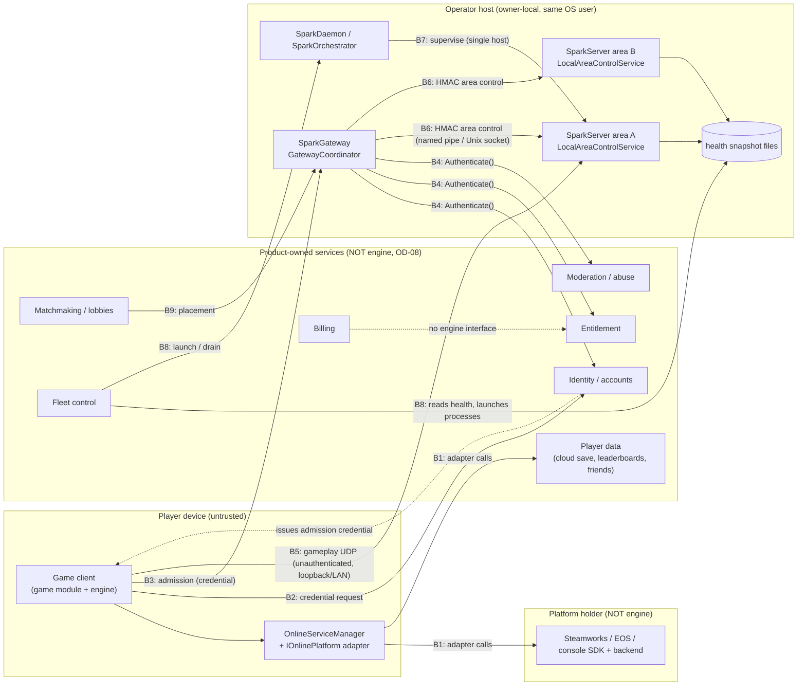

# SparkEngine Online-Services Boundary Specification

**Contract version:** 1.0  
**Date:** 2026-09-25  
**Status:** Normative boundary contract. The failure budgets in this document are requirements. Where the current code does not yet enforce a budget, the document says so.  
**Work item:** `NET-110` (outside the `stable-v1` profile). **Owner decision:** OD-08 in [`docs/readiness/OWNER-DECISIONS.md`](../readiness/OWNER-DECISIONS.md).  
**Capability row:** `services.production` in `docs/site/readiness.json` (`implementation: absent`, `support: unsupported`).

## 1. Purpose and scope

This specification separates the online-facing **engine SDK interfaces** that SparkEngine ships from the
**product-owned services** that a game must build, buy, or get from a platform holder. It names every trust and
ownership boundary between them, and for each call across a boundary it gives:

- the timeout, retry, and circuit-breaker budget
- the failure semantics
- the current adapter status

OD-08 applies throughout. Identity, matchmaking, fleet, entitlement, and billing services are out of engine scope, and
SparkEngine ships no hosted online services. None of the processes or adapters described here is production
infrastructure. The narrative companion page is [Online Service Boundary](../../wiki/advanced/Online-Service-Boundary.md),
and the interface reference is [Online Services](../../wiki/gameplay-tools/Online-Services.md).

The key words MUST, MUST NOT, SHOULD, and MAY are used as described in RFC 2119.

## 2. Ownership model

### 2.1 Engine SDK interfaces (shipped in this repository)

| Surface | Source | Role at the boundary | Status |
|---|---|---|---|
| `IOnlinePlatform` / `OnlineServiceManager` | `SparkEngine/Source/Engine/OnlineServices/OnlineServices.h` | Client-side seam that a platform or product adapter implements. The manager owns one active adapter and is initialized, ticked, and shut down by `GameplayLifecycleShared.cpp` | Interface only |
| `NetworkManager` / `ITransport` / `UDPTransport` | `SparkEngine/Source/Engine/Networking/` | Gameplay UDP transport, reliability, replication. The bind policy (`NetworkBindPolicy.h`) allows only loopback or a private LAN | Experimental. Transport security is still a placeholder (`NET-100`) |
| `DedicatedServer` | `SparkEngine/Source/Engine/Networking/DedicatedServer.h` | Headless authoritative tick loop, map rotation, trusted in-process administration, LAN discovery | Development/reference |
| `SparkServer` | `SparkServer/src/` | Headless module host. Publishes a JSON health snapshot (`ServerHealth.h`) and hosts `LocalAreaControlService` | Development/reference |
| `SparkGateway` (`GatewayCoordinator`, `IGatewayAuthenticator`, `IAreaControlPlane`) | `SparkGateway/src/` | Admission, routing, and the fenced cross-area handoff control plane | Development/reference, owner-local only |
| `SparkDaemon` / `SparkOrchestrator` | `SparkDaemon/src/` | Supervises allowlisted processes on a single host | Development/reference, single host |
| `Spark::PasswordHash` | `SparkEngine/Source/Utils/PasswordHash.h` | PBKDF2-HMAC-SHA256 helpers for an account store that the product builds | Library helper |

### 2.2 Product-owned services (never shipped by the engine)

| Service | What the product owns | Engine seam it plugs into |
|---|---|---|
| Identity and accounts | Sign-up, login, recovery, credential storage, issuing admission credentials | `IGatewayAuthenticator::Authenticate`, `IOnlinePlatform::Login` |
| Matchmaking and lobbies | Queues, skill rating, parties, session discovery beyond the LAN | `IOnlinePlatform::FindSessions` / `CreateSession` / `JoinSession`, `GatewayCoordinator::Admit` |
| Fleet | Provisioning, scaling, placement, regional routing, health-driven replacement | Reads `SparkServer` health snapshots and launches `SparkServer` / `SparkGateway` processes |
| Moderation and abuse | Reports, sanctions, chat filtering policy, ban lists | The authenticator rejects sanctioned principals. The server kicks through trusted in-process administration |
| Entitlement | Ownership checks and DLC grants | `IGatewayAuthenticator` (admission), plus product code in the game module |
| Billing | Store, payments, receipts, refunds, tax | None. No engine interface touches billing |
| Player data | Cloud saves, leaderboards, achievements, friends, presence | The matching `IOnlinePlatform` calls |
| Secrets and operations | Production key material, telemetry pipelines, backups, incident response | Key-file paths passed to `KeyFileAuthenticator` / `LocalAreaControlPlane` (OD-22: no production secret ships in engine configuration) |

## 3. Deployment diagram

The diagram draws the whole Product and Vendor subgraphs as external. The engine repository contains no code in
either subgraph. `NullOnlinePlatform` stands in for B1 during local development and does not contact either one.

## 4. Trust boundaries

| Id | Boundary | Crosses | Who is trusted | Current mechanism | Status |
|---|---|---|---|---|---|
| B1 | Game ↔ platform/product adapter | Process → vendor SDK or product API | The adapter. Its results are advisory client state and are never proof of identity to a server | Synchronous `IOnlinePlatform` calls on the game thread | Only `NullOnlinePlatform` (local, deterministic) and fail-closed stubs exist |
| B2 | Client ↔ identity service | Device → product | Product identity service | None in the engine | Product-owned |
| B3 | Client ↔ gateway admission | Untrusted network → `SparkGateway` | Nothing on the client side. The credential is opaque and bounded (`GatewayMaximumCredentialSize` = 512 bytes, body ≤ 4096 bytes) | `LocalGatewayIngressService` (owner-local named pipe) → `GatewayCoordinator::Admit` | Owner-local reference only. There is no internet-facing ingress |
| B4 | Gateway ↔ credential issuer | `SparkGateway` → product identity, entitlement, moderation | `IGatewayAuthenticator` implementation | `KeyFileAuthenticator`: `v1.<unix-ms>.<nonce>.<hmac-sha256>` with a 60 s replay window and a 4096-entry replay ledger | The local reference is complete. Product adapters are product-owned |
| B5 | Client ↔ gameplay server | Untrusted network → `SparkServer` / `DedicatedServer` | Server is authoritative. Client input is validated (`PacketValidator`) | `NetworkManager` UDP. The bind policy allows loopback or a private LAN only | Experimental and unauthenticated. Blocked on `NET-100` |
| B6 | Gateway ↔ area servers | Process ↔ process on one host | Same operating-system user, holder of the area-control key | HMAC-SHA256 frames, ±60 s timestamp window, nonce replay ledger, per-session epoch fence persisted to an epoch-state file, one audit record per frame | Owner-local reference |
| B7 | Supervisor ↔ servers | Process ↔ process on one host | Same host operator | `SparkDaemon` orchestration allowlist | Single host only. Not a fleet |
| B8 | Fleet ↔ servers | Product control plane → operator hosts | Product fleet | Reads `SparkServer` health JSON, launches or drains processes | Product-owned. The engine provides only the health snapshot and `GatewayCoordinator::BeginDrain` |
| B9 | Matchmaking ↔ gateway placement | Product → `SparkGateway` | Product matchmaker | None in the engine. Placement today is `WorldServer` area selection inside `Admit` | Product-owned |

Invariants that hold across every boundary:

1. **No client-asserted identity.** A server trusts a principal only through `AuthenticationResult::principalId`
   from the configured `IGatewayAuthenticator`. `IOnlinePlatform::GetLocalPlayer()` is client state and MUST NOT be
   used for server-side authorization. `NullOnlinePlatform::Login` accepts any username and ignores the token, so it
   MUST NOT back an admission decision.
2. **Credentials are never logged.** `IGatewayAuthenticator::Authenticate` implementations MUST NOT log the
   credential. Credential-bearing gameplay messages use `NetworkManager::RegisterSensitiveHandler`.
3. **Source authority until acknowledgement.** During a cross-area handoff the source area stays authoritative until
   the `Acknowledge` phase applies. Every failure resolves through an explicit `Abort` before a new epoch starts.
4. **No production secrets in engine configuration** (OD-22). Key files are operator-provisioned, and the loader
   rejects files that other users can read.

## 5. Call budgets and failure semantics

### 5.1 `IOnlinePlatform` (boundary B1)

The interface is synchronous and is called from the game thread. The contract for every adapter is:

| Budget | Requirement | Enforced today |
|---|---|---|
| Per-call time on the game thread | A call MUST return within **5 ms**. An adapter that talks to a remote backend MUST do the network work off the game thread, and it MUST return cached state or queue the request. It drains completions in `OnlineServiceManager::Update` | No. There is no watchdog, and a blocking adapter stalls the frame |
| Remote request timeout (adapter-internal) | **10 s** per remote request, then the operation fails | Adapter responsibility. None exists in the tree |
| Retries | Idempotent reads (`FindSessions`, `QueryScores`, `QueryAchievements`, `ListCloudSaves`, `LoadFromCloud`, `GetFriendsList`) MAY retry at most **2** times with exponential backoff starting at **500 ms** and capped at **4 s**. Mutations (`Login`, `CreateSession`, `JoinSession`, `SubmitScore`, `UnlockAchievement`, `SetAchievementProgress`, `SaveToCloud`, `DeleteCloudSave`, `SetPresence`, `InviteToSession`) MUST NOT retry automatically unless the backend deduplicates them | Adapter responsibility |
| Circuit breaker | After **5** consecutive failures of one capability, calls to that capability fail immediately for **30 s**, then one probe call is allowed | Yes, for every adapter installed with `SetPlatform()`. `OnlineServiceManager::GetPlatform()` returns `GuardedOnlinePlatform`, which counts failures per capability and runs the cooldown on the `Update()` clock. A probe that fails reopens the circuit. `Logout()` and `LeaveSession()` always reach the adapter. The circuit is disabled for the in-process `NullOnlinePlatform`: it has no remote dependency, so its failures are caller errors, and they are only counted. Tested by `OnlineServices_Degraded_*` |

Failure semantics that every adapter MUST follow. The `OnlineServices_Contract_*` conformance suite (section 8) checks
the first three rules on every shipped adapter: fail-closed capabilities, a failure reason that is present and never
echoes the login token, and `Logout()` / `LeaveSession()` in any state. On the Null adapter it also checks that each
failed call sets its own exact reason and each successful call clears it. The stubs return one constant
`GetLastError()` string, so for them the suite checks only that the reason is present. The suite does not test the
no-throw and no-local-corruption rules:

- A capability that `GetCapabilities()` reports as `false` MUST fail every call. Mutations return `false`, queries
  return an empty value, and no call may fabricate success.
- Every failed call MUST leave a non-empty, human-readable, secret-free `GetLastError()`.
- `Logout()` and `LeaveSession()` MUST be safe to call in any state, including when no session exists.
- An adapter MUST NOT throw out of an interface call. `GuardedOnlinePlatform` contains any exception that an
  adapter throws anyway, so it never reaches a caller that goes through `GetPlatform()`. The call fails, it counts
  as a failure of its capability, and `GetLastError()` reports `<call> failed: adapter threw: <what>`. A login token in
  the exception text is replaced with `<redacted>`.
- A failure MUST NOT corrupt local game state. Callers treat online results as optional. Local saves go through the
  [Save System](../../wiki/gameplay-tools/Save-System.md), not through `SaveToCloud`.

Observability: `OnlineServiceManager::Console_GetStatus()` reports the active adapter name, whether it has any
capability, the last error, per-capability health, and the logged-in display name. The health field is `ok`, or it lists
each capability that has failed since its last success, with its consecutive-failure count and circuit state (for example
`leaderboards 5 consecutive failures (circuit open, retry in 30.0s)`). `GetCapabilityHealth()` returns the consecutive,
total and rejected-call counters for one capability. A mutation counts as failed when it returns `false`. A query counts as
failed when it throws, or when it returns nothing and the adapter reports a `GetLastError()` reason for that call. An empty
result with no reason, such as an empty leaderboard, is a success. Opening and closing a circuit is logged.

### 5.2 Gateway admission and authentication (boundaries B3, B4)

| Call | Budget | Failure semantics |
|---|---|---|
| `GatewayCoordinator::Admit` | Bounded input: body ≤ 4096 bytes, credential ≤ 512 bytes. Local ingress I/O deadline **2 s** per frame | Fails closed with a `RouteFailure` (`NotReady`, `InvalidRequest`, `AuthenticationFailed`, `DuplicateSession`, `CapacityReached`, `NoAreaAvailable`). Rejected requests create no session. `BeginDrain` rejects new admissions |
| `IGatewayAuthenticator::Authenticate` | MUST be thread-safe and MUST complete within **2 s**, the ingress deadline. A product authenticator that calls a remote identity service MUST NOT retry inside that window, and it SHOULD open a circuit (reject immediately with a reason) after **5** consecutive backend failures for **30 s** | Any failure returns `accepted = false` with a `reason`. An unready authenticator (`IsReady() == false`) makes the coordinator not ready, so every admission is rejected |
| `KeyFileAuthenticator` | Timestamp within the 60 s replay window. Replay ledger bounded at 4096 entries | Wrong MAC, a stale or future timestamp, or a replayed nonce is rejected. A full ledger fails closed |

### 5.3 Area control plane (boundary B6)

| Call | Budget | Failure semantics |
|---|---|---|
| `IAreaControlPlane::Prepare` / `Transfer` / `Commit` / `Acknowledge` / `Abort` | One request per connection. Local I/O deadline **2 s** (`LocalIoTimeout`). Frame timestamp window ±60 s | Returns `Applied`, `Duplicate` (idempotent replay of the same `(sessionId, epoch, phase)`), `Rejected`, or `Unavailable`. The coordinator maps `Unavailable` to `WaitingForRetry` and keeps the phase. `Rejected` moves the session to `Aborting` |
| Retry policy | The caller of `GatewayCoordinator::AdvanceHandoff` owns retries, and every phase is idempotent, so a retry is always safe. Nothing in the engine retries automatically today. A product driver SHOULD retry `Unavailable` at most **3** times with backoff starting at **100 ms**, and then drive `Abort` | Stale epochs return `StaleEpoch`. The epoch fence persists across `SparkServer` restarts |
| `LocalAreaControlService::Start` | Listener startup deadline **5 s** | Start fails with `GetLastError()` set. The server is not ready |
| Observability | One audit record per frame (`AreaControlAuditReason`) plus per-reason counters (`GetAuditCount`) | Secret-free. Session identifiers are sanitized |

### 5.4 Gameplay transport and supervision (boundaries B5, B7, B8)

| Surface | Budget | Failure semantics |
|---|---|---|
| `NetworkManager` connection | Client considered timed out after **10 s** of silence (`m_connectionTimeout`). Adaptive retransmit timeout for reliable messages | `SetTimeoutHandler` callback. Reliable messages retransmit under the RTO |
| `DedicatedServer` | Kick after `ServerConfig::clientTimeoutSeconds` (default **30 s**). LAN discovery listens for `timeoutMs` (default **2000 ms**) | Graceful `Stop()` notifies clients and flushes |
| `SparkServer` health | Periodic JSON snapshot with build identity, tick latency, and memory | A missing or stale snapshot means the server is unhealthy. The fleet (product) decides what to replace |
| Version compatibility | The gateway protocol is `GatewayProtocolMajor.Minor` = 1.0. `NetworkManager` has no protocol-version negotiation yet (`NET-100`) | Mismatched gameplay builds are not detected on the wire today. Deploy clients and servers from the same build |

## 6. Adapter status register

No adapter in this repository is production. The labels below are the only permitted descriptions.

| Adapter | Boundary | Label | Notes |
|---|---|---|---|
| `NullOnlinePlatform` | B1 | **local, deterministic** | In-process memory only. Nothing persists or leaves the process. Accepts any login. Results come from ordered containers, so a fixed call sequence gives a fixed result on every standard library. It has no friends list, so `InviteToSession()` always fails with a reason |
| `SteamPlatform` | B1 | **stub** | Reports no capabilities and fails every call. `GetLastError()` = "Steamworks SDK unavailable in this build" |
| `EpicPlatform` | B1 | **stub** | Reports no capabilities and fails every call. `GetLastError()` = "EOS SDK unavailable in this build" |
| `ConsolePlatform` | B1 | **stub** | Reports no capabilities and fails every call. The console SDKs are NDA-gated |
| `SteamTransport` | B5 | **stub** | `Send` / `Receive` fail with "transport unavailable (Steamworks SDK not linked)" |
| `UDPTransport` | B5 | **local/LAN, experimental** | Loopback or private LAN only, unauthenticated |
| `KeyFileAuthenticator` | B4 | **local reference** | Owner-local key file. Not an identity service |
| `LocalAreaControlPlane` / `LocalAreaControlService` | B6 | **local reference** | Same host, same OS user |
| `LocalGatewayIngressService` | B3 | **local reference** | Owner-local named pipe, not internet-facing |
| `SparkDaemon` orchestration | B7 | **local reference** | Single host |

A new adapter is labeled **production** only when all of these hold:

1. It lives in a product or integration layer, not in this repository (OD-08).
2. It passes the `OnlineServices_Contract_*` conformance suite.
3. Its degraded-dependency behaviour is covered by `OnlineServices_Degraded` tests.
4. Its budgets in section 5 are measured against the real backend.

## 7. Versioning

This document is contract version 1.0. A change that alters a budget, a failure result, or a boundary in a way an
existing adapter could observe bumps the major version. Additive clarifications bump the minor version. Changes to
`IOnlinePlatform`, `IGatewayAuthenticator`, or `IAreaControlPlane` virtual signatures MUST update this document in the
same change.

## 8. Verification and open work

| Requirement | Evidence today | Open |
|---|---|---|
| No hosted-service claim on public surfaces | `python3 tools/site-data/validate.py` (`validate_online_service_boundary`) governs this document, the two wiki pages, `docs/site/readiness.json`, and every public claim surface. `Tests/Tools/test_site_data_contract.py` `OnlineServiceBoundaryTests` | none |
| Null adapter deterministic, stubs fail closed | `Tests/TestOnlineServices.cpp` `OnlineServices_Null*` and stub tests. The `OnlineServices_Contract_*` conformance suite (ctest `OnlineServicesContract`, label `online-services`, exact count 5) runs the section 5.1 failure semantics and the section 6 labels against `NullOnlinePlatform`, `SteamPlatform`, `EpicPlatform` and `ConsolePlatform`, checks `Console_GetStatus()` for each, and compares two fresh runs of the Null adapter against one fixed expected transcript. Friends and presence are checked for success and failure only: the Null adapter has no friends to read back and `SetPresence()` has no getter | A new adapter must be added to the suite before it is shipped |
| Degraded-dependency budgets (section 5.1 circuit breaker) | `Tests/TestOnlineServices.cpp` `OnlineServices_Degraded_*` (ctest `OnlineServicesDegraded`, label `online-services`, exact count 7) drives a fault-injecting adapter through `SetPlatform()` / `GetPlatform()`. It covers exception containment and token redaction, opening after 5 consecutive failures, fail-fast without reaching the adapter, per-capability isolation, the probe after the cooldown, reset on success and on platform change, the Logout bypass, the Null-adapter exemption, and the `Console_GetStatus()` health field | The 5 ms game-thread budget has no watchdog, and the 10 s remote timeout and retry budgets remain adapter responsibilities with no production adapter to measure |
| Versioned client/server compatibility | Gateway protocol constants only | `SessionCompatibility_*` tests after `NET-100` protocol negotiation |
| Hosted CI | none | `service-contract` and `network-integration` jobs (planned) |

## Source & Freshness

Written 2026-09-25 for `NET-110` from `OnlineServices.h`, `SparkGateway/src/GatewayCoordinator.h`,
`GatewaySecurity.h`, `GatewayAreaControl.h/.cpp`, `NetworkManager.h`, `DedicatedServer.h`, `NetworkBindPolicy.h`,
`SteamTransport.h`, and `SparkServer/src/ServerHealth.h` at that date. Update it when any of those interfaces, the
budgets above, or owner decision OD-08 change.
