# Class Hierarchy

> Inheritance relationships parsed from `class Foo : public Bar` /
> `struct Foo : public Bar` patterns in all scanned headers.
>
> **Total inheritance edges:** 274. Grouped by top-level module.

Auto-generated by `docs/generate-class-hierarchy.sh`.

---

## `GameModules`

```mermaid
classDiagram
    Projectile <|-- Bullet
    InteractiveObject <|-- ClassTerminal
    GameObject <|-- CubeObject
    InteractiveObject <|-- DestructibleObject
    InteractiveObject <|-- DoorObject
    InteractiveObject <|-- ElevatorObject
    Projectile <|-- Grenade
    GameObject <|-- InteractiveObject
    InteractiveObject <|-- JumpPadObject
    GameObject <|-- ModelObject
    InteractiveObject <|-- PickupObject
    GameObject <|-- PlaneObject
    GameObject <|-- Projectile
    GameObject <|-- PyramidObject
    GameObject <|-- RampObject
    Projectile <|-- Rocket
    IModule <|-- SparkGameARPGModule
    IModule <|-- SparkGameDefaultModule
    IModule <|-- SparkGameMMOModule
    IModule <|-- SparkGameModule
    IModule <|-- SparkGameOpenWorldModule
    IModule <|-- SparkGamePlatformerModule
    IModule <|-- SparkGameRPGModule
    IModule <|-- SparkGameRTSModule
    IModule <|-- SparkGameRacingModule
    IModule <|-- SparkGameVisualScriptModule
    GameObject <|-- SphereObject
    InteractiveObject <|-- SwitchObject
    InteractiveObject <|-- TeleporterObject
    GameObject <|-- Vehicle
    GameObject <|-- WallObject
```

## `SparkEditor`

## `SparkEngine`

