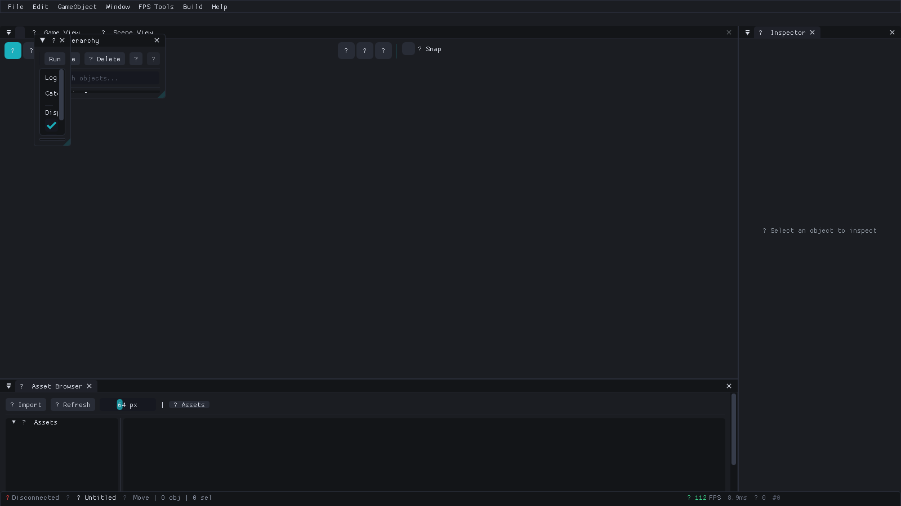

# Spark Engine

**Spark Engine** is a free, open-source 3D game engine written in C++23. Originally designed for first-person shooters, Spark Engine is evolving into a general-purpose engine supporting FPS, RPG, MMO, open-world, and other genres. It ships with a multi-backend RHI (DirectX 11/12, Vulkan, OpenGL, Metal, NullRHI), global illumination, GPU-driven rendering, mesh shaders, DXR ray tracing, Jolt Physics, XAudio2 spatial audio, AngelScript hot-reload scripting with visual scripting and Shader Graph, an EnTT-based ECS architecture, an ImGui visual editor with dockable panels, and HeroEngine-inspired features including seamless world streaming, area-based server architecture, and collaborative multi-user editing.

> **Release hardening in progress** — SparkEngine is currently source-usable,
> but no versioned release has been published. The repository's readiness gates
> distinguish implemented features from verified, supported release claims.



*SparkEditor default layout with the Spark Professional theme. Open more panels from the Window menu.*

## Platform Support

| Platform | Status | Compiler |
|----------|--------|----------|
| Windows 10+ | Primary | MSVC v143 (VS 2022), v145 (VS 2026) |
| Linux x64 | Experimental | GCC 13+, Clang 17+ |
| macOS 11+ | Experimental | Apple Clang with C++23 |

See [System Requirements](platform/System-Requirements.md) for minimum and
recommended hardware per platform (CPU, RAM, GPU, VRAM), runtime resource
footprint, and the build toggles that move the needle.

## Feature Highlights

- **Rendering** — Multi-backend RHI (DirectX 11/12, Vulkan 1.4, OpenGL 4.6, Metal, NullRHI) with forward, deferred, forward+, and clustered pipelines via a declarative RenderGraph. PBR materials, cascaded shadow mapping, SSAO, SSR, volumetric lighting/fog, bloom, HDR tone mapping, TAA/FXAA/MSAA, IBL, GPU particles, decals, water rendering, sky atmosphere, and quality presets. [Global illumination](graphics/Global-Illumination.md) (DDGI + Adaptive Probe Volumes), [GPU-driven rendering](graphics/GPU-Driven-Rendering.md) (compute culling, HiZ occlusion), [mesh shaders](graphics/Mesh-Shaders.md) (meshlet pipeline), [virtual texturing](graphics/Virtual-Texturing.md), [DXR 1.1 ray tracing](graphics/DXR-Raytracing.md) (reflections, shadows, AO, GI), [Shader Graph](graphics/Shader-Graph.md) (35+ nodes, HLSL generation), and FSR upscaling.
- **Physics** — Jolt Physics with rigid bodies, 15 collision shape types, 12 constraint types, raycasting, overlap queries, physics materials, character controller, vehicle physics (wheeled/tracked/motorcycle), ragdoll, soft body/cloth, destruction/fracture, deterministic mode, and debug draw.
- **Audio** — XAudio2 3D spatial audio with Doppler effects, distance attenuation, volume channels, audio mixer, and object pooling. Miniaudio as cross-platform fallback.
- **Gameplay** — ECS architecture (EnTT components and systems), FPS player controller, weapons, vehicles, inventory, quests, achievements, abilities/conditions, event response system, dialogue, destruction, replay, day/night cycle, weather, terrain with quadtree LOD, tween/coroutine systems, and [accessibility](platform/Accessibility.md) (colorblind modes, subtitles, reduced motion).
- **AI** — Behavior trees, NavMesh A* pathfinding (Recast/Detour), perception system (vision/hearing/memory), steering behaviors (seek/flee/pursue/evade/flocking), tactical points (EQS-like), cover/formation system, AI budget limiter for 100+ agents, and AI director.
- **Animation** — Skeletal animation, state machines, multi-layer blending, IK (two-bone, look-at, FABRIK), root motion, retargeting, ragdoll blending, cloth simulation, [cinematic sequencer](gameplay-tools/Cinematic-Sequencer.md), FBX/glTF import.
- **Scripting** — AngelScript with hot-reload, lifecycle callbacks, full engine API bindings, client/server separation. [Visual scripting](subsystems/Visual-Scripting.md) with 60 node types that compiles to AngelScript. Lua also supported. [Mod system](subsystems/Mod-System.md).
- **Networking** — UDP client/server, entity replication, client-side prediction, lag compensation (hitbox rewinding), delta snapshots. [HeroEngine-inspired MMO architecture](subsystems/Area-Server-Architecture.md) with AreaServers, WorldServer, seamless entity migration, and dynamic load balancing.
- **Editor** — ImGui-powered visual editor with 59 dockable panels: scene hierarchy, inspector, gizmos, [Shader Graph](graphics/Shader-Graph.md) material editor, [visual script editor](subsystems/Visual-Scripting.md), cinematic sequencer, dialogue editor, AI debugger, command palette (Ctrl+P), collaborative multi-user editing, and 200+ debug console commands.

## Get the Source

There are no supported release or nightly binary downloads yet. Clone the
canonical repository and follow the [Build Guide](Build-Guide.md). CI artifacts,
when present, are diagnostic snapshots for a specific run rather than releases.

```bash
git clone --recurse-submodules https://github.com/Krilliac/SparkEngine.git
cd SparkEngine
```

## Where to Start

Pick the path that matches your role:

| Role | Recommended reading order |
|------|---------------------------|
| **New to SparkEngine** | [Getting Started](getting-started/Getting-Started.md) → [Quick-Start Tutorial](getting-started/Quick-Start-Tutorial.md) → [FAQ](getting-started/FAQ.md) |
| **Programmer** | [Getting Started](getting-started/Getting-Started.md) → [Architecture Overview](getting-started/Architecture-Overview.md) → [Creating a Game Module](getting-started/Creating-a-Game-Module.md) → [Entity Component System](subsystems/Entity-Component-System.md) |
| **Artist / Designer** | [Getting Started](getting-started/Getting-Started.md) → [Quick-Start Tutorial](getting-started/Quick-Start-Tutorial.md) → [Editor Walkthrough](getting-started/Editor-Walkthrough.md) → [Artist Workflow Guide](getting-started/Artist-Workflow-Guide.md) |
| **Gameplay Designer** | [Making Your First Game](getting-started/Making-Your-First-Game.md) → [Gameplay Systems](gameplay-tools/Gameplay-Systems.md) → [Scripting with AngelScript](subsystems/Scripting-with-AngelScript.md) |
| **Multiplayer Developer** | [Multiplayer Quick Start](subsystems/Multiplayer-Quick-Start.md) → [Networking](subsystems/Networking.md) → [Dedicated Server](subsystems/Dedicated-Server.md) |
| **Optimizer / QA** | [Performance Tips](advanced/Performance-Tips.md) → [Configuration Reference](advanced/Configuration-Reference.md) → [Profiler and Debugging](advanced/Profiler-and-Debugging.md) |
| **Upgrading** | [Migration Guide](getting-started/Migration-Guide.md) → [Asset Migration](gameplay-tools/Asset-Migration.md) |

## Wiki Navigation

`wiki/_Sidebar.md` is the canonical table of contents for all wiki pages and categories.

- [Documentation portal](Documentation.md)
- [Guides](Guides.md), [Tutorials](Tutorials.md), and [Samples](Samples.md)
- [Build Guide](Build-Guide.md) and [Dependencies](Dependencies.md)
- [Browse full wiki index](./_Sidebar.md)
- [API Reference](reference/API-Reference.md)
- [Documentation Index](../docs/README.md)

## Code Quality

SparkEngine enforces code quality automatically:

- **clang-format** — Enforced in CI on every PR (Microsoft-based style, Allman braces, 120-col, 4-space indent)
- **clang-tidy** — Static analysis for bugprone, modernize, performance, and readability checks
- **Comprehensive unit tests** — CTest suite covering all major subsystems (live counts in Project Statistics)
- **5 sanitizers** — ASan, UBSan, LSan, TSan, MSan in CI
- **Code coverage** — lcov reports generated per CI run

See [Contributing](advanced/Contributing.md) for the full pre-commit checklist.

## License

SparkEngine is licensed under the [Spark Open License](https://github.com/Krilliac/SparkEngine/blob/Working/LICENSE) — no royalties, no fees, anti-plagiarism protected.

## Project Statistics

<!-- AUTO:stats -->
| Metric | Count |
|--------|-------|
| Header files | 964 |
| ECS Components | 79 |
| Engine System Classes | 75 |
| Editor Panels | 64 |
| Test files | 555 |
| Test cases | 6590+ |
| Wiki pages | 198 |
| *Last synced* | *2026-08-25 04:29* |
<!-- /AUTO:stats -->
