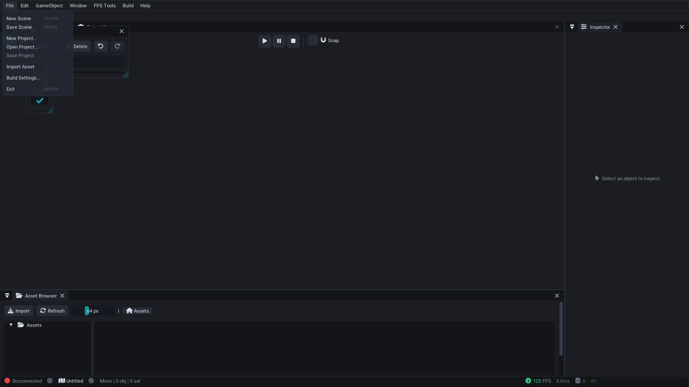

# SparkEditor

SparkEditor is a required Windows build product and authoring surface in the blocked and uncertified `stable-v1` profile. Its source inventory contains 65 `*Panel.h` classes; registration and default visibility are separate metrics. All three transform gizmos (translate, rotate, scale) now apply to `World` entities through one `CommandHistory` entry per drag, and World-document create/delete/duplicate/reparent/rename/transform/inspector edits are command-backed; `EDT-210` remains open for the asset browse/drag/assign path, the author-to-installed-runtime round trip, and the still-unwired crash-recovery pipeline. Collaboration, visual scripting, plugin breadth, and non-Windows editor paths remain experimental or outside the profile.


*SparkEditor default layout — Hierarchy, Scene View, Inspector, Asset Browser, and Console panels with the Spark Professional dark theme.*

### Welcome Screen

On first launch, a welcome screen introduces the core panels and offers quick actions:


### Window Menu — All Available Panels

Additional panels can be enabled from the **Window** menu at any time:


### File Menu



### GameObject Menu

Create entities with pre-configured components:


### FPS Tools Menu

Weapon editor, spawn points, objectives, explosives, and cover points:


**Source:** `SparkEditor/Source/`

**Platforms:**
- **Windows:** Win32 + DirectX 11 ImGui backends (primary)
- **Linux:** Experimental SDL2 + OpenGL 3.3 ImGui path; Mesa llvmpipe is an explicitly configured development route, not certified support

`ENABLE_EDITOR=ON`

## Architecture

```
EditorApplication
  |
  +-- EditorUI
  |     |
  |     +-- EditorLayoutManager   (dock positions, panel visibility, layout save/load)
  |     +-- EditorTheme           (color palette, rounding, spacing, font config)
  |     +-- EditorPanel* panels[] (registered panel set)
  |     +-- SceneViewPanel gizmos  (translate/rotate/scale, one value via EditorUI::SetTransformTool)
  |     +-- UndoRedoManager       (command history stack)
  |     +-- CommandPalette        (Ctrl+P quick-command search)
  |
  +-- EditorPluginManager         (built-in + DLL plugin lifecycle)
  +-- SceneManager                (scene load/save/serialize)
  +-- PrefabManager               (prefab asset CRUD)
  +-- VersionControlSystem        (optional git integration; git runs from an argument vector, no shell)
  +-- BuildCookPanel               (cook, package, deploy)
  +-- PerformanceProfiler         (frame time, FPS, percentiles; CPU samples only from imported captures)
```

### EditorApplication

The entry point is `EditorApplication` (`Core/EditorApplication.h`). On Windows it
owns the Win32 window and DirectX 11 device/context/swap chain; the experimental
Linux implementation owns an SDL2 window and OpenGL 3.3 context. Each platform
path owns its ImGui context and backend bindings.

```cpp
struct EditorConfig
{
    std::string projectPath = ".";
    std::string layoutDirectory = "Layouts";
    std::string logDirectory = "Logs";
    bool enableLogging = true;
    bool startMaximized = true;
    float autoSaveInterval = 30.0f;
    int windowWidth = 1600;
    int windowHeight = 900;
};

class EditorApplication
{
public:
    bool Initialize(const EditorConfig& config);
    int  Run();
    void Shutdown();
    bool IsRunning() const;
    void RequestExit();
    PerformanceMetrics GetPerformanceMetrics() const;
    void OnWindowResize(int width, int height);
    void SetWindowTitle(const std::string& title);
};
```

### Frame Loop

Each frame executes the following steps:

1. `ProcessMessages()` -- Win32 message pump or the Linux SDL2 event loop
2. `Update(deltaTime)` -- tick all panels, the Scene View gizmo interaction, profiler
3. `Render()` -- begin the platform ImGui frame, render visible panels, and present through DX11 or swap the SDL/OpenGL window

## EditorPanel Base Class

Every panel inherits from `EditorPanel` (`Core/EditorPanel.h`), which provides a consistent interface:

```cpp
class EditorPanel
{
public:
    EditorPanel(const std::string& name, const std::string& id);
    virtual ~EditorPanel() = default;

    virtual bool Initialize() = 0;
    virtual void Update(float deltaTime) = 0;
    virtual void Render() = 0;
    virtual void Shutdown() {}
    virtual bool HandleEvent(const std::string& eventType, void* eventData);

    // Visibility and state
    bool IsVisible() const;
    void SetVisible(bool visible);
    bool IsFocused() const;
    void SetFocused(bool focused);
    bool IsClosable() const;
    bool IsModified() const;

    // Persistence
    virtual std::string SaveState() const;
    virtual bool LoadState(const std::string& state);

    // Geometry
    void GetSize(float& width, float& height) const;
    void SetSize(float width, float height);
    void GetPosition(float& x, float& y) const;
    void SetPosition(float x, float y);

protected:
    bool BeginPanel();   // Sets up ImGui window
    void EndPanel();     // Finishes ImGui window
    void NotifyStateChange();
};
```

## Editor Panels

The generated inventory below tracks source `*Panel.h` headers rather than a fixed count of registered, visible, or certified subsystem panels.

### Scene Hierarchy

- Tree view of all scene nodes with parent-child relationships
- Drag-and-drop to reparent nodes
- Right-click context menu for add/delete/duplicate
- Search and filter nodes by name or type

### Inspector

- Property editor for the selected node/entity
- Transform editing (position, rotation, scale)
- [Component](../subsystems/Entity-Component-System.md) editing with type-appropriate widgets
- Material assignment and configuration
- Component reflection via `ComponentReflection.h`

### Game Viewport

- Real-time 3D preview of the scene
- Play/pause/stop game simulation via `PlayModeToolbarPanel`
- Camera controls (orbit, pan, fly-through)
- Grid and axis overlays

### Gizmos (Scene View)

The Scene View ships all three transform gizmos for selected `World` entities on
Windows: translate arrows, rotate rings, and scale box handles. Each drag commits
exactly one `CommandHistory` entry (`SceneEditTools::CommitEntityRotation` /
`CommitEntityScale` / translation), so a gizmo edit is a single undo step. Grid snap
applies 15 degrees to rotation and 0.1 to scale when snapping is enabled. The
toolbar buttons, the `W`/`E`/`R` hotkeys, the command palette, and the Scene View
toolbar all drive one value (`EditorUI::SetTransformTool`); previously they only
changed a status-bar label. The separate `Gizmos/GizmoSystem` class was deleted
as a duplicate of this path (see [Stub and Abandoned Features](../advanced/Stub-and-Abandoned-Features.md)).
Regression coverage: `Tests/TestEditorGizmoTransformReal.cpp`.

### Asset Browser (see [Asset Pipeline](Asset-Pipeline.md))

- File-system view of project assets
- Drag-and-drop assets into the scene
- Thumbnail previews for textures and models
- Dependency tracking via `AssetDependencyPanel`

### Material Editor (see [Shader Pipeline](Shader-Pipeline.md))

- PBR material authoring
- Texture slot assignment
- Real-time preview sphere
- Blend mode and [shader](Shader-Pipeline.md) selection

### Animation Timeline

Removed. The `SparkEditor/Source/Animation/` timeline, clip manager, curve, and
playback classes had no production caller and were deleted rather than completed.
Sprite animation authoring lives in the [Sprite Animation Editor Panel](#sprite-animation-editor-panel).

### Terrain Editor (see [Terrain and Procedural Generation](Terrain-and-Procedural-Generation.md))

- Heightmap painting (raise/lower/smooth/flatten)
- Texture splatting brush
- Object placement brush via `ObjectPlacementPanel`
- Terrain configuration (size, resolution, LOD)
- Save writes `.sparkterrain` v2 to an editable project-relative path (default `Assets/Terrains/<name>.sparkterrain`, overwrite confirmation, directory created); texture layers have Diffuse/Normal fields and detail meshes a Mesh Path field

### Weapon Editor (see [Gameplay Systems](Gameplay-Systems.md))

A balance calculator: DPS chart and comparison table over weapon stats (damage,
fire rate, spread, reload). Edits are session-only -- the panel cannot save, the
no-op "Save All" button was removed, and no game module reads its values.

### Node Graph (imnodes)

- Visual scripting nodes (see [Scripting with AngelScript](../subsystems/Scripting-with-AngelScript.md))
- Material graph editor
- Connection-based data flow

### Profiler Panel

- Frame time, FPS, and frame-time percentiles (measured live)
- CPU sample hierarchy and draw-call/triangle counters are populated **only from an imported capture file**; `ProfileScope`/`PROFILE_SCOPE` were deleted and no panel is instrumented, so there is no live CPU sample producer
- Memory usage tracking
- Frame time history

### Console Panel

Debug console with real-time log streaming (the panel subscribes to `Spark::Logger`), severity filtering, and command execution.

- Real-time log output with color-coded severity (Info, Warning, Error, Fatal)
- Command input with Tab auto-completion and Up/Down history
- Case-insensitive text search across log output (substring match, not regex)

The Version Control panel launches git from an argument vector with no shell, so commit
messages, branch names, and paths containing spaces, quotes, ampersands, or semicolons are
accepted verbatim; the former "File path contains unsafe characters" guard is gone, commit
messages are no longer mangled, and commit subjects no longer carry a trailing quote.
- Export logs to txt or csv
- Configurable scroll behavior (auto-scroll, pause on hover)

**Source:** `SparkEditor/Source/Panels/ConsolePanel.cpp` (821 lines)

### Scene View

3D viewport for editing the scene with editor camera controls.

- Orbit, pan, and fly-through camera modes
- Grid overlay with configurable spacing
- Multiple render modes (lit, wireframe, unlit, normals)
- Translate/rotate/scale gizmo rendering and interaction for selected entities (Windows path)
- Click-to-select entities via raycasting

**Source:** `SparkEditor/Source/Panels/SceneViewPanel.cpp` (404 lines)

### Play Mode Toolbar

Transport controls for play-in-editor (PIE) sessions.

- Play, Pause, Stop, and Step-Frame buttons
- Time-scale slider (0.1x to 10x)
- Per-subsystem toggle (physics, AI, audio, particles)
- Camera mode switching (editor camera vs. game camera)
- Frame statistics overlay during play

**Source:** `SparkEditor/Source/Panels/PlayModeToolbarPanel.cpp` (644 lines)

### Build & Cook Panel

Build configuration and packaging pipeline.

- Profile selection: Debug, Development, Release, Shipping
- Asset cooking with progress tracking
- Platform targeting (Windows, Linux, macOS stubs)
- Output directory configuration
- Build log with error/warning highlights

**Source:** `SparkEditor/Source/Panels/BuildCookPanel.cpp` (591 lines)

### Workflow Panel

Runs the project's build workflows from inside the editor.

- Build workflows configure with the host preset (`windows-release` on the stable-v1 platform) rather than `linux-gcc-release`
- **Clean & Rebuild** requires an explicit confirmation, deletes only the open project's build directory, and fails with a clear message when no project is open
- Running a workflow still blocks the editor UI for the duration of the process

**Source:** `SparkEditor/Source/Panels/WorkflowPanel.h`

### Dedicated Server Panel

Launch and monitor a `SparkServer` process from the editor.

- Server cook settings and launch configuration for the single launch map (the Maps tab is a pick-list for that map)
- Local server launch for testing; the browser lists only the server launched from this editor (there is no discovery transport)
- Join is disabled until an editor client transport exists
- Monitoring shows uptime plus the player count parsed from SparkServer's health report

There is no LAN auto-discovery, no RCON console, and no kick/ban player list.

**Source:** `SparkEditor/Source/Panels/DedicatedServerPanel.cpp`

### Debug Visualizer Panel

**Preview - not connected.** The grid, wireframe, collider, physics-contact,
navmesh, light-radius, and audio-range toggles are authored in the panel, but no
renderer consumes them yet and the panel reports no debug-draw counts. It is
listed in [Stub and Abandoned Features](../advanced/Stub-and-Abandoned-Features.md)
until `SceneViewPanel` reads it.

**Source:** `SparkEditor/Source/Panels/DebugVisualizerPanel.cpp`

### Event Monitor Panel

Real-time [EventBus](../subsystems/Event-System.md) inspector for debugging event-driven systems.

- Live event stream during play mode
- Filter by event type or source
- Event payload inspection
- Pause/resume event capture

**Source:** `SparkEditor/Source/Panels/EventMonitorPanel.cpp` (97 lines)

### Dialogue Editor Panel

Visual [dialogue tree](../subsystems/Dialogue-System.md) authoring tool.

- Node types: Text, Choice, Branch, Event, End
- Speaker name and voice clip assignment per node
- Branching condition configuration
- Preview dialogue flow in-editor

**Source:** `SparkEditor/Source/Panels/DialogueEditorPanel.cpp` (175 lines)

### FPS Tools Panel

Specialized tools for first-person shooter level design and balancing.

- Spawn point placement and team assignment
- Game mode configuration (Deathmatch, CTF, Domination)
- Player stats testing (health, armor, speed)
- Combat simulation for balance testing
- Level design helpers (cover analysis, sight lines)

**Source:** `SparkEditor/Source/Panels/FPSToolsPanel.cpp` (630 lines)

### Scene Statistics Panel

Live scene metrics dashboard, reading the open scene's `World`.

- Entity and component counts by type (from the open scene's World)
- Render statistics: draw calls and batches as reported by the scene viewport (only while it reports stats); triangle/vertex/shader/texture-VRAM figures are not measured
- Physics statistics: rigid bodies, contacts, constraints -- only while a game session runs
- Memory: the editor process working set (there is no per-asset mesh/texture/audio breakdown)
- Per-frame performance graphs with history

**Source:** `SparkEditor/Source/Panels/SceneStatisticsPanel.cpp`

### Search Panel

Fuzzy search over the open scene and the project asset root.

- Search entities by name and by the reflected component types on those entities
- Search file names under the project asset root
- Selecting an entity result selects it in the editor; asset results report their path
- Search history with recent queries

Property-value search does not exist.

**Source:** `SparkEditor/Source/Panels/SearchPanel.cpp`

### Object Placement Panel

Creates real, undoable entities from the editor's entity templates.

- **Quick Place** and **Place Selected** create entities through `CommandHistory`
- Entity template list (there is no drag-and-drop and no `PrefabManager` lookup)
- Brush, line, grid, and scatter modes, align mode, and snap settings are authored in the panel but **not yet read by the viewport** -- they are not working placement modes

**Source:** `SparkEditor/Source/Panels/ObjectPlacementPanel.cpp`

### Prefab Editor Panel

Create, edit, and manage [prefab](../subsystems/Scene-Management.md) assets.

- Prefab browser with search
- Component editing within prefab context
- Property serialization and override tracking
- Create prefab from selected entities
- Apply prefab changes to all instances

**Source:** `SparkEditor/Source/Panels/PrefabEditorPanel.cpp` (393 lines)

### Project Browser Panel

Project-level hub for opening, creating, and managing projects.

- Recent projects list with last-opened timestamps
- New project wizard with templates (FPS, RPG, Blank)
- Existing project browser with folder navigation
- Project settings quick-access

**Source:** `SparkEditor/Source/Panels/ProjectBrowserPanel.cpp` (540 lines)

### Particle Editor Panel

Visual [particle system](../subsystems/Rendering-and-Graphics.md) authoring.

- Emission rate, lifetime, and burst configuration
- Emitter shapes: Point, Sphere, Cone, Box
- Color gradient editor over particle lifetime
- Physics integration (gravity, wind, collision)
- Live preview in viewport

**Source:** `SparkEditor/Source/Panels/ParticleEditorPanel.cpp` (147 lines)

### Post-Processing (Inspector)

The separate `PostProcessingPanel` was removed: it edited a `SceneFile`-backed
document model the editor no longer builds. Add a **Post-Process Volume**
component to an entity and edit bloom, tonemapping, fog, and related settings in
the [Inspector](#inspector).

### Localization Panel

String table editor for [multi-language support](../subsystems/Localization.md).

- Supported languages: English, Spanish, French, German, Japanese, Chinese
- Key/value translation table with inline editing
- Missing translation highlighting
- Import/export CSV for translator workflows

**Source:** `SparkEditor/Source/Panels/LocalizationPanel.cpp` (149 lines)

### Save System Panel

[Save/Load](Save-System.md) slot manager over the real save directory.

- Lists the `.spark_save` files in the save directory with their metadata (timestamp, playtime, level)
- Rename and delete slots
- **Load** requires a running game session (a live `World` in the engine context) *and* at least one enumerated slot; it is disabled otherwise
- Export/Import were removed

**Source:** `SparkEditor/Source/Panels/SaveSystemPanel.cpp`

### Region Map Editor

The Region Map Editor discovers every Terrafront continent lattice declared by
`Assets/MMOFPS/Data/continents.json`. Switching maps is disabled while the
current map has unsaved edits. Save validates the serialized document with the
strict JSON parser, refreshes that selected map's sibling `.bak`, and atomically
replaces only its declared region file, so an interrupted write cannot truncate
the live lattice.

**Source:** `SparkEditor/Source/Panels/RegionMapEditorPanel.h`

### Spline Editor Panel

[Spline](Terrain-and-Procedural-Generation.md) path authoring for cameras, AI, and procedural content.

- Control point creation and editing
- Curve types: Catmull-Rom, Bezier
- Closed loop toggle
- Tension parameter adjustment
- Visual preview in scene view

**Source:** `SparkEditor/Source/Panels/SplineEditorPanel.cpp` (140 lines)

### Weather & Fog Panel

Applies the engine's own weather presets to the running [WeatherSystem](Day-Night-Cycle-and-Weather.md).

- Shows the engine's weather-type presets read-only
- Applies a selected type, intensity, and transition time to the running `WeatherSystem`
- With no game session the panel shows **Preview - not connected**

Custom presets, per-field authoring, and preset persistence do not exist.

**Source:** `SparkEditor/Source/Panels/WeatherFogPanel.cpp`

### Undo History Panel

Visual timeline of the [undo/redo](#undoredo-system) command stack.

- Chronological command list with descriptions
- Click to jump to any point in history
- Current position indicator
- Saved state marker

**Source:** `SparkEditor/Source/Panels/UndoHistoryPanel.cpp` (161 lines)

### AI Editor Panel

[Behavior tree](../subsystems/AI-and-Navigation.md) visual editor.

- Node creation for Selector, Sequence, Decorator, Action types
- Template management for reusable tree patterns
- Agent inspection with live blackboard values
- Tree validation and error highlighting

**Source:** `SparkEditor/Source/Panels/AIEditorPanel.cpp` (201 lines)

### AI Debug Panel

Real-time [AI agent](../subsystems/AI-and-Navigation.md) runtime inspector for play-mode debugging.

- Agent list with color-coded state (Idle, Patrol, Alert, Combat, Flee, Dead)
- Per-agent blackboard variable viewer with type-aware display
- Behavior tree execution trace with active node highlighting
- Perception overlay toggles (detection ranges, attack ranges, nav paths, target lines)
- AI system statistics (agent counts by state, targets)
- State filtering and configurable refresh rate

**Source:** `SparkEditor/Source/Panels/AIDebugPanel.cpp` (290 lines)

### 2D Panels

#### Physics 2D Panel

[2D physics](../subsystems/2D-Systems.md) configuration and debugging.

- Gravity vector configuration
- Collision layer matrix editor
- Debug visualization: AABBs, contacts, grid
- Interactive raycast testing tool

**Source:** `SparkEditor/Source/Panels/Physics2DPanel.cpp` (308 lines)

#### Sprite Editor Panel

[Sprite](../subsystems/2D-Systems.md) configuration for 2D rendering.

- Texture selection and source rectangle editing
- Pivot point setup with visual indicator
- Sorting layer and order assignment
- Color tint and flip controls

**Source:** `SparkEditor/Source/Panels/SpriteEditorPanel.cpp` (329 lines)

#### Sprite Animation Editor Panel

[2D animation](../subsystems/2D-Systems.md) clip authoring.

- Frame-by-frame timeline with keyframe editing
- Per-frame duration control
- Preview with play/pause/step controls
- Onion skinning for animation reference

**Source:** `SparkEditor/Source/Panels/SpriteAnimationEditorPanel.cpp` (534 lines)

#### Tilemap Editor Panel

[Tile-based](../subsystems/2D-Systems.md) map editing.

- Tools: Paint, Erase, Fill, Rectangle
- Collision layer painting
- Auto-tiling rules configuration
- Zoom and pan viewport
- Panel-local undo/redo commands; this does not establish complete editor-wide coverage

**Source:** `SparkEditor/Source/Panels/TilemapEditorPanel.cpp` (540 lines)

### Game View Panel

Game viewport with a **simulated** FPS HUD preview.

- The HUD overlay (crosshair, health/armor bars, ammo, minimap, kill feed, scoreboard) is generated by the editor and labelled on screen as `SIMULATED HUD - not game data`; it is not connected to `SparkGameFPS` state
- The Game View fly camera no longer moves the scene's authored camera

**Source:** `SparkEditor/Source/Panels/GameViewPanel.cpp`

## Collaborative Editing

SparkEditor contains an experimental multi-user collaboration implementation outside `stable-v1`. See [Collaborative Editing](../subsystems/Collaborative-Editing.md) for development documentation.

Key features:
- **Peer presence** — see other editors' selections and viewport cameras
- **Node locking** — pessimistic locks prevent conflicting edits
- **Edit broadcasting** — changes are visible across all editors in real-time
- **Auto-expiry** — locks expire after 5 minutes to prevent blocking

Source: `SparkEditor/Source/Communication/CollaborativeEditSession.h`

## Undo/Redo System

The `UndoRedoManager` (`UndoRedo/UndoRedoManager.h`) maintains command stacks. For the World document the following mutations are all command-backed and undoable (regression coverage in `Tests/TestEditorUndoHierarchyReal.cpp` and `Tests/TestEditorGizmoTransformReal.cpp`):

| Operation | Entry points |
|---|---|
| Create / delete / duplicate entity | Hierarchy context menu, `Ctrl+D`, `Delete` key |
| Rename entity | `F2`, double-click, context menu, toolbar |
| Reparent | Hierarchy drag-and-drop |
| Translate / rotate / scale | Scene View gizmos (one command per drag) |
| Inspector property edits | Reflected component fields |

Editor-wide certification is still open under `EDT-210` because the asset drag/assign path and the author-to-package round trip are not yet gated:

```cpp
class UndoRedoManager
{
public:
    void ExecuteCommand(std::unique_ptr<EditorCommand> command);
    bool Undo();
    bool Redo();
    void UndoToIndex(size_t targetIndex);

    bool CanUndo() const;
    bool CanRedo() const;
    std::string GetUndoDescription() const;
    std::string GetRedoDescription() const;

    void Clear();
    void MarkSaved();
    bool HasUnsavedChanges() const;

    size_t GetMaxStackDepth() const;           // Default: 100
    void SetMaxStackDepth(size_t depth);
    void SetOnStackChanged(std::function<void()> callback);
};
```

Operations use `ExecuteCommand()` and implement `EditorCommand::Execute()` / `Undo()`. Executing a new command clears the redo stack, and `UndoHistoryPanel` exposes the recorded command history.

## Theme System

The `EditorTheme` class (`Core/EditorTheme.h`) provides professional theming with 8 built-in themes:

| Theme | Description |
|-------|-------------|
| Unity Pro | Unity-inspired dark theme |
| Unreal Pro | Unreal Engine-inspired dark theme |
| VS Pro | Visual Studio-inspired dark theme |
| JetBrains | JetBrains IDE-inspired theme |
| Professional Light | Light theme for well-lit environments |
| High Contrast | Accessibility-focused high-contrast theme |
| Blue Accent | Custom blue accent dark theme |
| Orange Accent | Custom orange accent dark theme |

### Theme Data Structure

The `EditorThemeData` struct contains 60+ color properties organized into groups:

- **Background**: `background`, `backgroundDark`, `backgroundLight`, `backgroundAccent`, `backgroundHeader`, `backgroundActive`, `backgroundHover`, `backgroundSelected`
- **Text**: `text`, `textDisabled`, `textSecondary`, `textAccent`, `textWarning`, `textError`, `textSuccess`
- **Buttons**: `button`, `buttonHovered`, `buttonActive`, `buttonDisabled`
- **Frames**: `frame`, `frameHovered`, `frameActive`
- **Borders**: `border`, `borderLight`, `borderAccent`, `borderSeparator`
- **Tabs/Scrollbars/Menus**: full color sets for each
- **Style values**: rounding, border sizes, padding, spacing, shadows, font size

### Theme Customization

```cpp
// Apply a built-in theme
EditorTheme::ApplyTheme("UnityPro");

// Create a blended theme
EditorTheme::CreateBlendedTheme("UnityPro", "UnrealPro", 0.5f, "HybridTheme");

// Export/import custom themes
ThemeCustomizer::ExportTheme(theme, "MyTheme.json");
ThemeCustomizer::ImportTheme("MyTheme.json", theme);

// Live editing
ThemeCustomizer::ShowThemeEditor();
```

## Layout Management

The `EditorLayoutManager` (`Core/EditorLayoutManager.h`) handles docking, saving, and loading panel layouts:

```cpp
enum class DockPosition { Left, Right, Top, Bottom, Center, Float };

struct PanelConfig
{
    std::string name;
    std::string displayName;
    DockPosition dockPosition;
    ImVec2 size;
    ImVec2 position;
    bool isVisible;
    bool isFloating;
    bool canClose;
    bool canDock;
    float dockRatio;    // Ratio of parent space to occupy
    int tabOrder;
    std::string parentDock;
};
```

The editor uses ImGui's docking branch for a fully customizable workspace:
- Drag panels to dock at any edge
- Create floating windows
- Save and load layout configurations
- Reset to default layout

## Plugin System

The `EditorPluginManager` (`Core/EditorPluginManager.h`) supports both built-in and DLL-loaded editor plugins:

```cpp
class EditorPluginManager
{
public:
    // Registration
    template<typename T> bool RegisterPlugin();
    bool LoadPlugin(const std::string& path);
    bool UnloadPlugin(const std::string& name);

    // Lookup
    IEditorPlugin* GetPlugin(const std::string& name) const;
    size_t GetPluginCount() const;
    std::vector<std::string> GetPluginNames() const;

    // Lifecycle
    bool InitializeAll(EditorApplication* app);
    void ShutdownAll();
    void UpdateAll(float deltaTime);
    void RenderAll();

    // Events
    void NotifySceneLoad(const std::string& scenePath);
    void NotifySceneSave(const std::string& scenePath);
    void NotifyEntitySelected(uint32_t entityID);
    void RenderMenuBarItems();

    // Panel registration from plugins
    void RegisterPanel(std::unique_ptr<EditorPanel> panel);
};
```

Plugins implement the `IEditorPlugin` interface and are loaded at startup or dynamically at runtime. Each plugin can register custom panels, menu items, and respond to editor events.

## Building with the Editor

```powershell
# Windows (preferred): CMake presets
cmake --preset windows-release
cmake --build --preset windows-release

# build.ps1 remains supported; ENABLE_EDITOR defaults ON, and -editor only forces it ON
.\build.ps1 -config Release -editor
```

## Performance Considerations

- All panel rendering uses immediate-mode ImGui; no retained scene graph overhead.
- The `PerformanceProfiler` reports frame time, FPS, and percentiles; it has no per-panel or CPU-sample producer (`PROFILE_SCOPE` was deleted), so bottleneck hunting needs an imported capture or an external profiler.
- Gizmo rendering uses dedicated DX11 vertex/pixel shaders with minimal draw calls.
- The `EditorApplication` frame loop targets 60 FPS; the editor can optionally cap to lower rates when idle.

## Thread Safety

- All editor UI code runs on the main thread.
- The `EditorApplication` holds the DX11 device and context; rendering is single-threaded.
- Background asset imports (if any) communicate results back to the main thread via queues.
- The `SimpleConsolePanel` wraps the engine's thread-safe `SimpleConsole`.

## Troubleshooting

### Editor window does not appear

1. Verify `ENABLE_EDITOR=ON` is set in CMake.
2. Confirm you are building on Windows with MSVC.
3. Check that DirectX 11 runtime is available (Windows 10+ includes it).

### Panel is missing from the View menu

1. Check that the panel's `SetVisibleInMenu(true)` is called during registration.
2. If the panel was loaded from a plugin, verify the plugin initialized successfully.

### Gizmo does not respond to clicks

1. Ensure the Scene View panel has focus so it receives mouse events before ImGui consumes them.
2. Check the active transform tool (`W`/`E`/`R` or the toolbar) -- all surfaces drive `EditorUI::SetTransformTool`.
3. Verify at least one `World` entity is selected in the hierarchy.

### Editor crashed -- where is the dump?

`SparkEditor` installs a Windows unhandled-exception filter at startup and
restores the previous filter on shutdown. Dumps and logs are written under the
per-user editor data directory (not a CWD-relative `Crashes/`). The recovery
dialog and `RecordOperation` journaling are still unwired (`EDT-210`), so a crash
leaves a dump but does not offer scene recovery.

### Theme colors look wrong

1. Call `EditorTheme::ApplyProfessionalEnhancements()` after applying the theme.
2. Verify custom fonts loaded successfully via `EditorTheme::ApplyCustomFonts()`.

### Time of Day

- Time slider (0-24h) with formatted HH:MM display
- Time scale control (1x, 10x, 60x, 600x) with pause/resume
- Preset buttons: Dawn, Morning, Noon, Dusk, Midnight
- Sun direction, color, and intensity preview with color swatches
- Ambient lighting state display
- Day/night indicator and day period classification
- Day cycle progress bar

### Ability Editor

- Tabbed view: Abilities, Auras, Procs
- Ability authoring: targeting, range, cast time, cooldown, resource cost, channeling
- Aura authoring: type, school, duration, tick interval, modifiers, stacking
- Proc authoring: trigger mask checkboxes, chance, cooldown, charges
- Filterable lists with create/delete operations

### Trigger Editor

- List of proximity trigger volumes with ID, shape, label, enabled state
- Create dialog for sphere/AABB triggers with center and size parameters
- Per-trigger detail editor (shape, center, radius/extents, enabled, occupant count)
- Viewport visualization toggle

### Condition Editor

- Visual condition set builder with AND/OR group logic
- 27 condition types matching ConditionSystem enum (IsAlive, HasItem, QuestComplete, etc.)
- Negation toggle per condition
- World variable editor (name/value pairs with add/edit/delete)
- World flag editor (boolean toggle list)

### Decal Editor

- Decal material list with create/delete
- Per-material texture paths (albedo, normal, roughness), opacity, fade time
- Surface-to-decal mapping table (Concrete, Metal, Wood, etc.)
- Active decal count display and "Clear All" button
- Max decal pool size configuration

---

## See Also

- [Scene Management](../subsystems/Scene-Management.md) -- Scene hierarchy and serialization
- [Rendering and Graphics](../subsystems/Rendering-and-Graphics.md) -- Material system and render pipelines
- [Animation](../subsystems/Animation.md) -- Animation state machines and timeline
- [Cinematic Sequencer](Cinematic-Sequencer.md) -- Timeline editor
- [Entity Component System](../subsystems/Entity-Component-System.md) -- Component architecture
- [Shader Pipeline](Shader-Pipeline.md) -- Shader authoring and compilation
- [Asset Pipeline](Asset-Pipeline.md) -- Asset importing and management
- [Physics](../subsystems/Physics.md) -- Physics simulation
- [Terrain and Procedural Generation](Terrain-and-Procedural-Generation.md) -- Terrain editing and procedural tools
- [Gameplay Systems](Gameplay-Systems.md) -- Weapons, inventory, and game mechanics
- [Scripting with AngelScript](../subsystems/Scripting-with-AngelScript.md) -- Visual scripting system

## Editor Panels

<!-- AUTO:panel_list -->
| Panel | Header |
|-------|--------|
| `AIDebugPanel` | `SparkEditor/Source/Panels/AIDebugPanel.h` |
| `AIEditorPanel` | `SparkEditor/Source/Panels/AIEditorPanel.h` |
| `AbilityEditorPanel` | `SparkEditor/Source/Panels/AbilityEditorPanel.h` |
| `AssetBrowserPanel` | `SparkEditor/Source/Panels/AssetBrowserPanel.h` |
| `AudioMixerPanel` | `SparkEditor/Source/Panels/AudioMixerPanel.h` |
| `BasicMaterialEditorPanel` | `SparkEditor/Source/Panels/BasicMaterialEditorPanel.h` |
| `BuildCookPanel` | `SparkEditor/Source/Panels/BuildCookPanel.h` |
| `CSGEditorPanel` | `SparkEditor/Source/Panels/CSGEditorPanel.h` |
| `CinematicSequencerPanel` | `SparkEditor/Source/Panels/CinematicSequencerPanel.h` |
| `CollaborationPanel` | `SparkEditor/Source/Panels/CollaborationPanel.h` |
| `ConditionEditorPanel` | `SparkEditor/Source/Panels/ConditionEditorPanel.h` |
| `ConsolePanel` | `SparkEditor/Source/Panels/ConsolePanel.h` |
| `CoroutineDebugPanel` | `SparkEditor/Source/Panels/CoroutineDebugPanel.h` |
| `DebugVisualizerPanel` | `SparkEditor/Source/Panels/DebugVisualizerPanel.h` |
| `DecalEditorPanel` | `SparkEditor/Source/Panels/DecalEditorPanel.h` |
| `DecorLayoutEditorPanel` | `SparkEditor/Source/Panels/DecorLayoutEditorPanel.h` |
| `DedicatedServerPanel` | `SparkEditor/Source/Panels/DedicatedServerPanel.h` |
| `DestructionEditorPanel` | `SparkEditor/Source/Panels/DestructionEditorPanel.h` |
| `DialogueEditorPanel` | `SparkEditor/Source/Panels/DialogueEditorPanel.h` |
| `EventMonitorPanel` | `SparkEditor/Source/Panels/EventMonitorPanel.h` |
| `EventResponsePanel` | `SparkEditor/Source/Panels/EventResponsePanel.h` |
| `FPSToolsPanel` | `SparkEditor/Source/Panels/FPSToolsPanel.h` |
| `GameModuleSelectorPanel` | `SparkEditor/Source/Panels/GameModuleSelectorPanel.h` |
| `GameModuleSelectorPanel` | `SparkEditor/Source/Panels/PlayControlPanel.h` |
| `GameViewPanel` | `SparkEditor/Source/Panels/GameViewPanel.h` |
| `HierarchyPanel` | `SparkEditor/Source/Panels/HierarchyPanel.h` |
| `InspectorPanel` | `SparkEditor/Source/Panels/InspectorPanel.h` |
| `LocalizationPanel` | `SparkEditor/Source/Panels/LocalizationPanel.h` |
| `MaterialEditorPanel` | `SparkEditor/Source/Panels/MaterialEditorPanel.h` |
| `ModdingPanel` | `SparkEditor/Source/Panels/ModdingPanel.h` |
| `NetworkDebugPanel` | `SparkEditor/Source/Panels/NetworkDebugPanel.h` |
| `ObjectPlacementPanel` | `SparkEditor/Source/Panels/ObjectPlacementPanel.h` |
| `ParticleEditorPanel` | `SparkEditor/Source/Panels/ParticleEditorPanel.h` |
| `Physics2DPanel` | `SparkEditor/Source/Panels/Physics2DPanel.h` |
| `Physics3DPanel` | `SparkEditor/Source/Panels/Physics3DPanel.h` |
| `PlayModeToolbarPanel` | `SparkEditor/Source/Panels/PlayModeToolbarPanel.h` |
| `PrefabEditorPanel` | `SparkEditor/Source/Panels/PrefabEditorPanel.h` |
| `ProjectBrowserPanel` | `SparkEditor/Source/Panels/ProjectBrowserPanel.h` |
| `ProjectSettingsPanel` | `SparkEditor/Source/Panels/ProjectSettingsPanel.h` |
| `PrototypingPanel` | `SparkEditor/Source/Panels/PrototypingPanel.h` |
| `RegionMapEditorPanel` | `SparkEditor/Source/Panels/RegionMapEditorPanel.h` |
| `ReplayPanel` | `SparkEditor/Source/Panels/ReplayPanel.h` |
| `SaveSystemPanel` | `SparkEditor/Source/Panels/SaveSystemPanel.h` |
| `SceneImportPanel` | `SparkEditor/Source/Panels/SceneImportPanel.h` |
| `SceneStatisticsPanel` | `SparkEditor/Source/Panels/SceneStatisticsPanel.h` |
| `SceneViewPanel` | `SparkEditor/Source/Panels/SceneViewPanel.h` |
| `ScriptDebugPanel` | `SparkEditor/Source/Panels/ScriptDebugPanel.h` |
| `ScriptEditorPanel` | `SparkEditor/Source/Panels/ScriptEditorPanel.h` |
| `SearchPanel` | `SparkEditor/Source/Panels/SearchPanel.h` |
| `ServiceTopologyPanel` | `SparkEditor/Source/Panels/ServiceTopologyPanel.h` |
| `SplineEditorPanel` | `SparkEditor/Source/Panels/SplineEditorPanel.h` |
| `SpriteAnimationEditorPanel` | `SparkEditor/Source/Panels/SpriteAnimationEditorPanel.h` |
| `SpriteEditorPanel` | `SparkEditor/Source/Panels/SpriteEditorPanel.h` |
| `StreamingPanel` | `SparkEditor/Source/Panels/StreamingPanel.h` |
| `TilemapEditorPanel` | `SparkEditor/Source/Panels/TilemapEditorPanel.h` |
| `TimeOfDayPanel` | `SparkEditor/Source/Panels/TimeOfDayPanel.h` |
| `TriggerEditorPanel` | `SparkEditor/Source/Panels/TriggerEditorPanel.h` |
| `UIDesignerPanel` | `SparkEditor/Source/Panels/UIDesignerPanel.h` |
| `UndoHistoryPanel` | `SparkEditor/Source/Panels/UndoHistoryPanel.h` |
| `VRConfigPanel` | `SparkEditor/Source/Panels/VRConfigPanel.h` |
| `VisualScriptPanel` | `SparkEditor/Source/Panels/VisualScriptPanel.h` |
| `WeaponEditorPanel` | `SparkEditor/Source/Panels/WeaponEditorPanel.h` |
| `WeatherFogPanel` | `SparkEditor/Source/Panels/WeatherFogPanel.h` |
| `WorkflowPanel` | `SparkEditor/Source/Panels/WorkflowPanel.h` |
<!-- /AUTO:panel_list -->
