# File Tree

> Every source file scanned by the API documentation pipeline.
>
> Each entry shows line count and — when the file has a top-of-file
> `@brief` — a one-line summary. Click a path to open the source file.

Auto-generated by `docs/generate-file-tree.sh`.

## Module Dependency Graph

Edges are aggregated from `#include "..."` directives grouped by top-level module.

```mermaid
graph LR
    SparkEditor --> Communication
    SparkEditor --> Core
    SparkEditor --> Engine
    SparkEditor --> Graphics
    SparkEditor --> SceneManager
    SparkEditor --> UndoRedo
    SparkEditor --> Utils
    SparkEditor --> __
    SparkEngine --> Audio
    SparkEngine --> Camera
    SparkEngine --> Components
    SparkEngine --> Core
    SparkEngine --> D3D11
    SparkEngine --> D3D12
    SparkEngine --> Engine
    SparkEngine --> Enums
    SparkEngine --> Game
    SparkEngine --> Graphics
    SparkEngine --> HybridRT
    SparkEngine --> Input
    SparkEngine --> Metal
    SparkEngine --> OpenGL
    SparkEngine --> Physics
    SparkEngine --> RHI
    SparkEngine --> RenderGraph
    SparkEngine --> SceneManager
    SparkEngine --> Spark
    SparkEngine --> Systems
    SparkEngine --> Utils
    SparkEngine --> Vulkan
    SparkEngine --> __
    SparkGame --> Engine
    SparkGame --> Graphics
    SparkGame --> Spark
    SparkGame --> Utils
    SparkGameARPG --> Combat
    SparkGameARPG --> Dungeon
    SparkGameARPG --> Engine
    SparkGameARPG --> Enums
    SparkGameARPG --> Graphics
    SparkGameARPG --> Hero
    SparkGameARPG --> Loot
    SparkGameARPG --> Monster
    SparkGameARPG --> Skill
    SparkGameARPG --> Spark
    SparkGameARPG --> Utils
    SparkGameFPS --> Audio
    SparkGameFPS --> Camera
    SparkGameFPS --> Console
    SparkGameFPS --> Core
    SparkGameFPS --> Engine
    SparkGameFPS --> Enums
    SparkGameFPS --> Game
    SparkGameFPS --> Graphics
    SparkGameFPS --> Input
    SparkGameFPS --> Physics
    SparkGameFPS --> Projectiles
    SparkGameFPS --> SceneManager
    SparkGameFPS --> Spark
    SparkGameFPS --> Utils
    SparkGameMMO --> Account
    SparkGameMMO --> Achievement
    SparkGameMMO --> Character
    SparkGameMMO --> Chat
    SparkGameMMO --> Crafting
    SparkGameMMO --> Dungeon
    SparkGameMMO --> Engine
    SparkGameMMO --> Enums
    SparkGameMMO --> Graphics
    SparkGameMMO --> Guild
    SparkGameMMO --> Inventory
    SparkGameMMO --> Party
    SparkGameMMO --> Persistence
    SparkGameMMO --> Player
    SparkGameMMO --> Reputation
    SparkGameMMO --> Spark
    SparkGameMMO --> Trading
    SparkGameMMO --> UI
    SparkGameMMO --> Utils
    SparkGameMMO --> World
    SparkGameMMO --> WorldBoss
    SparkGameOpenWorld --> Audio
    SparkGameOpenWorld --> Engine
    SparkGameOpenWorld --> Enums
    SparkGameOpenWorld --> Events
    SparkGameOpenWorld --> Exploration
    SparkGameOpenWorld --> Gathering
    SparkGameOpenWorld --> Graphics
    SparkGameOpenWorld --> Player
    SparkGameOpenWorld --> Settlement
    SparkGameOpenWorld --> Spark
    SparkGameOpenWorld --> Utils
    SparkGameOpenWorld --> Wildlife
    SparkGameOpenWorld --> World
    SparkGamePlatformer --> Audio
    SparkGamePlatformer --> Camera
    SparkGamePlatformer --> Checkpoint
    SparkGamePlatformer --> Collectible
    SparkGamePlatformer --> Core
    SparkGamePlatformer --> Engine
    SparkGamePlatformer --> Enums
    SparkGamePlatformer --> Hazard
    SparkGamePlatformer --> Level
    SparkGamePlatformer --> Player
    SparkGamePlatformer --> Spark
    SparkGamePlatformer --> Utils
    SparkGameRPG --> Audio
    SparkGameRPG --> Character
    SparkGameRPG --> Combat
    SparkGameRPG --> Engine
    SparkGameRPG --> Enums
    SparkGameRPG --> Gameplay
    SparkGameRPG --> Graphics
    SparkGameRPG --> Inventory
    SparkGameRPG --> NPC
    SparkGameRPG --> Spark
    SparkGameRPG --> Utils
    SparkGameRPG --> World
    SparkGameRTS --> Audio
    SparkGameRTS --> Building
    SparkGameRTS --> Command
    SparkGameRTS --> Engine
    SparkGameRTS --> Enums
    SparkGameRTS --> FogOfWar
    SparkGameRTS --> Graphics
    SparkGameRTS --> Match
    SparkGameRTS --> Resource
    SparkGameRTS --> Spark
    SparkGameRTS --> Unit
    SparkGameRTS --> Utils
    SparkGameRacing --> AI
    SparkGameRacing --> Audio
    SparkGameRacing --> Camera
    SparkGameRacing --> Engine
    SparkGameRacing --> Enums
    SparkGameRacing --> Graphics
    SparkGameRacing --> HUD
    SparkGameRacing --> Race
    SparkGameRacing --> Spark
    SparkGameRacing --> Track
    SparkGameRacing --> Utils
    SparkGameRacing --> Vehicle
    SparkGameVisualScript --> Engine
    SparkGameVisualScript --> Spark
    SparkGameVisualScript --> Utils
    SparkSDK --> Spark
    SparkShaderCompiler --> __
    Tests --> Audio
    Tests --> Communication
    Tests --> Core
    Tests --> Engine
    Tests --> Game
    Tests --> Graphics
    Tests --> Input
    Tests --> LevelStreaming
    Tests --> Panels
    Tests --> Physics
    Tests --> Prototyping
    Tests --> SceneManager
    Tests --> Search
    Tests --> UIDesigner
    Tests --> Utils
    Tests --> VersionControl
    Tests --> Workflow
    Tests --> __
```

## Hierarchy

### `GameModules/SparkGame/Source/Core/`

- [`GameplayShowcase.cpp`](../../GameModules/SparkGame/Source/Core/GameplayShowcase.cpp) — 472 LOC — Implementation of GameplayShowcase — engine subsystem demonstration
- [`GameplayShowcase.h`](../../GameModules/SparkGame/Source/Core/GameplayShowcase.h) — 102 LOC — Demonstrates usage of multiple SparkEngine subsystems from a game module
- [`Main.cpp`](../../GameModules/SparkGame/Source/Core/Main.cpp) — 222 LOC — SparkGame DLL - IModule implementation and exports
- [`SparkGame.h`](../../GameModules/SparkGame/Source/Core/SparkGame.h) — 62 LOC — SparkGame module - engine capabilities showcase

### `GameModules/SparkGameARPG/Source/Combat/`

- [`ARPGCombatSystem.cpp`](../../GameModules/SparkGameARPG/Source/Combat/ARPGCombatSystem.cpp) — 165 LOC — Real-time ARPG combat resolution, resistance calculation, and DoT processing
- [`ARPGCombatSystem.h`](../../GameModules/SparkGameARPG/Source/Combat/ARPGCombatSystem.h) — 99 LOC — Real-time ARPG combat with damage types, resistances, and AoE

### `GameModules/SparkGameARPG/Source/Core/`

- [`ARPGEngineSystems.cpp`](../../GameModules/SparkGameARPG/Source/Core/ARPGEngineSystems.cpp) — 370 LOC — Implementation of engine system integrations for the ARPG module
- [`ARPGEngineSystems.h`](../../GameModules/SparkGameARPG/Source/Core/ARPGEngineSystems.h) — 99 LOC — Wires Spark Engine subsystems into ARPG gameplay
- [`Main.cpp`](../../GameModules/SparkGameARPG/Source/Core/Main.cpp) — 382 LOC — SparkGameARPG DLL - IModule implementation and exports
- [`SparkGameARPG.h`](../../GameModules/SparkGameARPG/Source/Core/SparkGameARPG.h) — 86 LOC — SparkGameARPG module - Diablo-style action-RPG showcase

### `GameModules/SparkGameARPG/Source/Dungeon/`

- [`ARPGDungeonSystem.cpp`](../../GameModules/SparkGameARPG/Source/Dungeon/ARPGDungeonSystem.cpp) — 252 LOC — Procedural dungeon floor generation and tier difficulty scaling
- [`ARPGDungeonSystem.h`](../../GameModules/SparkGameARPG/Source/Dungeon/ARPGDungeonSystem.h) — 89 LOC — Procedural dungeon level generation with difficulty tiers

### `GameModules/SparkGameARPG/Source/Enums/`

- [`ARPGEnums.h`](../../GameModules/SparkGameARPG/Source/Enums/ARPGEnums.h) — 118 LOC — Enumerations for ARPG gameplay systems

### `GameModules/SparkGameARPG/Source/Hero/`

- [`ARPGHeroSystem.cpp`](../../GameModules/SparkGameARPG/Source/Hero/ARPGHeroSystem.cpp) — 350 LOC — Hero class definitions, stat growth, leveling, and attribute allocation
- [`ARPGHeroSystem.h`](../../GameModules/SparkGameARPG/Source/Hero/ARPGHeroSystem.h) — 117 LOC — Hero classes, attributes, leveling, and experience curves

### `GameModules/SparkGameARPG/Source/Loot/`

- [`ARPGLootSystem.cpp`](../../GameModules/SparkGameARPG/Source/Loot/ARPGLootSystem.cpp) — 262 LOC — Diablo-style randomized loot with affixes, rarity weights, and item naming
- [`ARPGLootSystem.h`](../../GameModules/SparkGameARPG/Source/Loot/ARPGLootSystem.h) — 81 LOC — Diablo-style randomized loot generation with affixes and rarity tiers

### `GameModules/SparkGameARPG/Source/Monster/`

- [`ARPGMonsterSystem.cpp`](../../GameModules/SparkGameARPG/Source/Monster/ARPGMonsterSystem.cpp) — 328 LOC — Monster templates, spawning, level scaling, and champion affix assignment
- [`ARPGMonsterSystem.h`](../../GameModules/SparkGameARPG/Source/Monster/ARPGMonsterSystem.h) — 106 LOC — Monster types, champion affixes, elite packs, and boss encounters

### `GameModules/SparkGameARPG/Source/Skill/`

- [`ARPGSkillSystem.cpp`](../../GameModules/SparkGameARPG/Source/Skill/ARPGSkillSystem.cpp) — 274 LOC — Skill tree population, learning, cooldown tracking, and usage
- [`ARPGSkillSystem.h`](../../GameModules/SparkGameARPG/Source/Skill/ARPGSkillSystem.h) — 88 LOC — Skill trees with active/passive abilities, cooldowns, and class tiers

### `GameModules/SparkGameFPS/Source/Console/`

- [`AdvancedConsoleCommands.cpp`](../../GameModules/SparkGameFPS/Source/Console/AdvancedConsoleCommands.cpp) — 422 LOC — Complete console command integration for all advanced systems
- [`AdvancedConsoleCommands.h`](../../GameModules/SparkGameFPS/Source/Console/AdvancedConsoleCommands.h) — 18 LOC — Console command declarations for unified GraphicsEngine

### `GameModules/SparkGameFPS/Source/Core/`

- [`Main.cpp`](../../GameModules/SparkGameFPS/Source/Core/Main.cpp) — 1266 LOC — SparkGameFPS DLL - IModule + IGameModule implementation and exports
- [`SparkGameFPS.h`](../../GameModules/SparkGameFPS/Source/Core/SparkGameFPS.h) — 85 LOC — SparkGameFPS module - Spark Engine FPS showcase

### `GameModules/SparkGameFPS/Source/Enums/`

- [`GameSystemEnums.h`](../../GameModules/SparkGameFPS/Source/Enums/GameSystemEnums.h) — 409 LOC — Game system enumerations for Spark Engine

### `GameModules/SparkGameFPS/Source/Game/`

- [`ArenaBuilder.cpp`](../../GameModules/SparkGameFPS/Source/Game/ArenaBuilder.cpp) — 208 LOC — Procedural arena construction with multi-room layouts
- [`ArenaBuilder.h`](../../GameModules/SparkGameFPS/Source/Game/ArenaBuilder.h) — 69 LOC — Procedural arena construction with multi-room layouts
- [`ClassSystem.cpp`](../../GameModules/SparkGameFPS/Source/Game/ClassSystem.cpp) — 692 LOC — Implementation of the FPS class system
- [`ClassSystem.h`](../../GameModules/SparkGameFPS/Source/Game/ClassSystem.h) — 304 LOC — FPS class system for the Spark Engine showcase
- [`Console.cpp`](../../GameModules/SparkGameFPS/Source/Game/Console.cpp) — 268 LOC
- [`Console.h`](../../GameModules/SparkGameFPS/Source/Game/Console.h) — 192 LOC — Debug console system for runtime commands and logging
- [`CubeObject.cpp`](../../GameModules/SparkGameFPS/Source/Game/CubeObject.cpp) — 67 LOC
- [`CubeObject.h`](../../GameModules/SparkGameFPS/Source/Game/CubeObject.h) — 115 LOC — Axis-aligned cube primitive game object for prototyping and level design
- [`Enemy.cpp`](../../GameModules/SparkGameFPS/Source/Game/Enemy.cpp) — 420 LOC — AI-driven enemy implementation using engine BehaviorTree system
- [`Enemy.h`](../../GameModules/SparkGameFPS/Source/Game/Enemy.h) — 136 LOC — AI-driven enemy entity for the SparkGame arena
- [`Game.cpp`](../../GameModules/SparkGameFPS/Source/Game/Game.cpp) — 840 LOC
- [`Game.h`](../../GameModules/SparkGameFPS/Source/Game/Game.h) — 659 LOC — Main game class - Spark Arena engine showcase
- [`GameConsoleOps.cpp`](../../GameModules/SparkGameFPS/Source/Game/GameConsoleOps.cpp) — 881 LOC — Console integration, graphics settings, scene management, class system,
- [`GameEngineSystems.cpp`](../../GameModules/SparkGameFPS/Source/Game/GameEngineSystems.cpp) — 253 LOC — Engine system integration — wires audio, weather, destruction,
- [`GameMechanics.cpp`](../../GameModules/SparkGameFPS/Source/Game/GameMechanics.cpp) — 397 LOC
- [`GameMechanics.h`](../../GameModules/SparkGameFPS/Source/Game/GameMechanics.h) — 229 LOC — Additional game mechanics for enhanced gameplay
- [`GameMode.cpp`](../../GameModules/SparkGameFPS/Source/Game/GameMode.cpp) — 589 LOC — Implementation of the FPS game mode system
- [`GameMode.h`](../../GameModules/SparkGameFPS/Source/Game/GameMode.h) — 293 LOC — FPS game mode system with scoring, rounds, and rules
- [`GameSetup.cpp`](../../GameModules/SparkGameFPS/Source/Game/GameSetup.cpp) — 542 LOC — Game initialization helpers — scene creation, system setup
- [`GravitySystem.cpp`](../../GameModules/SparkGameFPS/Source/Game/GravitySystem.cpp) — 357 LOC
- [`GravitySystem.h`](../../GameModules/SparkGameFPS/Source/Game/GravitySystem.h) — 231 LOC — Enhanced gravity system with zones and per-object gravity
- [`HUDSystem.cpp`](../../GameModules/SparkGameFPS/Source/Game/HUDSystem.cpp) — 320 LOC — Implementation of the FPS HUD system
- [`HUDSystem.h`](../../GameModules/SparkGameFPS/Source/Game/HUDSystem.h) — 454 LOC — FPS Heads-Up Display system for rendering in-game UI elements
- [`InteractiveObject.cpp`](../../GameModules/SparkGameFPS/Source/Game/InteractiveObject.cpp) — 974 LOC
- [`InteractiveObject.h`](../../GameModules/SparkGameFPS/Source/Game/InteractiveObject.h) — 508 LOC — Interactive object system for Spark Engine
- [`InventorySystem.h`](../../GameModules/SparkGameFPS/Source/Game/InventorySystem.h) — 455 LOC — Item-based inventory system with slots, stacking, and weight
- [`LootSystem.cpp`](../../GameModules/SparkGameFPS/Source/Game/LootSystem.cpp) — 326 LOC — Enemy loot drops and timed power-up buffs
- [`LootSystem.h`](../../GameModules/SparkGameFPS/Source/Game/LootSystem.h) — 168 LOC — Enemy loot drops and timed power-up buffs
- [`ModelObject.cpp`](../../GameModules/SparkGameFPS/Source/Game/ModelObject.cpp) — 97 LOC — Implementation of ModelObject class
- [`ModelObject.h`](../../GameModules/SparkGameFPS/Source/Game/ModelObject.h) — 75 LOC — GameObject that renders .obj model files
- [`MultiplayerSystem.cpp`](../../GameModules/SparkGameFPS/Source/Game/MultiplayerSystem.cpp) — 644 LOC — FPS multiplayer system implementation
- [`MultiplayerSystem.h`](../../GameModules/SparkGameFPS/Source/Game/MultiplayerSystem.h) — 272 LOC — Networked multiplayer system for the FPS game module
- [`PlaneObject.cpp`](../../GameModules/SparkGameFPS/Source/Game/PlaneObject.cpp) — 62 LOC
- [`PlaneObject.h`](../../GameModules/SparkGameFPS/Source/Game/PlaneObject.h) — 119 LOC — Flat rectangular plane primitive for ground surfaces and level design
- [`Player.cpp`](../../GameModules/SparkGameFPS/Source/Game/Player.cpp) — 1081 LOC
- [`Player.h`](../../GameModules/SparkGameFPS/Source/Game/Player.h) — 795 LOC — Player character controller with movement, combat, and health systems
- [`PlayerConsole.cpp`](../../GameModules/SparkGameFPS/Source/Game/PlayerConsole.cpp) — 251 LOC
- [`PlayerTypes.h`](../../GameModules/SparkGameFPS/Source/Game/PlayerTypes.h) — 80 LOC — Player-related type definitions and state structures
- [`ProgressionSystem.cpp`](../../GameModules/SparkGameFPS/Source/Game/ProgressionSystem.cpp) — 200 LOC — XP, leveling, and unlock progression
- [`ProgressionSystem.h`](../../GameModules/SparkGameFPS/Source/Game/ProgressionSystem.h) — 152 LOC — XP, leveling, and unlock progression system
- [`PyramidObject.cpp`](../../GameModules/SparkGameFPS/Source/Game/PyramidObject.cpp) — 70 LOC
- [`PyramidObject.h`](../../GameModules/SparkGameFPS/Source/Game/PyramidObject.h) — 107 LOC — Four-sided pyramid primitive game object for decorative and test geometry
- [`QuestSystem.h`](../../GameModules/SparkGameFPS/Source/Game/QuestSystem.h) — 396 LOC — Objective-based quest tracking system with progress and rewards
- [`RampObject.cpp`](../../GameModules/SparkGameFPS/Source/Game/RampObject.cpp) — 63 LOC
- [`RampObject.h`](../../GameModules/SparkGameFPS/Source/Game/RampObject.h) — 111 LOC — Inclined ramp primitive game object for slopes and traversal surfaces
- [`SphereObject.cpp`](../../GameModules/SparkGameFPS/Source/Game/SphereObject.cpp) — 65 LOC
- [`SphereObject.h`](../../GameModules/SparkGameFPS/Source/Game/SphereObject.h) — 118 LOC — UV-sphere primitive game object for prototyping and physics testing
- [`Terrain.cpp`](../../GameModules/SparkGameFPS/Source/Game/Terrain.cpp) — 647 LOC
- [`Terrain.h`](../../GameModules/SparkGameFPS/Source/Game/Terrain.h) — 209 LOC — Enhanced terrain system with LOD, texture splatting, and RAII safety
- [`VehicleSystem.cpp`](../../GameModules/SparkGameFPS/Source/Game/VehicleSystem.cpp) — 1009 LOC
- [`VehicleSystem.h`](../../GameModules/SparkGameFPS/Source/Game/VehicleSystem.h) — 364 LOC — Ground and aerial vehicle system for Spark Engine
- [`WallObject.cpp`](../../GameModules/SparkGameFPS/Source/Game/WallObject.cpp) — 53 LOC
- [`WallObject.h`](../../GameModules/SparkGameFPS/Source/Game/WallObject.h) — 111 LOC — Vertical wall primitive game object for barriers and level boundaries
- [`WaveSpawner.cpp`](../../GameModules/SparkGameFPS/Source/Game/WaveSpawner.cpp) — 284 LOC — Wave-based enemy spawning with escalating difficulty
- [`WaveSpawner.h`](../../GameModules/SparkGameFPS/Source/Game/WaveSpawner.h) — 166 LOC — Wave-based enemy spawning system with escalating difficulty

### `GameModules/SparkGameFPS/Source/Projectiles/`

- [`Bullet.cpp`](../../GameModules/SparkGameFPS/Source/Projectiles/Bullet.cpp) — 52 LOC
- [`Bullet.h`](../../GameModules/SparkGameFPS/Source/Projectiles/Bullet.h) — 90 LOC — High-speed hitscan-style bullet projectile for rifles and pistols
- [`Grenade.cpp`](../../GameModules/SparkGameFPS/Source/Projectiles/Grenade.cpp) — 126 LOC
- [`Grenade.h`](../../GameModules/SparkGameFPS/Source/Projectiles/Grenade.h) — 118 LOC — Gravity-affected grenade projectile with timed fuse and area explosion
- [`Projectile.cpp`](../../GameModules/SparkGameFPS/Source/Projectiles/Projectile.cpp) — 174 LOC
- [`Projectile.h`](../../GameModules/SparkGameFPS/Source/Projectiles/Projectile.h) — 208 LOC — Base class for all projectile objects in the game
- [`ProjectilePool.cpp`](../../GameModules/SparkGameFPS/Source/Projectiles/ProjectilePool.cpp) — 246 LOC
- [`ProjectilePool.h`](../../GameModules/SparkGameFPS/Source/Projectiles/ProjectilePool.h) — 168 LOC — Object pool system for efficient projectile management
- [`Rocket.cpp`](../../GameModules/SparkGameFPS/Source/Projectiles/Rocket.cpp) — 139 LOC
- [`Rocket.h`](../../GameModules/SparkGameFPS/Source/Projectiles/Rocket.h) — 152 LOC — Rocket projectile with contact explosion and smoke trail effect
- [`WeaponStats.cpp`](../../GameModules/SparkGameFPS/Source/Projectiles/WeaponStats.cpp) — 340 LOC — Implementation of weapon statistics and utility functions
- [`WeaponStats.h`](../../GameModules/SparkGameFPS/Source/Projectiles/WeaponStats.h) — 162 LOC — Weapon configuration and statistics system

### `GameModules/SparkGameMMO/Source/Account/`

- [`MMOAccountSystem.cpp`](../../GameModules/SparkGameMMO/Source/Account/MMOAccountSystem.cpp) — 516 LOC — Account registration, login authentication, and session management
- [`MMOAccountSystem.h`](../../GameModules/SparkGameMMO/Source/Account/MMOAccountSystem.h) — 167 LOC — Account management: registration, login, sessions, bans

### `GameModules/SparkGameMMO/Source/Achievement/`

- [`MMOAchievementSystem.cpp`](../../GameModules/SparkGameMMO/Source/Achievement/MMOAchievementSystem.cpp) — 318 LOC — Achievement definitions, stat tracking, and completion logic
- [`MMOAchievementSystem.h`](../../GameModules/SparkGameMMO/Source/Achievement/MMOAchievementSystem.h) — 114 LOC — Achievement tracking with stat-based criteria and tiered rewards

### `GameModules/SparkGameMMO/Source/Character/`

- [`MMOCharacterSystem.cpp`](../../GameModules/SparkGameMMO/Source/Character/MMOCharacterSystem.cpp) — 480 LOC — Race/class definitions, character creation and selection
- [`MMOCharacterSystem.h`](../../GameModules/SparkGameMMO/Source/Character/MMOCharacterSystem.h) — 189 LOC — Character creation, selection, race/class definitions, and appearance

### `GameModules/SparkGameMMO/Source/Chat/`

- [`MMOChatSystem.cpp`](../../GameModules/SparkGameMMO/Source/Chat/MMOChatSystem.cpp) — 245 LOC — Multi-channel chat with network message routing
- [`MMOChatSystem.h`](../../GameModules/SparkGameMMO/Source/Chat/MMOChatSystem.h) — 94 LOC — Multi-channel chat system for the MMO showcase

### `GameModules/SparkGameMMO/Source/Core/`

- [`MMOEngineSystems.cpp`](../../GameModules/SparkGameMMO/Source/Core/MMOEngineSystems.cpp) — 423 LOC — Wires SparkGameMMO into engine subsystems: weather, abilities, dialogue,
- [`MMOEngineSystems.h`](../../GameModules/SparkGameMMO/Source/Core/MMOEngineSystems.h) — 108 LOC — Wires SparkGameMMO into engine subsystems: weather, abilities, dialogue,
- [`Main.cpp`](../../GameModules/SparkGameMMO/Source/Core/Main.cpp) — 621 LOC — SparkGameMMO DLL - IModule implementation and exports
- [`SparkGameMMO.h`](../../GameModules/SparkGameMMO/Source/Core/SparkGameMMO.h) — 107 LOC — SparkGameMMO module - MMO networking showcase

### `GameModules/SparkGameMMO/Source/Crafting/`

- [`MMOCraftingSystem.cpp`](../../GameModules/SparkGameMMO/Source/Crafting/MMOCraftingSystem.cpp) — 347 LOC — Recipe registry, crafting execution, and skill progression
- [`MMOCraftingSystem.h`](../../GameModules/SparkGameMMO/Source/Crafting/MMOCraftingSystem.h) — 110 LOC — Item crafting with recipes, stations, and skill progression

### `GameModules/SparkGameMMO/Source/Dungeon/`

- [`MMODungeonSystem.cpp`](../../GameModules/SparkGameMMO/Source/Dungeon/MMODungeonSystem.cpp) — 342 LOC — Dungeon definitions, instance management, boss encounters, lockouts
- [`MMODungeonSystem.h`](../../GameModules/SparkGameMMO/Source/Dungeon/MMODungeonSystem.h) — 143 LOC — Instanced dungeon system with boss encounters and loot lockouts

### `GameModules/SparkGameMMO/Source/Enums/`

- [`MMOEnums.h`](../../GameModules/SparkGameMMO/Source/Enums/MMOEnums.h) — 218 LOC — Enumerations for MMO gameplay systems

### `GameModules/SparkGameMMO/Source/Guild/`

- [`MMOGuildSystem.cpp`](../../GameModules/SparkGameMMO/Source/Guild/MMOGuildSystem.cpp) — 301 LOC — Guild creation, membership, permissions, and bank operations
- [`MMOGuildSystem.h`](../../GameModules/SparkGameMMO/Source/Guild/MMOGuildSystem.h) — 116 LOC — Guild creation, rank management, permissions, and guild bank

### `GameModules/SparkGameMMO/Source/Inventory/`

- [`MMOInventorySystem.cpp`](../../GameModules/SparkGameMMO/Source/Inventory/MMOInventorySystem.cpp) — 333 LOC — Item registry, inventory operations, and loot table implementation
- [`MMOInventorySystem.h`](../../GameModules/SparkGameMMO/Source/Inventory/MMOInventorySystem.h) — 118 LOC — MMO item definitions, inventory management, and loot tables

### `GameModules/SparkGameMMO/Source/Party/`

- [`MMOPartySystem.cpp`](../../GameModules/SparkGameMMO/Source/Party/MMOPartySystem.cpp) — 305 LOC — Party formation, role assignment, ready checks, and loot rules
- [`MMOPartySystem.h`](../../GameModules/SparkGameMMO/Source/Party/MMOPartySystem.h) — 114 LOC — Party/group system for cooperative MMO content

### `GameModules/SparkGameMMO/Source/Persistence/`

- [`MMOPersistenceSystem.cpp`](../../GameModules/SparkGameMMO/Source/Persistence/MMOPersistenceSystem.cpp) — 839 LOC — Database schema, prepared statements, and save/load implementation
- [`MMOPersistenceSystem.h`](../../GameModules/SparkGameMMO/Source/Persistence/MMOPersistenceSystem.h) — 247 LOC — MMO character and world persistence using AsyncDatabasePool

### `GameModules/SparkGameMMO/Source/Player/`

- [`MMOPlayerSystem.cpp`](../../GameModules/SparkGameMMO/Source/Player/MMOPlayerSystem.cpp) — 320 LOC — MMO player spawning, replication, prediction, and area migration
- [`MMOPlayerSystem.h`](../../GameModules/SparkGameMMO/Source/Player/MMOPlayerSystem.h) — 93 LOC — MMO player management: spawning, replication, prediction, migration

### `GameModules/SparkGameMMO/Source/Reputation/`

- [`MMOReputationSystem.cpp`](../../GameModules/SparkGameMMO/Source/Reputation/MMOReputationSystem.cpp) — 309 LOC — Faction definitions, reputation changes with spillover, tier rewards
- [`MMOReputationSystem.h`](../../GameModules/SparkGameMMO/Source/Reputation/MMOReputationSystem.h) — 97 LOC — Faction reputation tracking with tiered rewards and spillover

### `GameModules/SparkGameMMO/Source/Trading/`

- [`MMOTradingSystem.cpp`](../../GameModules/SparkGameMMO/Source/Trading/MMOTradingSystem.cpp) — 375 LOC — Direct trading and auction house implementation
- [`MMOTradingSystem.h`](../../GameModules/SparkGameMMO/Source/Trading/MMOTradingSystem.h) — 124 LOC — Player-to-player trading and auction house

### `GameModules/SparkGameMMO/Source/UI/`

- [`MMOLoginUI.cpp`](../../GameModules/SparkGameMMO/Source/UI/MMOLoginUI.cpp) — 511 LOC — Login, character select, and character creation ImGui panels
- [`MMOLoginUI.h`](../../GameModules/SparkGameMMO/Source/UI/MMOLoginUI.h) — 106 LOC — ImGui-based login, character select, and character creation screens

### `GameModules/SparkGameMMO/Source/World/`

- [`MMOWorldSetup.cpp`](../../GameModules/SparkGameMMO/Source/World/MMOWorldSetup.cpp) — 413 LOC — MMO world area definitions and server topology configuration
- [`MMOWorldSetup.h`](../../GameModules/SparkGameMMO/Source/World/MMOWorldSetup.h) — 111 LOC — Configures the MMO world: area definitions, server topology, streaming

### `GameModules/SparkGameMMO/Source/WorldBoss/`

- [`MMOWorldBossSystem.cpp`](../../GameModules/SparkGameMMO/Source/WorldBoss/MMOWorldBossSystem.cpp) — 453 LOC — World boss definitions, phase management, contribution tracking
- [`MMOWorldBossSystem.h`](../../GameModules/SparkGameMMO/Source/WorldBoss/MMOWorldBossSystem.h) — 139 LOC — Open-world boss encounters with phases, contribution tracking, shared loot

### `GameModules/SparkGameOpenWorld/Source/Core/`

- [`Main.cpp`](../../GameModules/SparkGameOpenWorld/Source/Core/Main.cpp) — 595 LOC — SparkGameOpenWorld DLL - IModule implementation and exports
- [`OWEngineSystems.cpp`](../../GameModules/SparkGameOpenWorld/Source/Core/OWEngineSystems.cpp) — 426 LOC — Wires open world gameplay into engine subsystems
- [`OWEngineSystems.h`](../../GameModules/SparkGameOpenWorld/Source/Core/OWEngineSystems.h) — 62 LOC — Wires open world gameplay into engine subsystems
- [`SparkGameOpenWorld.h`](../../GameModules/SparkGameOpenWorld/Source/Core/SparkGameOpenWorld.h) — 79 LOC — Open world game module - large-world exploration showcase

### `GameModules/SparkGameOpenWorld/Source/Enums/`

- [`OpenWorldEnums.h`](../../GameModules/SparkGameOpenWorld/Source/Enums/OpenWorldEnums.h) — 225 LOC — Enumerations for open world gameplay systems

### `GameModules/SparkGameOpenWorld/Source/Events/`

- [`OWDynamicEventSystem.cpp`](../../GameModules/SparkGameOpenWorld/Source/Events/OWDynamicEventSystem.cpp) — 344 LOC — Dynamic world events and random encounters
- [`OWDynamicEventSystem.h`](../../GameModules/SparkGameOpenWorld/Source/Events/OWDynamicEventSystem.h) — 97 LOC — Dynamic world events, random encounters, and emergent gameplay

### `GameModules/SparkGameOpenWorld/Source/Exploration/`

- [`OWExplorationSystem.cpp`](../../GameModules/SparkGameOpenWorld/Source/Exploration/OWExplorationSystem.cpp) — 341 LOC — POI discovery, map fog, and exploration progress tracking
- [`OWExplorationSystem.h`](../../GameModules/SparkGameOpenWorld/Source/Exploration/OWExplorationSystem.h) — 97 LOC — Points of interest, map discovery, landmarks, and exploration rewards

### `GameModules/SparkGameOpenWorld/Source/Gathering/`

- [`OWGatheringSystem.cpp`](../../GameModules/SparkGameOpenWorld/Source/Gathering/OWGatheringSystem.cpp) — 465 LOC — Resource nodes, harvesting, and crafting recipes
- [`OWGatheringSystem.h`](../../GameModules/SparkGameOpenWorld/Source/Gathering/OWGatheringSystem.h) — 129 LOC — Resource nodes, harvesting, and crafting recipes

### `GameModules/SparkGameOpenWorld/Source/Player/`

- [`OWPlayerSystem.cpp`](../../GameModules/SparkGameOpenWorld/Source/Player/OWPlayerSystem.cpp) — 258 LOC — Player survival mechanics, fast travel, and compass
- [`OWPlayerSystem.h`](../../GameModules/SparkGameOpenWorld/Source/Player/OWPlayerSystem.h) — 116 LOC — Open world player: survival stats, stamina, fast travel, compass

### `GameModules/SparkGameOpenWorld/Source/Settlement/`

- [`OWSettlementSystem.cpp`](../../GameModules/SparkGameOpenWorld/Source/Settlement/OWSettlementSystem.cpp) — 411 LOC — NPC settlements and player camp management
- [`OWSettlementSystem.h`](../../GameModules/SparkGameOpenWorld/Source/Settlement/OWSettlementSystem.h) — 108 LOC — NPC settlements, merchants, and player camp building

### `GameModules/SparkGameOpenWorld/Source/Wildlife/`

- [`OWWildlifeSystem.cpp`](../../GameModules/SparkGameOpenWorld/Source/Wildlife/OWWildlifeSystem.cpp) — 520 LOC — Wildlife ecology, herd behavior, predator-prey, taming
- [`OWWildlifeSystem.h`](../../GameModules/SparkGameOpenWorld/Source/Wildlife/OWWildlifeSystem.h) — 117 LOC — Wildlife ecology: animal spawning, herds, predator-prey, taming

### `GameModules/SparkGameOpenWorld/Source/World/`

- [`OWWorldSetup.cpp`](../../GameModules/SparkGameOpenWorld/Source/World/OWWorldSetup.cpp) — 394 LOC — Open world biome regions, road network, and streaming registration
- [`OWWorldSetup.h`](../../GameModules/SparkGameOpenWorld/Source/World/OWWorldSetup.h) — 100 LOC — Open world map with 8 biome regions, seamless streaming, and origin rebasing

### `GameModules/SparkGamePlatformer/Source/Camera/`

- [`PlatformerCameraSystem.cpp`](../../GameModules/SparkGamePlatformer/Source/Camera/PlatformerCameraSystem.cpp) — 241 LOC — Third-person follow camera with smooth tracking, look-ahead, and collision
- [`PlatformerCameraSystem.h`](../../GameModules/SparkGamePlatformer/Source/Camera/PlatformerCameraSystem.h) — 120 LOC — Third-person follow camera for 3D platformer

### `GameModules/SparkGamePlatformer/Source/Checkpoint/`

- [`PlatformerCheckpointSystem.cpp`](../../GameModules/SparkGamePlatformer/Source/Checkpoint/PlatformerCheckpointSystem.cpp) — 211 LOC — Checkpoint activation, respawn tracking, and flag animation
- [`PlatformerCheckpointSystem.h`](../../GameModules/SparkGamePlatformer/Source/Checkpoint/PlatformerCheckpointSystem.h) — 87 LOC — Checkpoint and respawn system for platformer levels

### `GameModules/SparkGamePlatformer/Source/Collectible/`

- [`PlatformerCollectibleSystem.cpp`](../../GameModules/SparkGamePlatformer/Source/Collectible/PlatformerCollectibleSystem.cpp) — 281 LOC — Collectible placement, collection detection, and tracking
- [`PlatformerCollectibleSystem.h`](../../GameModules/SparkGamePlatformer/Source/Collectible/PlatformerCollectibleSystem.h) — 127 LOC — Collectible management: coins, gems, stars, keys, power-ups

### `GameModules/SparkGamePlatformer/Source/Core/`

- [`Main.cpp`](../../GameModules/SparkGamePlatformer/Source/Core/Main.cpp) — 364 LOC — SparkGamePlatformer DLL - IModule implementation and exports
- [`PlatformerEngineSystems.cpp`](../../GameModules/SparkGamePlatformer/Source/Core/PlatformerEngineSystems.cpp) — 351 LOC — Engine system integration — wires audio, events, save, destruction,
- [`PlatformerEngineSystems.h`](../../GameModules/SparkGamePlatformer/Source/Core/PlatformerEngineSystems.h) — 102 LOC — Wires SparkEngine subsystems (audio, events, save, destruction,
- [`SparkGamePlatformer.h`](../../GameModules/SparkGamePlatformer/Source/Core/SparkGamePlatformer.h) — 83 LOC — SparkGamePlatformer module - 3D platformer showcase

### `GameModules/SparkGamePlatformer/Source/Enums/`

- [`PlatformerEnums.h`](../../GameModules/SparkGamePlatformer/Source/Enums/PlatformerEnums.h) — 110 LOC — Enumerations for 3D platformer gameplay systems

### `GameModules/SparkGamePlatformer/Source/Hazard/`

- [`PlatformerHazardSystem.cpp`](../../GameModules/SparkGamePlatformer/Source/Hazard/PlatformerHazardSystem.cpp) — 477 LOC — Environmental hazard logic: crushers, sawblades, projectiles, lasers
- [`PlatformerHazardSystem.h`](../../GameModules/SparkGamePlatformer/Source/Hazard/PlatformerHazardSystem.h) — 134 LOC — Environmental hazards: spikes, lava, crushers, sawblades, lasers

### `GameModules/SparkGamePlatformer/Source/Level/`

- [`PlatformerLevelSystem.cpp`](../../GameModules/SparkGamePlatformer/Source/Level/PlatformerLevelSystem.cpp) — 453 LOC — Level layout, progression, star ratings, and speedrun timer
- [`PlatformerLevelSystem.h`](../../GameModules/SparkGamePlatformer/Source/Level/PlatformerLevelSystem.h) — 162 LOC — Level management: layout, platforms, themes, progression, and star ratings

### `GameModules/SparkGamePlatformer/Source/Player/`

- [`PlatformerPlayerController.cpp`](../../GameModules/SparkGamePlatformer/Source/Player/PlatformerPlayerController.cpp) — 594 LOC — 3D platformer player controller with physics, state machine, and abilities
- [`PlatformerPlayerController.h`](../../GameModules/SparkGamePlatformer/Source/Player/PlatformerPlayerController.h) — 190 LOC — 3D platformer player movement, jumping, and ability state machine

### `GameModules/SparkGameRPG/Source/Character/`

- [`RPGCharacterSystem.cpp`](../../GameModules/SparkGameRPG/Source/Character/RPGCharacterSystem.cpp) — 446 LOC — Character class definitions, stat growth, leveling, and equipment
- [`RPGCharacterSystem.h`](../../GameModules/SparkGameRPG/Source/Character/RPGCharacterSystem.h) — 151 LOC — Character creation, class definitions, stat allocation, and leveling

### `GameModules/SparkGameRPG/Source/Combat/`

- [`RPGCombatSystem.cpp`](../../GameModules/SparkGameRPG/Source/Combat/RPGCombatSystem.cpp) — 319 LOC — Action combat, cooldowns, combos, damage formulas, and knockback
- [`RPGCombatSystem.h`](../../GameModules/SparkGameRPG/Source/Combat/RPGCombatSystem.h) — 132 LOC — Action-based combat with cooldowns, combos, and elemental damage

### `GameModules/SparkGameRPG/Source/Core/`

- [`Main.cpp`](../../GameModules/SparkGameRPG/Source/Core/Main.cpp) — 359 LOC — SparkGameRPG DLL - IModule implementation and exports
- [`RPGEngineSystems.cpp`](../../GameModules/SparkGameRPG/Source/Core/RPGEngineSystems.cpp) — 481 LOC — Wires RPG gameplay into engine subsystems
- [`RPGEngineSystems.h`](../../GameModules/SparkGameRPG/Source/Core/RPGEngineSystems.h) — 84 LOC — Wires RPG gameplay into engine subsystems (save, animation, AI, cinematic, etc.)
- [`SparkGameRPG.h`](../../GameModules/SparkGameRPG/Source/Core/SparkGameRPG.h) — 85 LOC — SparkGameRPG module - RPG mechanics showcase

### `GameModules/SparkGameRPG/Source/Dialogue/`

- [`RPGDialogueSystem.cpp`](../../GameModules/SparkGameRPG/Source/Dialogue/RPGDialogueSystem.cpp) — 330 LOC — Branching dialogue, skill checks, and reward distribution
- [`RPGDialogueSystem.h`](../../GameModules/SparkGameRPG/Source/Dialogue/RPGDialogueSystem.h) — 135 LOC — Branching dialogue trees with skill checks and consequences

### `GameModules/SparkGameRPG/Source/Enums/`

- [`RPGEnums.h`](../../GameModules/SparkGameRPG/Source/Enums/RPGEnums.h) — 152 LOC — Enumerations for RPG gameplay systems

### `GameModules/SparkGameRPG/Source/Gameplay/`

- [`RPGGameplayBridge.cpp`](../../GameModules/SparkGameRPG/Source/Gameplay/RPGGameplayBridge.cpp) — 357 LOC
- [`RPGGameplayBridge.h`](../../GameModules/SparkGameRPG/Source/Gameplay/RPGGameplayBridge.h) — 45 LOC

### `GameModules/SparkGameRPG/Source/Inventory/`

- [`RPGInventorySystem.cpp`](../../GameModules/SparkGameRPG/Source/Inventory/RPGInventorySystem.cpp) — 521 LOC — Item registry, inventory management, and equipment comparison
- [`RPGInventorySystem.h`](../../GameModules/SparkGameRPG/Source/Inventory/RPGInventorySystem.h) — 110 LOC — Item definitions, equipment, consumables, and weight-based inventory

### `GameModules/SparkGameRPG/Source/NPC/`

- [`RPGNPCSystem.cpp`](../../GameModules/SparkGameRPG/Source/NPC/RPGNPCSystem.cpp) — 422 LOC — NPC behavior, schedule updates, patrol movement, and disposition
- [`RPGNPCSystem.h`](../../GameModules/SparkGameRPG/Source/NPC/RPGNPCSystem.h) — 119 LOC — NPC AI with behavior states, schedules, and disposition

### `GameModules/SparkGameRPG/Source/Quest/`

- [`RPGQuestSystem.cpp`](../../GameModules/SparkGameRPG/Source/Quest/RPGQuestSystem.cpp) — 364 LOC — Quest definitions, tracking, objective updates, and journal
- [`RPGQuestSystem.h`](../../GameModules/SparkGameRPG/Source/Quest/RPGQuestSystem.h) — 113 LOC — Quest tracking with objectives, chains, rewards, and journal

### `GameModules/SparkGameRPG/Source/World/`

- [`RPGWorldSetup.cpp`](../../GameModules/SparkGameRPG/Source/World/RPGWorldSetup.cpp) — 267 LOC — RPG world areas, encounter tables, and streaming registration
- [`RPGWorldSetup.h`](../../GameModules/SparkGameRPG/Source/World/RPGWorldSetup.h) — 84 LOC — Defines RPG world areas, connections, and encounter tables

### `GameModules/SparkGameRTS/Source/Building/`

- [`RTSBuildingSystem.cpp`](../../GameModules/SparkGameRTS/Source/Building/RTSBuildingSystem.cpp) — 321 LOC — Building templates, placement, construction timers, and production queues
- [`RTSBuildingSystem.h`](../../GameModules/SparkGameRTS/Source/Building/RTSBuildingSystem.h) — 111 LOC — Base building: tech trees, production queues, and structure management

### `GameModules/SparkGameRTS/Source/Command/`

- [`RTSCommandSystem.cpp`](../../GameModules/SparkGameRTS/Source/Command/RTSCommandSystem.cpp) — 199 LOC — Unit selection, command issuing, and command queue processing
- [`RTSCommandSystem.h`](../../GameModules/SparkGameRTS/Source/Command/RTSCommandSystem.h) — 78 LOC — Unit commands: selection, move, attack, patrol, hold, build, gather

### `GameModules/SparkGameRTS/Source/Core/`

- [`Main.cpp`](../../GameModules/SparkGameRTS/Source/Core/Main.cpp) — 356 LOC — SparkGameRTS DLL - IModule implementation and exports
- [`RTSEngineSystems.cpp`](../../GameModules/SparkGameRTS/Source/Core/RTSEngineSystems.cpp) — 469 LOC — Implementation of RTSEngineSystems -- engine service wiring for the RTS module
- [`RTSEngineSystems.h`](../../GameModules/SparkGameRTS/Source/Core/RTSEngineSystems.h) — 92 LOC — Wires SparkEngine subsystems (AI, events, audio, weather, destruction,
- [`SparkGameRTS.h`](../../GameModules/SparkGameRTS/Source/Core/SparkGameRTS.h) — 84 LOC — SparkGameRTS module - RTS mechanics showcase

### `GameModules/SparkGameRTS/Source/Enums/`

- [`RTSEnums.h`](../../GameModules/SparkGameRTS/Source/Enums/RTSEnums.h) — 131 LOC — Enumerations for RTS gameplay systems

### `GameModules/SparkGameRTS/Source/FogOfWar/`

- [`RTSFogOfWarSystem.cpp`](../../GameModules/SparkGameRTS/Source/FogOfWar/RTSFogOfWarSystem.cpp) — 258 LOC — Grid-based fog of war: vision updates, exploration, and reveal/hide
- [`RTSFogOfWarSystem.h`](../../GameModules/SparkGameRTS/Source/FogOfWar/RTSFogOfWarSystem.h) — 82 LOC — Grid-based fog of war with vision ranges and exploration tracking

### `GameModules/SparkGameRTS/Source/Match/`

- [`RTSMatchSystem.cpp`](../../GameModules/SparkGameRTS/Source/Match/RTSMatchSystem.cpp) — 279 LOC — Match lifecycle: setup, faction selection, win conditions, state tracking
- [`RTSMatchSystem.h`](../../GameModules/SparkGameRTS/Source/Match/RTSMatchSystem.h) — 82 LOC — Match management: setup, factions, win conditions, state tracking

### `GameModules/SparkGameRTS/Source/Resource/`

- [`RTSResourceSystem.cpp`](../../GameModules/SparkGameRTS/Source/Resource/RTSResourceSystem.cpp) — 279 LOC — Economy: resource gathering, supply management, and node tracking
- [`RTSResourceSystem.h`](../../GameModules/SparkGameRTS/Source/Resource/RTSResourceSystem.h) — 94 LOC — Economy: minerals, gas, supply, resource nodes, and worker assignment

### `GameModules/SparkGameRTS/Source/Unit/`

- [`RTSUnitSystem.cpp`](../../GameModules/SparkGameRTS/Source/Unit/RTSUnitSystem.cpp) — 286 LOC — Unit templates, spawning, lifecycle, and behavioral AI
- [`RTSUnitSystem.h`](../../GameModules/SparkGameRTS/Source/Unit/RTSUnitSystem.h) — 109 LOC — Unit management: templates, spawning, stats, and AI states

### `GameModules/SparkGameRacing/Source/AI/`

- [`RacingAIDriver.cpp`](../../GameModules/SparkGameRacing/Source/AI/RacingAIDriver.cpp) — 387 LOC — AI racer behavior with difficulty scaling and rubber-banding
- [`RacingAIDriver.h`](../../GameModules/SparkGameRacing/Source/AI/RacingAIDriver.h) — 135 LOC — AI racer behavior with difficulty scaling and rubber-banding

### `GameModules/SparkGameRacing/Source/Camera/`

- [`RacingCameraSystem.cpp`](../../GameModules/SparkGameRacing/Source/Camera/RacingCameraSystem.cpp) — 336 LOC — Multiple camera modes with smooth transitions
- [`RacingCameraSystem.h`](../../GameModules/SparkGameRacing/Source/Camera/RacingCameraSystem.h) — 115 LOC — Multiple camera modes for the racing showcase

### `GameModules/SparkGameRacing/Source/Core/`

- [`Main.cpp`](../../GameModules/SparkGameRacing/Source/Core/Main.cpp) — 576 LOC — SparkGameRacing DLL - IModule implementation and exports
- [`RacingEngineSystems.cpp`](../../GameModules/SparkGameRacing/Source/Core/RacingEngineSystems.cpp) — 402 LOC — Engine system integration for the racing module
- [`RacingEngineSystems.h`](../../GameModules/SparkGameRacing/Source/Core/RacingEngineSystems.h) — 96 LOC — Wires Spark Engine subsystems into racing gameplay
- [`SparkGameRacing.h`](../../GameModules/SparkGameRacing/Source/Core/SparkGameRacing.h) — 85 LOC — SparkGameRacing module - Racing game showcase

### `GameModules/SparkGameRacing/Source/Enums/`

- [`RacingEnums.h`](../../GameModules/SparkGameRacing/Source/Enums/RacingEnums.h) — 97 LOC — Enumerations for racing gameplay systems

### `GameModules/SparkGameRacing/Source/HUD/`

- [`RacingHUDSystem.cpp`](../../GameModules/SparkGameRacing/Source/HUD/RacingHUDSystem.cpp) — 218 LOC — Racing HUD overlay rendering
- [`RacingHUDSystem.h`](../../GameModules/SparkGameRacing/Source/HUD/RacingHUDSystem.h) — 115 LOC — Racing HUD overlay (speedometer, minimap, standings)

### `GameModules/SparkGameRacing/Source/Race/`

- [`RacingRaceManager.cpp`](../../GameModules/SparkGameRacing/Source/Race/RacingRaceManager.cpp) — 397 LOC — Race lifecycle, timing, position tracking, and championship points
- [`RacingRaceManager.h`](../../GameModules/SparkGameRacing/Source/Race/RacingRaceManager.h) — 147 LOC — Race lifecycle, timing, and position tracking

### `GameModules/SparkGameRacing/Source/Track/`

- [`RacingTrackSystem.cpp`](../../GameModules/SparkGameRacing/Source/Track/RacingTrackSystem.cpp) — 368 LOC — Track layout, checkpoints, and surface zone management
- [`RacingTrackSystem.h`](../../GameModules/SparkGameRacing/Source/Track/RacingTrackSystem.h) — 148 LOC — Track layout, checkpoints, and surface zones for the racing showcase

### `GameModules/SparkGameRacing/Source/Vehicle/`

- [`RacingVehicleSystem.cpp`](../../GameModules/SparkGameRacing/Source/Vehicle/RacingVehicleSystem.cpp) — 336 LOC — Physics-based vehicle driving model
- [`RacingVehicleSystem.h`](../../GameModules/SparkGameRacing/Source/Vehicle/RacingVehicleSystem.h) — 132 LOC — Physics-based vehicle driving model for the racing showcase

### `GameModules/SparkGameVisualScript/Source/Core/`

- [`Main.cpp`](../../GameModules/SparkGameVisualScript/Source/Core/Main.cpp) — 295 LOC — SparkGameVisualScript — IModule shell that loads visual scripts
- [`SparkGameVisualScript.h`](../../GameModules/SparkGameVisualScript/Source/Core/SparkGameVisualScript.h) — 64 LOC — Visual-script-only game module — zero C++ game logic

### `SparkConsole/src/`

- [`CommandParser.cpp`](../../SparkConsole/src/CommandParser.cpp) — 57 LOC
- [`CommandParser.h`](../../SparkConsole/src/CommandParser.h) — 37 LOC — Splits raw command-line strings into a command name and argument list.
- [`CommandRegistry.cpp`](../../SparkConsole/src/CommandRegistry.cpp) — 84 LOC
- [`CommandRegistry.h`](../../SparkConsole/src/CommandRegistry.h) — 79 LOC — Console command registration and dispatch for the SparkConsole subprocess.
- [`ConsoleApp.cpp`](../../SparkConsole/src/ConsoleApp.cpp) — 1407 LOC
- [`ConsoleApp.h`](../../SparkConsole/src/ConsoleApp.h) — 148 LOC — SparkConsole application — external console subprocess for the Spark Engine.
- [`main.cpp`](../../SparkConsole/src/main.cpp) — 58 LOC

### `SparkEditor/Source/Animation/`

- [`AnimationClipManager.cpp`](../../SparkEditor/Source/Animation/AnimationClipManager.cpp) — 291 LOC — AnimationTrack, AnimationClip methods, and AnimationTimeline file I/O
- [`AnimationCurve.cpp`](../../SparkEditor/Source/Animation/AnimationCurve.cpp) — 177 LOC — AnimationCurve class methods: Evaluate, AddKeyframe, RemoveKeyframe, FindKeyframe
- [`AnimationPlayback.cpp`](../../SparkEditor/Source/Animation/AnimationPlayback.cpp) — 523 LOC — Playback controls, recording, keyframe editing, coordinate mapping, and view management
- [`AnimationTimeline.cpp`](../../SparkEditor/Source/Animation/AnimationTimeline.cpp) — 41 LOC — AnimationTimeline construction, initialization, and shutdown
- [`AnimationTimeline.h`](../../SparkEditor/Source/Animation/AnimationTimeline.h) — 447 LOC — Professional animation system and timeline editor for Spark Engine
- [`AnimationTimelineTypes.h`](../../SparkEditor/Source/Animation/AnimationTimelineTypes.h) — 263 LOC — Type definitions for the animation timeline system
- [`AnimationTimelineUI.cpp`](../../SparkEditor/Source/Animation/AnimationTimelineUI.cpp) — 918 LOC — ImGui rendering and input handling for AnimationTimeline

### `SparkEditor/Source/AssetBrowser/`

- [`AssetDatabase.cpp`](../../SparkEditor/Source/AssetBrowser/AssetDatabase.cpp) — 997 LOC — Implementation of the advanced asset management system
- [`AssetDatabase.h`](../../SparkEditor/Source/AssetBrowser/AssetDatabase.h) — 317 LOC — Advanced asset management system for Spark Engine Editor

### `SparkEditor/Source/AssetPipeline/`

- [`AdvancedAssetPipeline.cpp`](../../SparkEditor/Source/AssetPipeline/AdvancedAssetPipeline.cpp) — 781 LOC — Implementation of the advanced asset processing and pipeline system
- [`AdvancedAssetPipeline.h`](../../SparkEditor/Source/AssetPipeline/AdvancedAssetPipeline.h) — 554 LOC — Advanced asset processing and pipeline system for Spark Engine Editor
- [`AdvancedAssetPipelineUI.cpp`](../../SparkEditor/Source/AssetPipeline/AdvancedAssetPipelineUI.cpp) — 952 LOC — UI rendering methods for the AdvancedAssetPipeline
- [`AssetPipelineTypes.h`](../../SparkEditor/Source/AssetPipeline/AssetPipelineTypes.h) — 226 LOC — Type definitions for the advanced asset pipeline system
- [`AssetProcessors.cpp`](../../SparkEditor/Source/AssetPipeline/AssetProcessors.cpp) — 1006 LOC — Asset processor implementations (Texture, Mesh, Audio, DependencyGraph)

### `SparkEditor/Source/`

- [`CommandHistory.h`](../../SparkEditor/Source/CommandHistory.h) — 377 LOC — Undo/Redo command pattern for the Spark Editor

### `SparkEditor/Source/Communication/`

- [`CollaborativeEditSession.cpp`](../../SparkEditor/Source/Communication/CollaborativeEditSession.cpp) — 1373 LOC — Multi-user collaborative editor session with TCP networking
- [`CollaborativeEditSession.h`](../../SparkEditor/Source/Communication/CollaborativeEditSession.h) — 376 LOC — Multi-user collaborative editor session with presence, locking, and TCP networking
- [`EngineInterface.cpp`](../../SparkEditor/Source/Communication/EngineInterface.cpp) — 693 LOC — Implementation of the Engine communication interface
- [`EngineInterface.h`](../../SparkEditor/Source/Communication/EngineInterface.h) — 452 LOC — Communication interface between Editor and Engine
- [`LiveEditBridge.cpp`](../../SparkEditor/Source/Communication/LiveEditBridge.cpp) — 270 LOC — Bridge between collaborative editing and a running AreaServer
- [`LiveEditBridge.h`](../../SparkEditor/Source/Communication/LiveEditBridge.h) — 125 LOC — Bridge between collaborative editing and a running AreaServer

### `SparkEditor/Source/Core/`

- [`EditorApplication.cpp`](../../SparkEditor/Source/Core/EditorApplication.cpp) — 250 LOC — Implementation of the enhanced editor application class
- [`EditorApplication.h`](../../SparkEditor/Source/Core/EditorApplication.h) — 138 LOC — Main SparkEditor application class with cross-platform graphics and ImGui integration
- [`EditorApplicationLinux.cpp`](../../SparkEditor/Source/Core/EditorApplicationLinux.cpp) — 321 LOC — Linux/SDL2+OpenGL editor application — window creation, graphics init, run loop, shutdown
- [`EditorApplicationWindows.cpp`](../../SparkEditor/Source/Core/EditorApplicationWindows.cpp) — 418 LOC — Windows/D3D11 editor application — window creation, graphics init, run loop, shutdown
- [`EditorCommandRegistry.cpp`](../../SparkEditor/Source/Core/EditorCommandRegistry.cpp) — 173 LOC — Command palette registration for the SparkEditor UI.
- [`EditorCrashHandler.cpp`](../../SparkEditor/Source/Core/EditorCrashHandler.cpp) — 977 LOC — Implementation of the editor crash handler
- [`EditorCrashHandler.h`](../../SparkEditor/Source/Core/EditorCrashHandler.h) — 208 LOC — Enhanced crash handling system for Spark Engine Editor
- [`EditorFonts.cpp`](../../SparkEditor/Source/Core/EditorFonts.cpp) — 116 LOC — Font loading implementation for the Spark Engine Editor
- [`EditorFonts.h`](../../SparkEditor/Source/Core/EditorFonts.h) — 57 LOC — Font management for the Spark Engine Editor
- [`EditorIcons.h`](../../SparkEditor/Source/Core/EditorIcons.h) — 229 LOC — FontAwesome 6 icon constants for the Spark Engine Editor
- [`EditorLayoutManager.cpp`](../../SparkEditor/Source/Core/EditorLayoutManager.cpp) — 616 LOC — Implementation of EditorLayoutManager — disk-backed panel layouts
- [`EditorLayoutManager.h`](../../SparkEditor/Source/Core/EditorLayoutManager.h) — 234 LOC — Panel-layout persistence for the Spark Engine Editor
- [`EditorLogger.cpp`](../../SparkEditor/Source/Core/EditorLogger.cpp) — 337 LOC — Implementation of the editor logging system
- [`EditorLogger.h`](../../SparkEditor/Source/Core/EditorLogger.h) — 303 LOC — Advanced logging system for the Spark Engine Editor
- [`EditorMenuBar.cpp`](../../SparkEditor/Source/Core/EditorMenuBar.cpp) — 868 LOC — Main menu bar and toolbar rendering for the SparkEditor UI
- [`EditorNotificationManager.cpp`](../../SparkEditor/Source/Core/EditorNotificationManager.cpp) — 134 LOC — Implementation of the SparkEditor toast notification queue.
- [`EditorNotificationManager.h`](../../SparkEditor/Source/Core/EditorNotificationManager.h) — 62 LOC — Toast-style notification queue for the SparkEditor UI.
- [`EditorPanel.cpp`](../../SparkEditor/Source/Core/EditorPanel.cpp) — 86 LOC — Implementation of base editor panel class
- [`EditorPanel.h`](../../SparkEditor/Source/Core/EditorPanel.h) — 301 LOC — Base class for all editor UI panels
- [`EditorPanelFactory.cpp`](../../SparkEditor/Source/Core/EditorPanelFactory.cpp) — 440 LOC — Panel creation for the SparkEditor UI
- [`EditorPluginManager.cpp`](../../SparkEditor/Source/Core/EditorPluginManager.cpp) — 430 LOC — Implementation of the editor plugin manager (R7.1)
- [`EditorPluginManager.h`](../../SparkEditor/Source/Core/EditorPluginManager.h) — 205 LOC — Manages editor plugin lifecycle and registration (R7.1)
- [`EditorTheme.cpp`](../../SparkEditor/Source/Core/EditorTheme.cpp) — 1456 LOC — Theme system implementation for the Spark Engine Editor
- [`EditorTheme.h`](../../SparkEditor/Source/Core/EditorTheme.h) — 339 LOC — Professional theme management system with Unity/Unreal-inspired styling
- [`EditorUI.cpp`](../../SparkEditor/Source/Core/EditorUI.cpp) — 1515 LOC — Core editor UI system — lifecycle, rendering dispatch, layout, commands
- [`EditorUI.h`](../../SparkEditor/Source/Core/EditorUI.h) — 323 LOC — Core UI management system for the Spark Engine Editor with advanced features
- [`EditorWindowManager.cpp`](../../SparkEditor/Source/Core/EditorWindowManager.cpp) — 399 LOC — Implementation of EditorWindowManager methods (layout persistence, JSON helpers)
- [`EditorWindowManager.h`](../../SparkEditor/Source/Core/EditorWindowManager.h) — 245 LOC — Multi-monitor floating window management with layout persistence
- [`IEditorPlugin.h`](../../SparkEditor/Source/Core/IEditorPlugin.h) — 111 LOC — Abstract interface for editor plugins (R7.1)
- [`ProjectManager.cpp`](../../SparkEditor/Source/Core/ProjectManager.cpp) — 1096 LOC — Implementation of the project management system
- [`ProjectManager.h`](../../SparkEditor/Source/Core/ProjectManager.h) — 171 LOC — Project management system for the Spark Engine Editor
- [`TutorialSystem.h`](../../SparkEditor/Source/Core/TutorialSystem.h) — 531 LOC — Interactive editor tutorial system with step-by-step guidance

### `SparkEditor/Source/Enums/`

- [`AudioSystemEnums.h`](../../SparkEditor/Source/Enums/AudioSystemEnums.h) — 114 LOC — Enumerations for the audio system
- [`BuildSystemEnums.h`](../../SparkEditor/Source/Enums/BuildSystemEnums.h) — 115 LOC — Enumerations for the build and deployment system
- [`CoreEditorEnums.h`](../../SparkEditor/Source/Enums/CoreEditorEnums.h) — 111 LOC — Core enumerations for the editor application
- [`LevelStreamingEnums.h`](../../SparkEditor/Source/Enums/LevelStreamingEnums.h) — 149 LOC — Enumerations for the level streaming system
- [`ProfilerEnums.h`](../../SparkEditor/Source/Enums/ProfilerEnums.h) — 124 LOC — Enumerations for the performance profiler system
- [`RenderingEnums.h`](../../SparkEditor/Source/Enums/RenderingEnums.h) — 186 LOC — Enumerations for the rendering and graphics system
- [`SceneSystemEnums.h`](../../SparkEditor/Source/Enums/SceneSystemEnums.h) — 206 LOC — Enumerations for the scene management system
- [`VersionControlEnums.h`](../../SparkEditor/Source/Enums/VersionControlEnums.h) — 128 LOC — Enumerations for the version control system

### `SparkEditor/Source/Gizmos/`

- [`GizmoSystem.cpp`](../../SparkEditor/Source/Gizmos/GizmoSystem.cpp) — 925 LOC — 3D object manipulation gizmo system implementation
- [`GizmoSystem.h`](../../SparkEditor/Source/Gizmos/GizmoSystem.h) — 463 LOC — 3D object manipulation gizmo system for the Spark Engine Editor

### `SparkEditor/Source/Integration/`

- [`ExternalConsoleIntegration.cpp`](../../SparkEditor/Source/Integration/ExternalConsoleIntegration.cpp) — 928 LOC — Enhanced external console integration with engine-style logging
- [`ExternalConsoleIntegration.h`](../../SparkEditor/Source/Integration/ExternalConsoleIntegration.h) — 153 LOC — External console integration for Spark Engine Editor
- [`IntegrationTypes.h`](../../SparkEditor/Source/Integration/IntegrationTypes.h) — 164 LOC — Type definitions for editor/engine integration
- [`SparkEngineIntegration.cpp`](../../SparkEditor/Source/Integration/SparkEngineIntegration.cpp) — 972 LOC — Full implementation of SparkEngineIntegration
- [`SparkEngineIntegration.h`](../../SparkEditor/Source/Integration/SparkEngineIntegration.h) — 612 LOC — Deep integration system between Spark Engine Editor and Runtime

### `SparkEditor/Source/LevelStreaming/`

- [`LevelStreamingSystem.cpp`](../../SparkEditor/Source/LevelStreaming/LevelStreamingSystem.cpp) — 1272 LOC
- [`LevelStreamingSystem.h`](../../SparkEditor/Source/LevelStreaming/LevelStreamingSystem.h) — 463 LOC — Level streaming and world composition system for large worlds in Spark Engine
- [`LevelStreamingTypes.h`](../../SparkEditor/Source/LevelStreaming/LevelStreamingTypes.h) — 237 LOC — Type definitions for the level streaming and world composition system

### `SparkEditor/Source/Lighting/`

- [`LightingTools.cpp`](../../SparkEditor/Source/Lighting/LightingTools.cpp) — 1163 LOC — Full implementation of the advanced lighting and environment system
- [`LightingTools.h`](../../SparkEditor/Source/Lighting/LightingTools.h) — 556 LOC — Advanced lighting and environment system for Spark Engine
- [`LightingToolsUI.cpp`](../../SparkEditor/Source/Lighting/LightingToolsUI.cpp) — 864 LOC — UI rendering methods for LightingTools

### `SparkEditor/Source/MaterialEditor/`

- [`MaterialEditor.cpp`](../../SparkEditor/Source/MaterialEditor/MaterialEditor.cpp) — 1269 LOC — Node-based material editor implementation
- [`MaterialEditor.h`](../../SparkEditor/Source/MaterialEditor/MaterialEditor.h) — 576 LOC — Visual material and shader editor for the Spark Engine Editor

### `SparkEditor/Source/Panels/`

- [`AIDebugPanel.cpp`](../../SparkEditor/Source/Panels/AIDebugPanel.cpp) — 324 LOC — Real-time AI debug visualization panel implementation
- [`AIDebugPanel.h`](../../SparkEditor/Source/Panels/AIDebugPanel.h) — 103 LOC — Real-time AI debug visualization panel for inspecting live agent state
- [`AIEditorPanel.cpp`](../../SparkEditor/Source/Panels/AIEditorPanel.cpp) — 209 LOC — Implementation of the AI system editor panel
- [`AIEditorPanel.h`](../../SparkEditor/Source/Panels/AIEditorPanel.h) — 63 LOC — AI system editor panel for the Spark Engine Editor
- [`AbilityEditorPanel.cpp`](../../SparkEditor/Source/Panels/AbilityEditorPanel.cpp) — 381 LOC — Implementation of the ability/aura/proc editor panel
- [`AbilityEditorPanel.h`](../../SparkEditor/Source/Panels/AbilityEditorPanel.h) — 98 LOC — Ability/aura/proc editor panel for the Spark Engine Editor
- [`AssetAuditGraph.h`](../../SparkEditor/Source/Panels/AssetAuditGraph.h) — 490 LOC — Editor-facing asset audit graph (unused / circular / size budgeting)
- [`AssetBrowserPanel.cpp`](../../SparkEditor/Source/Panels/AssetBrowserPanel.cpp) — 461 LOC — Implementation of the Asset Browser panel
- [`AssetBrowserPanel.h`](../../SparkEditor/Source/Panels/AssetBrowserPanel.h) — 87 LOC — Asset browser panel for the Spark Engine Editor
- [`AudioMixerPanel.cpp`](../../SparkEditor/Source/Panels/AudioMixerPanel.cpp) — 278 LOC — Implementation of the audio mixer management panel
- [`AudioMixerPanel.h`](../../SparkEditor/Source/Panels/AudioMixerPanel.h) — 91 LOC — Audio mixer and sound management panel for the Spark Engine Editor
- [`BuildCookPanel.cpp`](../../SparkEditor/Source/Panels/BuildCookPanel.cpp) — 682 LOC — Build, cook, and package settings panel implementation
- [`BuildCookPanel.h`](../../SparkEditor/Source/Panels/BuildCookPanel.h) — 140 LOC — Build, cook, and package settings panel for the Spark Engine Editor
- [`BuildPipeline.cpp`](../../SparkEditor/Source/Panels/BuildPipeline.cpp) — 438 LOC — Async CMake subprocess management for build orchestration
- [`BuildPipeline.h`](../../SparkEditor/Source/Panels/BuildPipeline.h) — 141 LOC — Async build orchestrator that invokes CMake as a subprocess
- [`CSGEditorPanel.h`](../../SparkEditor/Source/Panels/CSGEditorPanel.h) — 294 LOC — Editor panel for constructive solid geometry (CSG) level design
- [`CinematicSequencerPanel.cpp`](../../SparkEditor/Source/Panels/CinematicSequencerPanel.cpp) — 376 LOC — Implementation of the cinematic sequence editor panel
- [`CinematicSequencerPanel.h`](../../SparkEditor/Source/Panels/CinematicSequencerPanel.h) — 82 LOC — Cinematic sequence editor panel for the Spark Engine Editor
- [`CollaborationPanel.cpp`](../../SparkEditor/Source/Panels/CollaborationPanel.cpp) — 304 LOC — Editor panel for collaborative editing session management
- [`CollaborationPanel.h`](../../SparkEditor/Source/Panels/CollaborationPanel.h) — 58 LOC — Editor panel for managing collaborative editing sessions
- [`ConditionEditorPanel.cpp`](../../SparkEditor/Source/Panels/ConditionEditorPanel.cpp) — 301 LOC — Implementation of the condition system editor panel
- [`ConditionEditorPanel.h`](../../SparkEditor/Source/Panels/ConditionEditorPanel.h) — 76 LOC — Condition system editor panel for the Spark Engine Editor
- [`ConsolePanel.cpp`](../../SparkEditor/Source/Panels/ConsolePanel.cpp) — 829 LOC — Implementation of the advanced console panel with integrated logging
- [`ConsolePanel.h`](../../SparkEditor/Source/Panels/ConsolePanel.h) — 316 LOC — Advanced console panel for Spark Engine Editor with integrated logging
- [`CoroutineDebugPanel.cpp`](../../SparkEditor/Source/Panels/CoroutineDebugPanel.cpp) — 177 LOC — Implementation of the coroutine debug panel
- [`CoroutineDebugPanel.h`](../../SparkEditor/Source/Panels/CoroutineDebugPanel.h) — 66 LOC — Coroutine scheduler debug and visualization panel
- [`DebugVisualizerPanel.cpp`](../../SparkEditor/Source/Panels/DebugVisualizerPanel.cpp) — 252 LOC — Debug visualization overlay panel implementation
- [`DebugVisualizerPanel.h`](../../SparkEditor/Source/Panels/DebugVisualizerPanel.h) — 120 LOC — Debug visualization overlay panel for the Spark Engine Editor
- [`DecalEditorPanel.cpp`](../../SparkEditor/Source/Panels/DecalEditorPanel.cpp) — 209 LOC — Implementation of the decal material and surface mapping editor
- [`DecalEditorPanel.h`](../../SparkEditor/Source/Panels/DecalEditorPanel.h) — 64 LOC — Decal material and surface mapping editor panel
- [`DedicatedServerPanel.cpp`](../../SparkEditor/Source/Panels/DedicatedServerPanel.cpp) — 1015 LOC — Editor panel for dedicated server management, cooking, and PIE launching
- [`DedicatedServerPanel.h`](../../SparkEditor/Source/Panels/DedicatedServerPanel.h) — 220 LOC — Editor panel for dedicated server management, cooking, and PIE server spawning
- [`DestructionEditorPanel.cpp`](../../SparkEditor/Source/Panels/DestructionEditorPanel.cpp) — 181 LOC — Implementation of the destruction system editor panel
- [`DestructionEditorPanel.h`](../../SparkEditor/Source/Panels/DestructionEditorPanel.h) — 63 LOC — Destruction system editor panel for fracture pattern authoring
- [`DialogueEditorPanel.cpp`](../../SparkEditor/Source/Panels/DialogueEditorPanel.cpp) — 179 LOC — Implementation of the dialogue tree editor panel
- [`DialogueEditorPanel.h`](../../SparkEditor/Source/Panels/DialogueEditorPanel.h) — 89 LOC — Dialogue tree editor panel for the Spark Engine Editor
- [`EditorAutomation.h`](../../SparkEditor/Source/Panels/EditorAutomation.h) — 466 LOC — Editor automation, scripted tools, and batch operation framework
- [`EventMonitorPanel.cpp`](../../SparkEditor/Source/Panels/EventMonitorPanel.cpp) — 200 LOC — Implementation of the event system monitor panel
- [`EventMonitorPanel.h`](../../SparkEditor/Source/Panels/EventMonitorPanel.h) — 72 LOC — Event system monitor panel for the Spark Engine Editor
- [`EventResponsePanel.cpp`](../../SparkEditor/Source/Panels/EventResponsePanel.cpp) — 668 LOC — Implementation of the event response rule editor panel
- [`EventResponsePanel.h`](../../SparkEditor/Source/Panels/EventResponsePanel.h) — 92 LOC — Editor panel for creating and managing event response rules (no-code gameplay)
- [`FPSToolsPanel.cpp`](../../SparkEditor/Source/Panels/FPSToolsPanel.cpp) — 655 LOC — FPS-specific development tools
- [`FPSToolsPanel.h`](../../SparkEditor/Source/Panels/FPSToolsPanel.h) — 92 LOC — FPS-specific development tools panel
- [`GameModuleSelectorPanel.cpp`](../../SparkEditor/Source/Panels/GameModuleSelectorPanel.cpp) — 252 LOC — Game module discovery, selection, and manifest generation
- [`GameModuleSelectorPanel.h`](../../SparkEditor/Source/Panels/GameModuleSelectorPanel.h) — 71 LOC — Panel for discovering and selecting which game modules to load
- [`GameViewPanel.cpp`](../../SparkEditor/Source/Panels/GameViewPanel.cpp) — 1172 LOC — Game viewport panel with full FPS HUD — shows player camera perspective
- [`GameViewPanel.h`](../../SparkEditor/Source/Panels/GameViewPanel.h) — 163 LOC — Game viewport panel with full FPS HUD preview
- [`HierarchyPanel.cpp`](../../SparkEditor/Source/Panels/HierarchyPanel.cpp) — 1182 LOC — Implementation of the Hierarchy panel
- [`HierarchyPanel.h`](../../SparkEditor/Source/Panels/HierarchyPanel.h) — 344 LOC — Scene hierarchy panel for the Spark Engine Editor
- [`InspectorComponentRenderers_2D.cpp`](../../SparkEditor/Source/Panels/InspectorComponentRenderers_2D.cpp) — 93 LOC — Inspector renderers for 2D components with complex conditional UI
- [`InspectorComponentRenderers_Core3D.cpp`](../../SparkEditor/Source/Panels/InspectorComponentRenderers_Core3D.cpp) — 559 LOC — Inspector renderers for core 3D components: Transform, MeshRenderer, Light, Camera, RigidBody, Collider
- [`InspectorComponentRenderers_Gameplay.cpp`](../../SparkEditor/Source/Panels/InspectorComponentRenderers_Gameplay.cpp) — 66 LOC — Inspector renderers for gameplay components with complex conditional UI
- [`InspectorComponentRenderers_Reflected.cpp`](../../SparkEditor/Source/Panels/InspectorComponentRenderers_Reflected.cpp) — 1362 LOC — Inspector renderers using reflection-driven field rendering
- [`InspectorPanel.cpp`](../../SparkEditor/Source/Panels/InspectorPanel.cpp) — 1288 LOC — Implementation of the Inspector panel
- [`InspectorPanel.h`](../../SparkEditor/Source/Panels/InspectorPanel.h) — 151 LOC — Inspector panel for property editing in the Spark Engine Editor
- [`LocalizationPanel.cpp`](../../SparkEditor/Source/Panels/LocalizationPanel.cpp) — 258 LOC — Implementation of the localization editor panel
- [`LocalizationPanel.h`](../../SparkEditor/Source/Panels/LocalizationPanel.h) — 60 LOC — Localization editor panel for the Spark Engine Editor
- [`MaterialEditorPanel.cpp`](../../SparkEditor/Source/Panels/MaterialEditorPanel.cpp) — 627 LOC — Visual material and shader property editor — core lifecycle and UI
- [`MaterialEditorPanel.h`](../../SparkEditor/Source/Panels/MaterialEditorPanel.h) — 270 LOC — Visual material and shader property editor
- [`MaterialEditorParameters.cpp`](../../SparkEditor/Source/Panels/MaterialEditorParameters.cpp) — 537 LOC — Parameter and texture editing for the material editor
- [`MaterialEditorPreview.cpp`](../../SparkEditor/Source/Panels/MaterialEditorPreview.cpp) — 787 LOC — Preview rendering, render state editing, and default material setup
- [`ModdingPanel.cpp`](../../SparkEditor/Source/Panels/ModdingPanel.cpp) — 164 LOC — Implementation of the mod management panel
- [`ModdingPanel.h`](../../SparkEditor/Source/Panels/ModdingPanel.h) — 55 LOC — Mod management and hot-reload panel
- [`NetworkDebugPanel.h`](../../SparkEditor/Source/Panels/NetworkDebugPanel.h) — 521 LOC — Editor panel for real-time network debugging and diagnostics
- [`ObjectPlacementPanel.cpp`](../../SparkEditor/Source/Panels/ObjectPlacementPanel.cpp) — 428 LOC — Object placement and snapping tools panel implementation
- [`ObjectPlacementPanel.h`](../../SparkEditor/Source/Panels/ObjectPlacementPanel.h) — 109 LOC — Object placement and snapping tools panel for level editing
- [`ParticleEditorPanel.cpp`](../../SparkEditor/Source/Panels/ParticleEditorPanel.cpp) — 345 LOC — Implementation of the particle system editor panel
- [`ParticleEditorPanel.h`](../../SparkEditor/Source/Panels/ParticleEditorPanel.h) — 101 LOC — Particle system editor panel for the Spark Engine Editor
- [`Physics2DPanel.cpp`](../../SparkEditor/Source/Panels/Physics2DPanel.cpp) — 312 LOC — Implementation of the 2D Physics panel
- [`Physics2DPanel.h`](../../SparkEditor/Source/Panels/Physics2DPanel.h) — 80 LOC — 2D Physics configuration and debug visualization panel
- [`Physics3DPanel.cpp`](../../SparkEditor/Source/Panels/Physics3DPanel.cpp) — 331 LOC — Implementation of the 3D Physics (Jolt) editor panel
- [`Physics3DPanel.h`](../../SparkEditor/Source/Panels/Physics3DPanel.h) — 111 LOC — 3D Physics (Jolt) configuration, debug visualization, and object placement panel
- [`PlayModeToolbarPanel.cpp`](../../SparkEditor/Source/Panels/PlayModeToolbarPanel.cpp) — 654 LOC — Implementation of the play-in-editor toolbar with transport controls and simulation options
- [`PlayModeToolbarPanel.h`](../../SparkEditor/Source/Panels/PlayModeToolbarPanel.h) — 81 LOC — Dedicated play-in-editor toolbar with transport controls and simulation options
- [`PostProcessingPanel.cpp`](../../SparkEditor/Source/Panels/PostProcessingPanel.cpp) — 168 LOC — Implementation of the post-processing settings panel
- [`PostProcessingPanel.h`](../../SparkEditor/Source/Panels/PostProcessingPanel.h) — 43 LOC — Post-processing settings panel for the Spark Engine Editor
- [`PrefabEditorPanel.cpp`](../../SparkEditor/Source/Panels/PrefabEditorPanel.cpp) — 399 LOC — Implementation of the prefab editor panel
- [`PrefabEditorPanel.h`](../../SparkEditor/Source/Panels/PrefabEditorPanel.h) — 58 LOC — Panel for editing prefab templates
- [`ProjectBrowserPanel.cpp`](../../SparkEditor/Source/Panels/ProjectBrowserPanel.cpp) — 551 LOC — Implementation of the project browser panel
- [`ProjectBrowserPanel.h`](../../SparkEditor/Source/Panels/ProjectBrowserPanel.h) — 81 LOC — Project browser panel for creating and opening projects
- [`ProjectSettingsPanel.cpp`](../../SparkEditor/Source/Panels/ProjectSettingsPanel.cpp) — 1501 LOC — Implementation of the project settings editor panel
- [`ProjectSettingsPanel.h`](../../SparkEditor/Source/Panels/ProjectSettingsPanel.h) — 63 LOC — Project-wide settings editor panel for the Spark Engine Editor
- [`PrototypingPanel.cpp`](../../SparkEditor/Source/Panels/PrototypingPanel.cpp) — 204 LOC — Editor panel for rapid prototyping tools
- [`PrototypingPanel.h`](../../SparkEditor/Source/Panels/PrototypingPanel.h) — 48 LOC — Editor panel for rapid prototyping tools
- [`ReplayPanel.cpp`](../../SparkEditor/Source/Panels/ReplayPanel.cpp) — 174 LOC — Implementation of the replay system editor panel
- [`ReplayPanel.h`](../../SparkEditor/Source/Panels/ReplayPanel.h) — 56 LOC — Replay system editor panel for recording and playback management
- [`SaveSystemPanel.cpp`](../../SparkEditor/Source/Panels/SaveSystemPanel.cpp) — 211 LOC — Implementation of the save system management panel
- [`SaveSystemPanel.h`](../../SparkEditor/Source/Panels/SaveSystemPanel.h) — 60 LOC — Save system management panel for the Spark Engine Editor
- [`SceneStatisticsPanel.cpp`](../../SparkEditor/Source/Panels/SceneStatisticsPanel.cpp) — 393 LOC — Implementation of the scene statistics panel
- [`SceneStatisticsPanel.h`](../../SparkEditor/Source/Panels/SceneStatisticsPanel.h) — 125 LOC — Panel displaying real-time scene statistics and performance metrics
- [`SceneViewPanel.cpp`](../../SparkEditor/Source/Panels/SceneViewPanel.cpp) — 513 LOC — Implementation of the Scene View panel
- [`SceneViewPanel.h`](../../SparkEditor/Source/Panels/SceneViewPanel.h) — 140 LOC — Scene view panel for 3D scene rendering in the Spark Engine Editor
- [`ScriptDebugPanel.cpp`](../../SparkEditor/Source/Panels/ScriptDebugPanel.cpp) — 365 LOC — Visual script debugger panel implementation
- [`ScriptDebugPanel.h`](../../SparkEditor/Source/Panels/ScriptDebugPanel.h) — 111 LOC — Visual script debugger panel with breakpoints, watch variables, and trace
- [`ScriptEditorPanel.cpp`](../../SparkEditor/Source/Panels/ScriptEditorPanel.cpp) — 182 LOC — Implementation of the AngelScript editor panel
- [`ScriptEditorPanel.h`](../../SparkEditor/Source/Panels/ScriptEditorPanel.h) — 64 LOC — AngelScript editor and hot-reload management panel
- [`SearchPanel.cpp`](../../SparkEditor/Source/Panels/SearchPanel.cpp) — 438 LOC — Implementation of the search panel
- [`SearchPanel.h`](../../SparkEditor/Source/Panels/SearchPanel.h) — 117 LOC — Search panel for finding entities, components, and assets
- [`SelectionManager.h`](../../SparkEditor/Source/Panels/SelectionManager.h) — 623 LOC — Centralized editor object selection and picking pipeline
- [`SplineEditorPanel.cpp`](../../SparkEditor/Source/Panels/SplineEditorPanel.cpp) — 241 LOC — Implementation of the spline path editor panel
- [`SplineEditorPanel.h`](../../SparkEditor/Source/Panels/SplineEditorPanel.h) — 65 LOC — Spline path editor panel for the Spark Engine Editor
- [`SpriteAnimationEditorPanel.cpp`](../../SparkEditor/Source/Panels/SpriteAnimationEditorPanel.cpp) — 537 LOC — Implementation of the Sprite Animation Editor panel
- [`SpriteAnimationEditorPanel.h`](../../SparkEditor/Source/Panels/SpriteAnimationEditorPanel.h) — 93 LOC — Sprite animation editor for creating and editing frame-based 2D animations
- [`SpriteEditorPanel.cpp`](../../SparkEditor/Source/Panels/SpriteEditorPanel.cpp) — 364 LOC — Implementation of the Sprite Editor panel
- [`SpriteEditorPanel.h`](../../SparkEditor/Source/Panels/SpriteEditorPanel.h) — 61 LOC — Sprite editor panel for 2D sprite configuration and preview
- [`StreamingPanel.cpp`](../../SparkEditor/Source/Panels/StreamingPanel.cpp) — 300 LOC — Implementation of the area streaming management panel
- [`StreamingPanel.h`](../../SparkEditor/Source/Panels/StreamingPanel.h) — 84 LOC — Area streaming and LOD management panel
- [`TilemapEditorPanel.cpp`](../../SparkEditor/Source/Panels/TilemapEditorPanel.cpp) — 541 LOC — Implementation of the Tilemap Editor panel
- [`TilemapEditorPanel.h`](../../SparkEditor/Source/Panels/TilemapEditorPanel.h) — 113 LOC — Tilemap editor panel for painting and editing tile-based maps
- [`TimeOfDayPanel.cpp`](../../SparkEditor/Source/Panels/TimeOfDayPanel.cpp) — 199 LOC — Implementation of the time-of-day editor panel
- [`TimeOfDayPanel.h`](../../SparkEditor/Source/Panels/TimeOfDayPanel.h) — 49 LOC — Time-of-day controls for the Spark Engine Editor
- [`TriggerEditorPanel.cpp`](../../SparkEditor/Source/Panels/TriggerEditorPanel.cpp) — 200 LOC — Implementation of the proximity trigger volume editor panel
- [`TriggerEditorPanel.h`](../../SparkEditor/Source/Panels/TriggerEditorPanel.h) — 64 LOC — Proximity trigger volume editor panel for the Spark Engine Editor
- [`UIDesignerPanel.cpp`](../../SparkEditor/Source/Panels/UIDesignerPanel.cpp) — 319 LOC — WYSIWYG UI layout editor panel
- [`UIDesignerPanel.h`](../../SparkEditor/Source/Panels/UIDesignerPanel.h) — 49 LOC — WYSIWYG UI layout editor panel
- [`UndoHistoryPanel.cpp`](../../SparkEditor/Source/Panels/UndoHistoryPanel.cpp) — 163 LOC — Implementation of the undo history panel
- [`UndoHistoryPanel.h`](../../SparkEditor/Source/Panels/UndoHistoryPanel.h) — 52 LOC — Panel displaying the undo/redo command history
- [`VRConfigPanel.cpp`](../../SparkEditor/Source/Panels/VRConfigPanel.cpp) — 131 LOC — Implementation of the VR configuration panel
- [`VRConfigPanel.h`](../../SparkEditor/Source/Panels/VRConfigPanel.h) — 51 LOC — VR device configuration and tracking panel
- [`VisualScriptPanel.cpp`](../../SparkEditor/Source/Panels/VisualScriptPanel.cpp) — 1773 LOC — Implementation of the node-based visual scripting editor
- [`VisualScriptPanel.h`](../../SparkEditor/Source/Panels/VisualScriptPanel.h) — 206 LOC — Node-based visual scripting editor panel
- [`WeaponEditorPanel.cpp`](../../SparkEditor/Source/Panels/WeaponEditorPanel.cpp) — 480 LOC — Weapon configuration and balancing editor
- [`WeaponEditorPanel.h`](../../SparkEditor/Source/Panels/WeaponEditorPanel.h) — 59 LOC — Weapon configuration and balancing editor panel
- [`WeatherFogPanel.cpp`](../../SparkEditor/Source/Panels/WeatherFogPanel.cpp) — 185 LOC — Implementation of the weather and fog preset editor panel
- [`WeatherFogPanel.h`](../../SparkEditor/Source/Panels/WeatherFogPanel.h) — 63 LOC — Weather and fog preset editor panel for the Spark Engine Editor
- [`WorkflowPanel.cpp`](../../SparkEditor/Source/Panels/WorkflowPanel.cpp) — 194 LOC — ImGui panel for browsing and running editor workflows
- [`WorkflowPanel.h`](../../SparkEditor/Source/Panels/WorkflowPanel.h) — 56 LOC — ImGui panel for browsing and running editor workflows

### `SparkEditor/Source/Prefabs/`

- [`PrefabAsset.cpp`](../../SparkEditor/Source/Prefabs/PrefabAsset.cpp) — 248 LOC — Implementation of the PrefabAsset class
- [`PrefabAsset.h`](../../SparkEditor/Source/Prefabs/PrefabAsset.h) — 176 LOC — Prefab asset data structure for reusable entity templates
- [`PrefabManager.cpp`](../../SparkEditor/Source/Prefabs/PrefabManager.cpp) — 429 LOC — Implementation of the PrefabManager
- [`PrefabManager.h`](../../SparkEditor/Source/Prefabs/PrefabManager.h) — 186 LOC — Manages prefab assets — creation, instantiation, saving, and loading

### `SparkEditor/Source/Profiler/`

- [`PerformanceProfiler.cpp`](../../SparkEditor/Source/Profiler/PerformanceProfiler.cpp) — 1609 LOC — Implementation of the Performance Profiler panel
- [`PerformanceProfiler.h`](../../SparkEditor/Source/Profiler/PerformanceProfiler.h) — 462 LOC — Performance profiling and optimization system for Spark Engine Editor
- [`ProfilerTypes.h`](../../SparkEditor/Source/Profiler/ProfilerTypes.h) — 312 LOC — Type definitions, enums, and structs for the performance profiling system

### `SparkEditor/Source/Prototyping/`

- [`PrototypingSystem.cpp`](../../SparkEditor/Source/Prototyping/PrototypingSystem.cpp) — 223 LOC — Rapid prototyping tools implementation
- [`PrototypingSystem.h`](../../SparkEditor/Source/Prototyping/PrototypingSystem.h) — 149 LOC — Rapid prototyping tools: blockout meshes, game templates, gameplay rules

### `SparkEditor/Source/SceneSystem/`

- [`BinarySceneSerializer.cpp`](../../SparkEditor/Source/SceneSystem/BinarySceneSerializer.cpp) — 232 LOC — Binary serialization and deserialization for scene files
- [`JSONSceneSerializer.cpp`](../../SparkEditor/Source/SceneSystem/JSONSceneSerializer.cpp) — 1180 LOC — JSON serialization and deserialization for scene files
- [`SceneFile.cpp`](../../SparkEditor/Source/SceneSystem/SceneFile.cpp) — 146 LOC — Implementation of SceneFile data structures and methods
- [`SceneFile.h`](../../SparkEditor/Source/SceneSystem/SceneFile.h) — 79 LOC — Scene file format definition and data structures
- [`SceneFileTypes.h`](../../SparkEditor/Source/SceneSystem/SceneFileTypes.h) — 1116 LOC — Scene file type definitions, enums, and data structures
- [`SceneManager.cpp`](../../SparkEditor/Source/SceneSystem/SceneManager.cpp) — 172 LOC — Implementation of the scene management system
- [`SceneManager.h`](../../SparkEditor/Source/SceneSystem/SceneManager.h) — 70 LOC — Scene management system for the Spark Engine Editor
- [`SceneSerializer.cpp`](../../SparkEditor/Source/SceneSystem/SceneSerializer.cpp) — 237 LOC — Scene serialization coordinator and format utilities
- [`SceneSerializer.h`](../../SparkEditor/Source/SceneSystem/SceneSerializer.h) — 333 LOC — Scene file serialization and deserialization system

### `SparkEditor/Source/Search/`

- [`CommandPalette.cpp`](../../SparkEditor/Source/Search/CommandPalette.cpp) — 356 LOC — Implementation of the command palette overlay
- [`CommandPalette.h`](../../SparkEditor/Source/Search/CommandPalette.h) — 109 LOC — Command palette overlay for quick action execution

### `SparkEditor/Source/Terrain/`

- [`TerrainData.cpp`](../../SparkEditor/Source/Terrain/TerrainData.cpp) — 231 LOC — Implementation of terrain data structures (brush, heightmap, splatmap)
- [`TerrainData.h`](../../SparkEditor/Source/Terrain/TerrainData.h) — 178 LOC — Data structures for the terrain editing system
- [`TerrainEditor.cpp`](../../SparkEditor/Source/Terrain/TerrainEditor.cpp) — 515 LOC — Core terrain editor: lifecycle, load/save, undo/redo, mesh/collision rebuild
- [`TerrainEditor.h`](../../SparkEditor/Source/Terrain/TerrainEditor.h) — 157 LOC — Terrain editing panel for the Spark Engine Editor
- [`TerrainEditorTools.cpp`](../../SparkEditor/Source/Terrain/TerrainEditorTools.cpp) — 442 LOC — Tool application, coordinate conversion, noise, and erosion for the terrain editor
- [`TerrainEditorUI.cpp`](../../SparkEditor/Source/Terrain/TerrainEditorUI.cpp) — 430 LOC — ImGui UI rendering for the terrain editor panel

### `SparkEditor/Source/UIDesigner/`

- [`UIDesignerSystem.cpp`](../../SparkEditor/Source/UIDesigner/UIDesignerSystem.cpp) — 420 LOC — WYSIWYG UI layout editor implementation
- [`UIDesignerSystem.h`](../../SparkEditor/Source/UIDesigner/UIDesignerSystem.h) — 167 LOC — WYSIWYG UI layout editor with widget tree and data binding

### `SparkEditor/Source/UndoRedo/`

- [`EditorCommand.h`](../../SparkEditor/Source/UndoRedo/EditorCommand.h) — 513 LOC — Command pattern base class and concrete commands for the undo/redo system
- [`EditorCommands.h`](../../SparkEditor/Source/UndoRedo/EditorCommands.h) — 252 LOC — Additional concrete editor commands for hierarchy and material operations
- [`UndoRedoManager.cpp`](../../SparkEditor/Source/UndoRedo/UndoRedoManager.cpp) — 225 LOC — Implementation of the undo/redo command history manager
- [`UndoRedoManager.h`](../../SparkEditor/Source/UndoRedo/UndoRedoManager.h) — 177 LOC — Manages the undo/redo command history stack

### `SparkEditor/Source/Utils/`

- [`EditorConsoleBridge.cpp`](../../SparkEditor/Source/Utils/EditorConsoleBridge.cpp) — 140 LOC — Implementation of EditorConsoleBridge (R7.3 — console consolidation)
- [`EditorConsoleBridge.h`](../../SparkEditor/Source/Utils/EditorConsoleBridge.h) — 125 LOC — Bridge that connects the editor's SimpleConsole to the engine's authoritative console (R7.3)
- [`ImGuiUtils.h`](../../SparkEditor/Source/Utils/ImGuiUtils.h) — 26 LOC — Utility helpers for Dear ImGui rendering in the SparkEditor

### `SparkEditor/Source/VersionControl/`

- [`VersionControlConflicts.cpp`](../../SparkEditor/Source/VersionControl/VersionControlConflicts.cpp) — 254 LOC — Locking, conflict resolution, user settings, file status queries, and ignore patterns
- [`VersionControlGitOps.cpp`](../../SparkEditor/Source/VersionControl/VersionControlGitOps.cpp) — 323 LOC — Git operations: staging, committing, pushing, pulling, branching, history, and diffs
- [`VersionControlHelpers.cpp`](../../SparkEditor/Source/VersionControl/VersionControlHelpers.cpp) — 348 LOC — Parsing and utility helpers for VersionControlSystem
- [`VersionControlRender.cpp`](../../SparkEditor/Source/VersionControl/VersionControlRender.cpp) — 573 LOC — UI rendering methods, operation queue processing, and command execution
- [`VersionControlSystem.cpp`](../../SparkEditor/Source/VersionControl/VersionControlSystem.cpp) — 460 LOC — Core VersionControlSystem lifecycle, merge handler implementations, and repository operations
- [`VersionControlSystem.h`](../../SparkEditor/Source/VersionControl/VersionControlSystem.h) — 511 LOC — Version control integration system for collaborative development in Spark Engine
- [`VersionControlTypes.h`](../../SparkEditor/Source/VersionControl/VersionControlTypes.h) — 289 LOC — Type definitions, structs, and base classes for the version control system

### `SparkEditor/Source/Workflow/`

- [`BuiltinWorkflows.cpp`](../../SparkEditor/Source/Workflow/BuiltinWorkflows.cpp) — 222 LOC — Implementations of pre-built editor workflow templates
- [`BuiltinWorkflows.h`](../../SparkEditor/Source/Workflow/BuiltinWorkflows.h) — 17 LOC — Pre-built editor workflow templates
- [`EditorWorkflow.cpp`](../../SparkEditor/Source/Workflow/EditorWorkflow.cpp) — 122 LOC — Workflow execution and registry implementation
- [`EditorWorkflow.h`](../../SparkEditor/Source/Workflow/EditorWorkflow.h) — 133 LOC — Lightweight editor workflow automation system

### `SparkEditor/Source/`

- [`main.cpp`](../../SparkEditor/Source/main.cpp) — 386 LOC — SparkEditor entry point with integrated debug and collab server support

### `SparkEngine/Source/Audio/`

- [`AudioBackendFactory.cpp`](../../SparkEngine/Source/Audio/AudioBackendFactory.cpp) — 71 LOC — Platform-aware factory for audio backend selection
- [`AudioBackendFactory.h`](../../SparkEngine/Source/Audio/AudioBackendFactory.h) — 60 LOC — Factory for creating the best available IAudioBackend at startup
- [`AudioEngine.cpp`](../../SparkEngine/Source/Audio/AudioEngine.cpp) — 950 LOC
- [`AudioEngine.h`](../../SparkEngine/Source/Audio/AudioEngine.h) — 589 LOC — XAudio2-based audio engine with comprehensive console integration
- [`AudioMixer.cpp`](../../SparkEngine/Source/Audio/AudioMixer.cpp) — 329 LOC — Implementation of the audio mixer, reverb zones, and occlusion
- [`AudioMixer.h`](../../SparkEngine/Source/Audio/AudioMixer.h) — 337 LOC — Audio mixer with mix buses, reverb zones, and occlusion
- [`HRTFProcessor.cpp`](../../SparkEngine/Source/Audio/HRTFProcessor.cpp) — 237 LOC — Analytical binaural HRTF renderer
- [`HRTFProcessor.h`](../../SparkEngine/Source/Audio/HRTFProcessor.h) — 167 LOC — Lightweight binaural HRTF approximation (ITD + ILD + head shadow)
- [`IAudioBackend.h`](../../SparkEngine/Source/Audio/IAudioBackend.h) — 198 LOC — Abstract audio backend interface for cross-platform audio support
- [`MusicManager.cpp`](../../SparkEngine/Source/Audio/MusicManager.cpp) — 542 LOC — Music system implementation — crossfading, playlists, dynamic music, reverb
- [`MusicManager.h`](../../SparkEngine/Source/Audio/MusicManager.h) — 306 LOC — Music playback system with crossfading, playlists, and dynamic intensity
- [`NullAudioBackend.h`](../../SparkEngine/Source/Audio/NullAudioBackend.h) — 117 LOC — No-op audio backend for headless and unsupported platforms
- [`OpenALAudioBackend.cpp`](../../SparkEngine/Source/Audio/OpenALAudioBackend.cpp) — 164 LOC — IAudioBackend adapter delegating to the OpenAL Soft engine
- [`OpenALAudioBackend.h`](../../SparkEngine/Source/Audio/OpenALAudioBackend.h) — 79 LOC — IAudioBackend adapter wrapping OpenALAudioEngine for Linux/macOS
- [`OpenALAudioEngine.cpp`](../../SparkEngine/Source/Audio/OpenALAudioEngine.cpp) — 722 LOC — OpenAL Soft audio backend implementation for Linux/macOS
- [`OpenALAudioEngine.h`](../../SparkEngine/Source/Audio/OpenALAudioEngine.h) — 199 LOC — OpenAL Soft audio backend for Linux/macOS cross-platform audio
- [`SoundEffect.cpp`](../../SparkEngine/Source/Audio/SoundEffect.cpp) — 384 LOC
- [`SoundEffect.h`](../../SparkEngine/Source/Audio/SoundEffect.h) — 330 LOC — Sound effect loading and procedural audio generation system
- [`XAudio2AudioBackend.cpp`](../../SparkEngine/Source/Audio/XAudio2AudioBackend.cpp) — 171 LOC — IAudioBackend adapter delegating to the XAudio2 AudioEngine
- [`XAudio2AudioBackend.h`](../../SparkEngine/Source/Audio/XAudio2AudioBackend.h) — 80 LOC — IAudioBackend adapter wrapping the existing XAudio2-based AudioEngine

### `SparkEngine/Source/Camera/`

- [`SparkEngineCamera.cpp`](../../SparkEngine/Source/Camera/SparkEngineCamera.cpp) — 465 LOC
- [`SparkEngineCamera.h`](../../SparkEngine/Source/Camera/SparkEngineCamera.h) — 404 LOC — First-person camera system with smooth movement and console integration

### `SparkEngine/Source/Core/`

- [`AssetHandle.h`](../../SparkEngine/Source/Core/AssetHandle.h) — 86 LOC — Lightweight hashed asset identifier for zero-allocation asset references
- [`AssetIntegration.h`](../../SparkEngine/Source/Core/AssetIntegration.h) — 258 LOC — Cross-links AssetHandle with the engine's resource systems
- [`AssetMigration.h`](../../SparkEngine/Source/Core/AssetMigration.h) — 476 LOC — Versioned asset format migration system
- [`AssetValidator.cpp`](../../SparkEngine/Source/Core/AssetValidator.cpp) — 396 LOC
- [`AssetValidator.h`](../../SparkEngine/Source/Core/AssetValidator.h) — 113 LOC — Asset validation pipeline for content integrity checking
- [`ComponentReflection.cpp`](../../SparkEngine/Source/Core/ComponentReflection.cpp) — 1050 LOC — Runtime reflection registration for all ECS components
- [`Contracts.h`](../../SparkEngine/Source/Core/Contracts.h) — 69 LOC — C++26 contract bridge macros (preconditions, postconditions, invariants)
- [`EngineBootstrap.cpp`](../../SparkEngine/Source/Core/EngineBootstrap.cpp) — 403 LOC — Dependency-ordered subsystem initialization and shutdown implementation
- [`EngineBootstrap.h`](../../SparkEngine/Source/Core/EngineBootstrap.h) — 210 LOC — Dependency-ordered subsystem initialization and shutdown
- [`EngineConsoleCommands.cpp`](../../SparkEngine/Source/Core/EngineConsoleCommands.cpp) — 974 LOC — Engine-wide console command registration
- [`EngineConsoleCommands.h`](../../SparkEngine/Source/Core/EngineConsoleCommands.h) — 28 LOC — Registers engine-wide console commands (modules, physics, audio, save, architecture)
- [`EngineContext.cpp`](../../SparkEngine/Source/Core/EngineContext.cpp) — 219 LOC — Concrete IEngineContext implementation
- [`EngineContext.h`](../../SparkEngine/Source/Core/EngineContext.h) — 459 LOC — Concrete implementation of IEngineContext for the engine runtime
- [`EngineDiagnostics.cpp`](../../SparkEngine/Source/Core/EngineDiagnostics.cpp) — 1010 LOC — Runtime diagnostic commands that exercise live engine subsystems
- [`EngineDiagnostics.h`](../../SparkEngine/Source/Core/EngineDiagnostics.h) — 93 LOC — Runtime diagnostic commands that exercise live engine subsystems
- [`EngineDiagnosticsExtended.cpp`](../../SparkEngine/Source/Core/EngineDiagnosticsExtended.cpp) — 541 LOC — Extended runtime diagnostics for RHI, JobSystem, AI, debug tools,
- [`EngineRuntime.cpp`](../../SparkEngine/Source/Core/EngineRuntime.cpp) — 28 LOC — Storage for the process-wide EngineRuntime instance.
- [`EngineRuntime.h`](../../SparkEngine/Source/Core/EngineRuntime.h) — 68 LOC — Private container for engine-owned subsystem instances.
- [`EngineSettings.cpp`](../../SparkEngine/Source/Core/EngineSettings.cpp) — 1478 LOC — Implementation of centralized engine settings
- [`EngineSettings.h`](../../SparkEngine/Source/Core/EngineSettings.h) — 1079 LOC — Centralized engine settings loaded from INI configuration
- [`EngineSetup.h`](../../SparkEngine/Source/Core/EngineSetup.h) — 281 LOC — Wires architecture components into the engine lifecycle
- [`FaultIsolation.cpp`](../../SparkEngine/Source/Core/FaultIsolation.cpp) — 391 LOC — Runtime fault isolation for engine subsystem updates
- [`FaultIsolation.h`](../../SparkEngine/Source/Core/FaultIsolation.h) — 143 LOC — Runtime fault isolation for engine subsystem updates
- [`FixedTimestepAccumulator.cpp`](../../SparkEngine/Source/Core/FixedTimestepAccumulator.cpp) — 127 LOC — Implementation of the fixed-timestep accumulator
- [`FixedTimestepAccumulator.h`](../../SparkEngine/Source/Core/FixedTimestepAccumulator.h) — 88 LOC — Centralized fixed-timestep accumulator for the main loop
- [`GameModuleLoader.cpp`](../../SparkEngine/Source/Core/GameModuleLoader.cpp) — 151 LOC — Platform-specific implementation of dynamic game module loading
- [`GameModuleLoader.h`](../../SparkEngine/Source/Core/GameModuleLoader.h) — 68 LOC — Loads game modules (DLLs/shared libraries) at runtime
- [`GamePackager.cpp`](../../SparkEngine/Source/Core/GamePackager.cpp) — 408 LOC
- [`GamePackager.h`](../../SparkEngine/Source/Core/GamePackager.h) — 91 LOC — Game packaging pipeline for distribution builds
- [`GameplaySystemLifecycle.cpp`](../../SparkEngine/Source/Core/GameplaySystemLifecycle.cpp) — 200 LOC
- [`GameplaySystemLifecycle.h`](../../SparkEngine/Source/Core/GameplaySystemLifecycle.h) — 62 LOC — Initialization, update, and shutdown for all gameplay and debug subsystems
- [`IGameModule.h`](../../SparkEngine/Source/Core/IGameModule.h) — 92 LOC — Abstract interface that game DLLs must implement

### `SparkEngine/Source/Core/Lifecycle/`

- [`GameplayLifecycleShared.cpp`](../../SparkEngine/Source/Core/Lifecycle/GameplayLifecycleShared.cpp) — 1347 LOC — Initialization, update, and shutdown for all gameplay and debug subsystems
- [`GameplayLifecycleShared.h`](../../SparkEngine/Source/Core/Lifecycle/GameplayLifecycleShared.h) — 20 LOC — Shared lifecycle functions for gameplay and debug subsystem management
- [`InitDebugStage.cpp`](../../SparkEngine/Source/Core/Lifecycle/InitDebugStage.cpp) — 21 LOC
- [`InitGameplayStage.cpp`](../../SparkEngine/Source/Core/Lifecycle/InitGameplayStage.cpp) — 21 LOC
- [`InitNetworkingStage.cpp`](../../SparkEngine/Source/Core/Lifecycle/InitNetworkingStage.cpp) — 21 LOC
- [`LifecycleStage.h`](../../SparkEngine/Source/Core/Lifecycle/LifecycleStage.h) — 46 LOC — Abstract base class for engine lifecycle stages (init, update, shutdown)
- [`LifecycleStages.h`](../../SparkEngine/Source/Core/Lifecycle/LifecycleStages.h) — 19 LOC — Factory functions for concrete lifecycle stage instances
- [`ShutdownStage.cpp`](../../SparkEngine/Source/Core/Lifecycle/ShutdownStage.cpp) — 25 LOC
- [`UpdateStage.cpp`](../../SparkEngine/Source/Core/Lifecycle/UpdateStage.cpp) — 25 LOC

### `SparkEngine/Source/Core/`

- [`ModuleHotReload.cpp`](../../SparkEngine/Source/Core/ModuleHotReload.cpp) — 291 LOC — DLL/SO hot-reload file watcher implementation
- [`ModuleHotReload.h`](../../SparkEngine/Source/Core/ModuleHotReload.h) — 148 LOC — Watches module DLLs for changes and triggers automatic hot-reload
- [`ModuleManager.cpp`](../../SparkEngine/Source/Core/ModuleManager.cpp) — 852 LOC — Multi-module loader and lifecycle manager implementation
- [`ModuleManager.h`](../../SparkEngine/Source/Core/ModuleManager.h) — 182 LOC — Multi-module loader and lifecycle manager
- [`NonNull.h`](../../SparkEngine/Source/Core/NonNull.h) — 73 LOC — Lightweight non-null pointer wrapper with debug-mode enforcement
- [`Platform.h`](../../SparkEngine/Source/Core/Platform.h) — 335 LOC — Cross-platform type definitions and compatibility layer
- [`PlatformAudioStubs.h`](../../SparkEngine/Source/Core/PlatformAudioStubs.h) — 375 LOC — XAudio2, XInput, and related stubs for non-Windows platforms
- [`PlatformD3DStubs.h`](../../SparkEngine/Source/Core/PlatformD3DStubs.h) — 221 LOC — D3D11/DXGI type stubs and ComPtr for non-Windows platforms
- [`PlatformDirectXMathStubs.h`](../../SparkEngine/Source/Core/PlatformDirectXMathStubs.h) — 671 LOC — DirectXMath compatibility stubs for non-Windows platforms
- [`PlatformTypes.h`](../../SparkEngine/Source/Core/PlatformTypes.h) — 399 LOC — Win32 type aliases and macros for non-Windows platforms
- [`PluginRegistry.cpp`](../../SparkEngine/Source/Core/PluginRegistry.cpp) — 116 LOC — Implementation of the static plugin registry
- [`PluginRegistry.h`](../../SparkEngine/Source/Core/PluginRegistry.h) — 82 LOC — Macro-based plugin registration using a static linked list
- [`Reflection.h`](../../SparkEngine/Source/Core/Reflection.h) — 580 LOC — Lightweight compile-time type reflection system (ezEngine-inspired)
- [`ReflectionSerializer.h`](../../SparkEngine/Source/Core/ReflectionSerializer.h) — 234 LOC — Generic reflection-driven serialization utilities
- [`ResourceVersionTracker.cpp`](../../SparkEngine/Source/Core/ResourceVersionTracker.cpp) — 88 LOC — Implementation of the resource version tracker
- [`ResourceVersionTracker.h`](../../SparkEngine/Source/Core/ResourceVersionTracker.h) — 72 LOC — Tracks version numbers for loaded resources to detect staleness
- [`SafeCast.h`](../../SparkEngine/Source/Core/SafeCast.h) — 92 LOC — Type-safe cast utilities with debug-mode validation
- [`SparkEngine.cpp`](../../SparkEngine/Source/Core/SparkEngine.cpp) — 443 LOC — SparkEngine executable entry point - loads game modules dynamically
- [`SparkEngine.h`](../../SparkEngine/Source/Core/SparkEngine.h) — 41 LOC — Main engine header - SparkEngine is the executable runtime host
- [`SparkEngineLinux.cpp`](../../SparkEngine/Source/Core/SparkEngineLinux.cpp) — 1186 LOC — POSIX entry point (main) and SDL2 event loop (Linux + macOS).
- [`SparkEngineMacOS.cpp`](../../SparkEngine/Source/Core/SparkEngineMacOS.cpp) — 135 LOC — macOS-specific engine entry-point helpers (Metal view lifecycle, exe path).
- [`SparkEngineMacOS.h`](../../SparkEngine/Source/Core/SparkEngineMacOS.h) — 54 LOC — macOS-specific engine entry-point helpers (Metal view, exe path).
- [`SparkEngineWindows.cpp`](../../SparkEngine/Source/Core/SparkEngineWindows.cpp) — 1028 LOC — Windows entry point (wWinMain) and platform helpers
- [`SparkExport.h`](../../SparkEngine/Source/Core/SparkExport.h) — 38 LOC — DLL export/import macros for the Spark Engine module system
- [`SparkPak.cpp`](../../SparkEngine/Source/Core/SparkPak.cpp) — 342 LOC — SparkPakReader implementation — opens .spk archives and reads entries
- [`SparkPak.h`](../../SparkEngine/Source/Core/SparkPak.h) — 165 LOC — MPQ-inspired binary archive format for asset packaging
- [`SparkPakWriter.cpp`](../../SparkEngine/Source/Core/SparkPakWriter.cpp) — 292 LOC — SparkPakWriter implementation — builds .spk archive files
- [`SparkPakWriter.h`](../../SparkEngine/Source/Core/SparkPakWriter.h) — 68 LOC — Builder for SparkPak (.spk) archive files
- [`SubsystemConsoleCommands.cpp`](../../SparkEngine/Source/Core/SubsystemConsoleCommands.cpp) — 608 LOC — Console commands for camera, network, AI, animation, weather, and post-processing
- [`SubsystemConsoleCommands.h`](../../SparkEngine/Source/Core/SubsystemConsoleCommands.h) — 24 LOC — Console commands for subsystems: camera, network, AI, animation, weather,
- [`SubsystemConsoleCommandsExt.cpp`](../../SparkEngine/Source/Core/SubsystemConsoleCommandsExt.cpp) — 734 LOC — Console commands for input, scripting, cinematic, replay, localization,
- [`framework.h`](../../SparkEngine/Source/Core/framework.h) — 51 LOC — Core framework header with essential includes and library links
- [`resource.h`](../../SparkEngine/Source/Core/resource.h) — 41 LOC — Windows resource definitions and identifiers
- [`targetver.h`](../../SparkEngine/Source/Core/targetver.h) — 26 LOC — Platform version targeting

### `SparkEngine/Source/Engine/2D/`

- [`Physics2D.h`](../../SparkEngine/Source/Engine/2D/Physics2D.h) — 405 LOC — 2D physics simulation with AABB/circle collision detection and resolution
- [`Physics2DTypes.h`](../../SparkEngine/Source/Engine/2D/Physics2DTypes.h) — 254 LOC — Type definitions, structs, and collision functions for 2D physics
- [`SceneGraph2D.h`](../../SparkEngine/Source/Engine/2D/SceneGraph2D.h) — 320 LOC — Retained 2D scene graph with granular update flags

### `SparkEngine/Source/Engine/AI/`

- [`AIBudgetLimiter.cpp`](../../SparkEngine/Source/Engine/AI/AIBudgetLimiter.cpp) — 263 LOC — Implementation of the AI frame-budget limiter
- [`AIBudgetLimiter.h`](../../SparkEngine/Source/Engine/AI/AIBudgetLimiter.h) — 303 LOC — Frame-budget limiter for AI processing (R4.3)
- [`AIDebugRenderer.cpp`](../../SparkEngine/Source/Engine/AI/AIDebugRenderer.cpp) — 315 LOC — AI debug visualization using DebugDraw primitives
- [`AIDebugRenderer.h`](../../SparkEngine/Source/Engine/AI/AIDebugRenderer.h) — 239 LOC — Debug visualization for AI systems: NavMesh, paths, perception, behavior trees
- [`AIDirector.cpp`](../../SparkEngine/Source/Engine/AI/AIDirector.cpp) — 262 LOC — Implementation of the AI Director dynamic difficulty system
- [`AIDirector.h`](../../SparkEngine/Source/Engine/AI/AIDirector.h) — 220 LOC — Dynamic difficulty and pacing system (inspired by Left 4 Dead's AI Director)
- [`AIIntegration.h`](../../SparkEngine/Source/Engine/AI/AIIntegration.h) — 289 LOC — Cross-links all AI architecture extensions with AISystem
- [`AISystem.cpp`](../../SparkEngine/Source/Engine/AI/AISystem.cpp) — 920 LOC — AI system implementation — processes all AI agents each frame
- [`AISystem.h`](../../SparkEngine/Source/Engine/AI/AISystem.h) — 417 LOC — ECS system for AI agent processing and coordination
- [`BehaviorTree.h`](../../SparkEngine/Source/Engine/AI/BehaviorTree.h) — 318 LOC — Behavior tree framework for NPC AI decision-making
- [`BehaviorTreeNodes.h`](../../SparkEngine/Source/Engine/AI/BehaviorTreeNodes.h) — 362 LOC — Concrete behavior tree node implementations
- [`BehaviorTreeTypes.h`](../../SparkEngine/Source/Engine/AI/BehaviorTreeTypes.h) — 247 LOC — Core types for the behavior tree framework: NodeStatus, Blackboard, and BTNode base class
- [`CollisionAvoidance.cpp`](../../SparkEngine/Source/Engine/AI/CollisionAvoidance.cpp) — 223 LOC — Implementation of the simplified ORCA collision avoidance system
- [`CollisionAvoidance.h`](../../SparkEngine/Source/Engine/AI/CollisionAvoidance.h) — 173 LOC — ORCA collision avoidance for AI crowds
- [`CoverSystem.cpp`](../../SparkEngine/Source/Engine/AI/CoverSystem.cpp) — 334 LOC — Cover analysis and querying implementation
- [`CoverSystem.h`](../../SparkEngine/Source/Engine/AI/CoverSystem.h) — 189 LOC — Cover analysis and querying for AI agents
- [`EnvironmentQuery.h`](../../SparkEngine/Source/Engine/AI/EnvironmentQuery.h) — 582 LOC — Environment Query System (EQS) for tactical AI positioning
- [`FormationSystem.cpp`](../../SparkEngine/Source/Engine/AI/FormationSystem.cpp) — 271 LOC — Formation management system implementation
- [`FormationSystem.h`](../../SparkEngine/Source/Engine/AI/FormationSystem.h) — 206 LOC — Formation management for AI groups
- [`GroupAI.cpp`](../../SparkEngine/Source/Engine/AI/GroupAI.cpp) — 306 LOC — Group/squad AI coordination system implementation
- [`GroupAI.h`](../../SparkEngine/Source/Engine/AI/GroupAI.h) — 240 LOC — Group/squad AI coordination system
- [`MovementSystem.cpp`](../../SparkEngine/Source/Engine/AI/MovementSystem.cpp) — 871 LOC — Implementation of the priority-based movement generator stack
- [`MovementSystem.h`](../../SparkEngine/Source/Engine/AI/MovementSystem.h) — 419 LOC — Priority-based movement generator stack (TC MotionMaster-inspired)
- [`NavMesh.cpp`](../../SparkEngine/Source/Engine/AI/NavMesh.cpp) — 1004 LOC — NavMesh implementation — query, builder, and manager
- [`NavMesh.h`](../../SparkEngine/Source/Engine/AI/NavMesh.h) — 468 LOC — Navigation mesh system for AI pathfinding
- [`NavMeshLink.h`](../../SparkEngine/Source/Engine/AI/NavMeshLink.h) — 134 LOC — Off-mesh navigation links for jumps, ladders, and teleporters
- [`NavMeshObstacles.cpp`](../../SparkEngine/Source/Engine/AI/NavMeshObstacles.cpp) — 435 LOC — Implementation of dynamic NavMesh obstacle carving
- [`NavMeshObstacles.h`](../../SparkEngine/Source/Engine/AI/NavMeshObstacles.h) — 396 LOC — Dynamic obstacle management for runtime NavMesh carving
- [`NavMeshTypes.h`](../../SparkEngine/Source/Engine/AI/NavMeshTypes.h) — 388 LOC — Data types, enums, and structures for the NavMesh subsystem.
- [`ParallelPerception.cpp`](../../SparkEngine/Source/Engine/AI/ParallelPerception.cpp) — 337 LOC — Implementation of the parallelized, Octree-accelerated perception system
- [`ParallelPerception.h`](../../SparkEngine/Source/Engine/AI/ParallelPerception.h) — 255 LOC — Parallelized perception system using JobSystem and Octree spatial partitioning
- [`PerceptionSystem.h`](../../SparkEngine/Source/Engine/AI/PerceptionSystem.h) — 478 LOC — AI perception system for sight, hearing, and memory
- [`RecastDetourBackend.cpp`](../../SparkEngine/Source/Engine/AI/RecastDetourBackend.cpp) — 343 LOC — Recast/Detour NavMesh generation implementation
- [`RecastDetourBackend.h`](../../SparkEngine/Source/Engine/AI/RecastDetourBackend.h) — 48 LOC — Recast/Detour-powered NavMesh generation backend
- [`SteeringBehaviors.h`](../../SparkEngine/Source/Engine/AI/SteeringBehaviors.h) — 484 LOC — Steering behavior utilities for AI agent locomotion
- [`TacticalPointSystem.cpp`](../../SparkEngine/Source/Engine/AI/TacticalPointSystem.cpp) — 280 LOC — Tactical point evaluation implementation
- [`TacticalPointSystem.h`](../../SparkEngine/Source/Engine/AI/TacticalPointSystem.h) — 219 LOC — Tactical point evaluation for AI combat positioning

### `SparkEngine/Source/Engine/Accessibility/`

- [`AccessibilitySystem.h`](../../SparkEngine/Source/Engine/Accessibility/AccessibilitySystem.h) — 329 LOC — Engine-wide accessibility framework with colorblind filters, subtitles, and adaptive UI

### `SparkEngine/Source/Engine/Animation/`

- [`AnimNotify.h`](../../SparkEngine/Source/Engine/Animation/AnimNotify.h) — 296 LOC — Animation notify system for firing gameplay events from animation keyframes
- [`AnimationBlender.h`](../../SparkEngine/Source/Engine/Animation/AnimationBlender.h) — 110 LOC — Animation blending modes, layers, and blend result structures
- [`AnimationClip.h`](../../SparkEngine/Source/Engine/Animation/AnimationClip.h) — 196 LOC — Keyframe data structures and animation clip definitions
- [`AnimationCompression.cpp`](../../SparkEngine/Source/Engine/Animation/AnimationCompression.cpp) — 731 LOC — Implementation of animation keyframe compression and quantization
- [`AnimationCompression.h`](../../SparkEngine/Source/Engine/Animation/AnimationCompression.h) — 138 LOC — Animation keyframe compression via redundant key removal and quantization
- [`AnimationEvaluator.h`](../../SparkEngine/Source/Engine/Animation/AnimationEvaluator.h) — 122 LOC — Core animation processing: sampling, blending, skinning, and IK solving
- [`AnimationRetargeting.h`](../../SparkEngine/Source/Engine/Animation/AnimationRetargeting.h) — 307 LOC — Skeleton retargeting for sharing animations between different characters
- [`AnimationStateMachine.cpp`](../../SparkEngine/Source/Engine/Animation/AnimationStateMachine.cpp) — 193 LOC — AnimationStateMachine implementation — state transitions, crossfade blending, state management
- [`AnimationSystem.cpp`](../../SparkEngine/Source/Engine/Animation/AnimationSystem.cpp) — 658 LOC — AnimationManager (asset cache) and AnimationInstance (per-entity runtime update)
- [`AnimationSystem.h`](../../SparkEngine/Source/Engine/Animation/AnimationSystem.h) — 543 LOC — Skeletal animation system with bone hierarchies, skinning, blending, and state machines
- [`AnimationTypes.h`](../../SparkEngine/Source/Engine/Animation/AnimationTypes.h) — 563 LOC — Core animation data types: bones, skeletons, keyframes, clips, blending, IK, and instances
- [`BlendSpace.cpp`](../../SparkEngine/Source/Engine/Animation/BlendSpace.cpp) — 444 LOC — Implementation of 2D parametric blend space with Delaunay triangulation
- [`BlendSpace.h`](../../SparkEngine/Source/Engine/Animation/BlendSpace.h) — 237 LOC — Parametric 2D blend space for animation blending
- [`IKSolver.h`](../../SparkEngine/Source/Engine/Animation/IKSolver.h) — 101 LOC — Inverse Kinematics types and chain definitions
- [`InverseKinematics.cpp`](../../SparkEngine/Source/Engine/Animation/InverseKinematics.cpp) — 418 LOC — IK solver implementations — TwoBoneIK, LookAtIK, FABRIK
- [`PoseModifier.cpp`](../../SparkEngine/Source/Engine/Animation/PoseModifier.cpp) — 362 LOC — Post-animation pose modification pipeline implementation
- [`PoseModifier.h`](../../SparkEngine/Source/Engine/Animation/PoseModifier.h) — 243 LOC — Post-animation pose modification pipeline
- [`RagdollSystem.cpp`](../../SparkEngine/Source/Engine/Animation/RagdollSystem.cpp) — 275 LOC — Implementation of the ragdoll physics system
- [`RagdollSystem.h`](../../SparkEngine/Source/Engine/Animation/RagdollSystem.h) — 269 LOC — Ragdoll physics with animation blending and hit reactions
- [`SkeletalAnimation.cpp`](../../SparkEngine/Source/Engine/Animation/SkeletalAnimation.cpp) — 228 LOC — Low-level skeletal animation evaluation — keyframe interpolation, clip sampling,
- [`Skeleton.h`](../../SparkEngine/Source/Engine/Animation/Skeleton.h) — 127 LOC — Bone and Skeleton structures for skeletal animation hierarchies

### `SparkEngine/Source/Engine/Build/`

- [`GamePackager.h`](../../SparkEngine/Source/Engine/Build/GamePackager.h) — 456 LOC — Standalone game packaging system for distributable builds

### `SparkEngine/Source/Engine/Cinematic/`

- [`Sequencer.cpp`](../../SparkEngine/Source/Engine/Cinematic/Sequencer.cpp) — 812 LOC — Implementation of the cinematic sequencer system
- [`Sequencer.h`](../../SparkEngine/Source/Engine/Cinematic/Sequencer.h) — 342 LOC — Timeline-based cinematic sequencer for cutscenes and scripted events
- [`VideoPlayer.h`](../../SparkEngine/Source/Engine/Cinematic/VideoPlayer.h) — 372 LOC — Video playback system for cutscenes, splash screens, and in-world displays

### `SparkEngine/Source/Engine/Coroutine/`

- [`CancellationToken.h`](../../SparkEngine/Source/Engine/Coroutine/CancellationToken.h) — 65 LOC — Cancellation token for coroutines tied to entity lifetime
- [`CoroutineScheduler.h`](../../SparkEngine/Source/Engine/Coroutine/CoroutineScheduler.h) — 226 LOC — Gameplay coroutine system -- delayed, yielding, and repeating tasks
- [`CoroutineTypes.h`](../../SparkEngine/Source/Engine/Coroutine/CoroutineTypes.h) — 495 LOC — Type definitions for the coroutine system -- yield instructions, promise types, and builder coroutine

### `SparkEngine/Source/Engine/Crafting/`

- [`LootAndCraftingSystem.h`](../../SparkEngine/Source/Engine/Crafting/LootAndCraftingSystem.h) — 492 LOC — Engine-level loot tables with weighted random drops and a crafting system

### `SparkEngine/Source/Engine/DataTable/`

- [`DataTableSystem.h`](../../SparkEngine/Source/Engine/DataTable/DataTableSystem.h) — 800 LOC — Data-driven table system for loading and querying structured game data.

### `SparkEngine/Source/Engine/Destruction/`

- [`DestructionSystem.cpp`](../../SparkEngine/Source/Engine/Destruction/DestructionSystem.cpp) — 223 LOC — Implementation of the destructible environment system
- [`DestructionSystem.h`](../../SparkEngine/Source/Engine/Destruction/DestructionSystem.h) — 286 LOC — Destructible environment system for FPS gameplay

### `SparkEngine/Source/Engine/Dialogue/`

- [`DialogueSystem.cpp`](../../SparkEngine/Source/Engine/Dialogue/DialogueSystem.cpp) — 569 LOC — Implementation of the dialogue tree and conversation system
- [`DialogueSystem.h`](../../SparkEngine/Source/Engine/Dialogue/DialogueSystem.h) — 332 LOC — Dialogue tree and conversation system for NPCs
- [`DynamicResponseSystem.cpp`](../../SparkEngine/Source/Engine/Dialogue/DynamicResponseSystem.cpp) — 256 LOC — Dynamic response system implementation
- [`DynamicResponseSystem.h`](../../SparkEngine/Source/Engine/Dialogue/DynamicResponseSystem.h) — 227 LOC — Signal/condition-driven dynamic response system

### `SparkEngine/Source/Engine/ECS/`

- [`Components.h`](../../SparkEngine/Source/Engine/ECS/Components.h) — 183 LOC — ECS components and World class for Spark Engine (umbrella header)

### `SparkEngine/Source/Engine/ECS/Components/`

- [`AIComponents.h`](../../SparkEngine/Source/Engine/ECS/Components/AIComponents.h) — 94 LOC — ECS AI component: AIComponent with behavior tree and pathfinding
- [`AdvancedPlacementComponents.h`](../../SparkEngine/Source/Engine/ECS/Components/AdvancedPlacementComponents.h) — 459 LOC — ECS components for advanced editor-placeable objects
- [`AnimationComponents.h`](../../SparkEngine/Source/Engine/ECS/Components/AnimationComponents.h) — 77 LOC — ECS animation components: AnimationController, ParticleEmitterComponent
- [`AudioComponents.h`](../../SparkEngine/Source/Engine/ECS/Components/AudioComponents.h) — 55 LOC — ECS audio component: AudioSourceComponent
- [`CollisionMaskComponents.h`](../../SparkEngine/Source/Engine/ECS/Components/CollisionMaskComponents.h) — 71 LOC — Lightweight game-logic collision masks separate from Bullet physics
- [`CoreComponents.cpp`](../../SparkEngine/Source/Engine/ECS/Components/CoreComponents.cpp) — 69 LOC
- [`CoreComponents.h`](../../SparkEngine/Source/Engine/ECS/Components/CoreComponents.h) — 149 LOC — Core ECS components: Transform, MeshRenderer, Camera, Script
- [`FPSComponents.h`](../../SparkEngine/Source/Engine/ECS/Components/FPSComponents.h) — 285 LOC — ECS components for FPS gameplay: Decals, Projectiles, Interactions
- [`GameplayComponents.h`](../../SparkEngine/Source/Engine/ECS/Components/GameplayComponents.h) — 214 LOC — ECS gameplay components: Tags, Health, Active, Weather, Inventory, Quests
- [`LightComponents.h`](../../SparkEngine/Source/Engine/ECS/Components/LightComponents.h) — 61 LOC — ECS lighting component: LightComponent
- [`NetworkComponents.h`](../../SparkEngine/Source/Engine/ECS/Components/NetworkComponents.h) — 30 LOC — ECS networking components: NetworkIdentity
- [`PhysicsComponents.h`](../../SparkEngine/Source/Engine/ECS/Components/PhysicsComponents.h) — 146 LOC — ECS physics components: RigidBodyComponent, ColliderComponent
- [`PlacementComponents.h`](../../SparkEngine/Source/Engine/ECS/Components/PlacementComponents.h) — 337 LOC — ECS components for editor-placeable gameplay objects
- [`SplineComponents.h`](../../SparkEngine/Source/Engine/ECS/Components/SplineComponents.h) — 75 LOC — ECS components for spline paths and path following
- [`Sprite2DComponents.h`](../../SparkEngine/Source/Engine/ECS/Components/Sprite2DComponents.h) — 507 LOC — ECS components for 2D/2.5D rendering: sprites, tilemaps, parallax, Camera2D
- [`TerrainComponents.h`](../../SparkEngine/Source/Engine/ECS/Components/TerrainComponents.h) — 57 LOC — ECS components for terrain entities
- [`VisibilityComponents.h`](../../SparkEngine/Source/Engine/ECS/Components/VisibilityComponents.h) — 64 LOC — Per-entity visibility bitmask and camera draw mask components
- [`VolumeComponents.h`](../../SparkEngine/Source/Engine/ECS/Components/VolumeComponents.h) — 333 LOC — ECS components for spatial volumes, probes, and placeable markers

### `SparkEngine/Source/Engine/ECS/`

- [`ECSIntegration.h`](../../SparkEngine/Source/Engine/ECS/ECSIntegration.h) — 173 LOC — Aggregates and cross-links all ECS architecture extensions
- [`EntityArchetype.cpp`](../../SparkEngine/Source/Engine/ECS/EntityArchetype.cpp) — 99 LOC — Entity archetype system implementation
- [`EntityArchetype.h`](../../SparkEngine/Source/Engine/ECS/EntityArchetype.h) — 179 LOC — Entity archetype/template system
- [`EntityArchetypeLoader.cpp`](../../SparkEngine/Source/Engine/ECS/EntityArchetypeLoader.cpp) — 386 LOC — Data-driven archetype loading and entity spawning
- [`EntityArchetypeLoader.h`](../../SparkEngine/Source/Engine/ECS/EntityArchetypeLoader.h) — 80 LOC — Data-driven archetype loading from .archetype files and spawn API
- [`EntityPresetManager.cpp`](../../SparkEngine/Source/Engine/ECS/EntityPresetManager.cpp) — 238 LOC — Implementation of entity preset registry with built-in game object templates
- [`EntityPresetManager.h`](../../SparkEngine/Source/Engine/ECS/EntityPresetManager.h) — 107 LOC — Pre-configured entity templates for rapid no-code game creation
- [`ReactiveSystem.h`](../../SparkEngine/Source/Engine/ECS/ReactiveSystem.h) — 221 LOC — EnTT-based reactive ECS system using observers (R2.4 — Architecture Analysis)
- [`RuntimePrefab.h`](../../SparkEngine/Source/Engine/ECS/RuntimePrefab.h) — 476 LOC — Runtime prefab system for data-driven entity templates with serialization

### `SparkEngine/Source/Engine/ECS/Systems/`

- [`ECSystemTypes.h`](../../SparkEngine/Source/Engine/ECS/Systems/ECSystemTypes.h) — 121 LOC — Base types and interfaces shared by all ECS systems.
- [`ECSystems.cpp`](../../SparkEngine/Source/Engine/ECS/Systems/ECSystems.cpp) — 707 LOC — ECS system implementations — the runtime logic that processes components each frame.
- [`ECSystems.h`](../../SparkEngine/Source/Engine/ECS/Systems/ECSystems.h) — 849 LOC — ECS system definitions that process component data each frame
- [`FixedTimestepPhysics.h`](../../SparkEngine/Source/Engine/ECS/Systems/FixedTimestepPhysics.h) — 164 LOC — Fixed-timestep physics system with accumulator pattern (R2.2 — Architecture Analysis)
- [`ParallelSystemExecutor.cpp`](../../SparkEngine/Source/Engine/ECS/Systems/ParallelSystemExecutor.cpp) — 176 LOC — Stage-based parallel ECS system execution implementation
- [`ParallelSystemExecutor.h`](../../SparkEngine/Source/Engine/ECS/Systems/ParallelSystemExecutor.h) — 421 LOC — Parallel ECS system execution via the JobSystem (R2.1 — Architecture Analysis)
- [`PhaseSystemManager.h`](../../SparkEngine/Source/Engine/ECS/Systems/PhaseSystemManager.h) — 264 LOC — Phase-based ECS system execution (R2.3 — Architecture Analysis)
- [`Systems2D.h`](../../SparkEngine/Source/Engine/ECS/Systems/Systems2D.h) — 485 LOC — ECS systems for 2D/2.5D: sprite rendering, 2D physics, animation, parallax, tilemap
- [`TerrainSystem.cpp`](../../SparkEngine/Source/Engine/ECS/Systems/TerrainSystem.cpp) — 97 LOC — Implementation of the TerrainSystem ECS system
- [`TerrainSystem.h`](../../SparkEngine/Source/Engine/ECS/Systems/TerrainSystem.h) — 42 LOC — ECS system that processes TerrainComponent entities each frame

### `SparkEngine/Source/Engine/Editor/`

- [`CoreComponentSerializers.cpp`](../../SparkEngine/Source/Engine/Editor/CoreComponentSerializers.cpp) — 491 LOC — Snapshot serializers for all core ECS component types
- [`CoreComponentSerializers.h`](../../SparkEngine/Source/Engine/Editor/CoreComponentSerializers.h) — 23 LOC — Registers snapshot serializers for all core ECS components
- [`PlayModeManager.h`](../../SparkEngine/Source/Engine/Editor/PlayModeManager.h) — 561 LOC — Play-in-editor mode management: scene snapshot, restore, time control
- [`PlayModeTypes.h`](../../SparkEngine/Source/Engine/Editor/PlayModeTypes.h) — 200 LOC — Type definitions for play-in-editor mode: enums, structs, callbacks
- [`SceneSnapshotSerializer.h`](../../SparkEngine/Source/Engine/Editor/SceneSnapshotSerializer.h) — 281 LOC — Binary ECS state serializer for play-in-editor snapshot save/restore

### `SparkEngine/Source/Engine/Events/`

- [`EventSystem.h`](../../SparkEngine/Source/Engine/Events/EventSystem.h) — 362 LOC — Built-in event types and deferred event queue for engine communication

### `SparkEngine/Source/Engine/Gameplay/`

- [`AbilityAuras.cpp`](../../SparkEngine/Source/Engine/Gameplay/AbilityAuras.cpp) — 290 LOC — Aura management, tick processing, and proc system for AbilitySystem
- [`AbilitySystem.cpp`](../../SparkEngine/Source/Engine/Gameplay/AbilitySystem.cpp) — 701 LOC — Implementation of the pipeline-based ability/spell system
- [`AbilitySystem.h`](../../SparkEngine/Source/Engine/Gameplay/AbilitySystem.h) — 345 LOC — Pipeline-based ability/spell system with auras and procs (TrinityCore-inspired)
- [`AchievementSystem.h`](../../SparkEngine/Source/Engine/Gameplay/AchievementSystem.h) — 463 LOC — Achievement tracking with progressive, tiered, and cumulative support
- [`ConditionSystem.cpp`](../../SparkEngine/Source/Engine/Gameplay/ConditionSystem.cpp) — 551 LOC — Implementation of the universal condition evaluation system
- [`ConditionSystem.h`](../../SparkEngine/Source/Engine/Gameplay/ConditionSystem.h) — 169 LOC — Universal data-driven condition evaluation (TC ConditionMgr-inspired)
- [`EventResponseSystem.cpp`](../../SparkEngine/Source/Engine/Gameplay/EventResponseSystem.cpp) — 868 LOC — Implementation of the data-driven event response rule engine
- [`EventResponseSystem.h`](../../SparkEngine/Source/Engine/Gameplay/EventResponseSystem.h) — 278 LOC — Data-driven "When/If/Then" event response rule engine for no-code gameplay
- [`GameplaySystemExtension.h`](../../SparkEngine/Source/Engine/Gameplay/GameplaySystemExtension.h) — 260 LOC — Extension point system for game modules to extend engine quest/dialogue
- [`GameplayTags.h`](../../SparkEngine/Source/Engine/Gameplay/GameplayTags.h) — 386 LOC — Hierarchical gameplay tag system for data-driven categorization and queries
- [`InstanceManager.cpp`](../../SparkEngine/Source/Engine/Gameplay/InstanceManager.cpp) — 484 LOC — Instance/dungeon management and encounter scripting implementation
- [`InstanceManager.h`](../../SparkEngine/Source/Engine/Gameplay/InstanceManager.h) — 237 LOC — Instance/dungeon management with encounter scripting (TC-inspired)
- [`InventorySystem.cpp`](../../SparkEngine/Source/Engine/Gameplay/InventorySystem.cpp) — 350 LOC — Implementation of the per-entity inventory management system
- [`InventorySystem.h`](../../SparkEngine/Source/Engine/Gameplay/InventorySystem.h) — 169 LOC — Reusable per-entity inventory management with item registry and stacking
- [`MaterialEffects.cpp`](../../SparkEngine/Source/Engine/Gameplay/MaterialEffects.cpp) — 99 LOC — Material interaction effect system implementation
- [`MaterialEffects.h`](../../SparkEngine/Source/Engine/Gameplay/MaterialEffects.h) — 159 LOC — Material interaction effect system
- [`QuestSystem.cpp`](../../SparkEngine/Source/Engine/Gameplay/QuestSystem.cpp) — 381 LOC — Implementation of the per-entity quest tracking system
- [`QuestSystem.h`](../../SparkEngine/Source/Engine/Gameplay/QuestSystem.h) — 224 LOC — Per-entity quest tracking with objectives, prerequisites, and rewards
- [`WeaponManager.cpp`](../../SparkEngine/Source/Engine/Gameplay/WeaponManager.cpp) — 475 LOC — Weapon system implementation - fire control, reload, recoil, ADS
- [`WeaponManager.h`](../../SparkEngine/Source/Engine/Gameplay/WeaponManager.h) — 307 LOC — Central weapon management system for FPS gameplay
- [`WeatherGameplayIntegration.cpp`](../../SparkEngine/Source/Engine/Gameplay/WeatherGameplayIntegration.cpp) — 199 LOC — Bridges weather events to physics wind, AI perception, and audio state
- [`WeatherGameplayIntegration.h`](../../SparkEngine/Source/Engine/Gameplay/WeatherGameplayIntegration.h) — 116 LOC — Bridges weather system events to gameplay mechanics (physics, AI, audio)

### `SparkEngine/Source/Engine/HLOD/`

- [`HLODSystem.h`](../../SparkEngine/Source/Engine/HLOD/HLODSystem.h) — 473 LOC — Hierarchical LOD and World Partition system

### `SparkEngine/Source/Engine/HotReload/`

- [`ModuleHotReload.h`](../../SparkEngine/Source/Engine/HotReload/ModuleHotReload.h) — 370 LOC — Runtime hot-reload system for game module DLLs

### `SparkEngine/Source/Engine/LevelDesign/`

- [`CSGSystem.h`](../../SparkEngine/Source/Engine/LevelDesign/CSGSystem.h) — 727 LOC — Constructive Solid Geometry (CSG) system for level greyboxing

### `SparkEngine/Source/Engine/Loading/`

- [`LoadingScreen.cpp`](../../SparkEngine/Source/Engine/Loading/LoadingScreen.cpp) — 164 LOC — Implementation of the loading screen and progress tracking system
- [`LoadingScreen.h`](../../SparkEngine/Source/Engine/Loading/LoadingScreen.h) — 191 LOC — Async asset loading with progress tracking and loading screen support

### `SparkEngine/Source/Engine/Localization/`

- [`LocalizationSystem.cpp`](../../SparkEngine/Source/Engine/Localization/LocalizationSystem.cpp) — 231 LOC — Implementation of the localization and string table system
- [`LocalizationSystem.h`](../../SparkEngine/Source/Engine/Localization/LocalizationSystem.h) — 197 LOC — Internationalization and localization system for Spark Engine

### `SparkEngine/Source/Engine/Mobile/`

- [`MobilePlatform.cpp`](../../SparkEngine/Source/Engine/Mobile/MobilePlatform.cpp) — 178 LOC — Implementation of the mobile platform abstraction
- [`MobilePlatform.h`](../../SparkEngine/Source/Engine/Mobile/MobilePlatform.h) — 246 LOC — Mobile platform abstraction for touch input and GPU optimization

### `SparkEngine/Source/Engine/Modding/`

- [`ArchiveResourceProvider.cpp`](../../SparkEngine/Source/Engine/Modding/ArchiveResourceProvider.cpp) — 71 LOC — IResourceProvider implementation backed by SparkPak (.spk) archives
- [`ArchiveResourceProvider.h`](../../SparkEngine/Source/Engine/Modding/ArchiveResourceProvider.h) — 60 LOC — IResourceProvider backed by a SparkPak (.spk) archive
- [`ModSystem.cpp`](../../SparkEngine/Source/Engine/Modding/ModSystem.cpp) — 425 LOC — Implementation of the mod loading and management system
- [`ModSystem.h`](../../SparkEngine/Source/Engine/Modding/ModSystem.h) — 199 LOC — Plugin and modding SDK for user-created content
- [`VirtualFileSystem.cpp`](../../SparkEngine/Source/Engine/Modding/VirtualFileSystem.cpp) — 333 LOC — Implementation of the mount-priority virtual filesystem
- [`VirtualFileSystem.h`](../../SparkEngine/Source/Engine/Modding/VirtualFileSystem.h) — 191 LOC — Mount-priority virtual filesystem for layered content loading

### `SparkEngine/Source/Engine/Networking/`

- [`AreaServer.cpp`](../../SparkEngine/Source/Engine/Networking/AreaServer.cpp) — 576 LOC — Area-based server process implementation
- [`AreaServer.h`](../../SparkEngine/Source/Engine/Networking/AreaServer.h) — 273 LOC — Area-based server process for scalable multiplayer worlds
- [`ClientPrediction.cpp`](../../SparkEngine/Source/Engine/Networking/ClientPrediction.cpp) — 147 LOC — Implementation of client-side prediction and server reconciliation
- [`ClientPrediction.h`](../../SparkEngine/Source/Engine/Networking/ClientPrediction.h) — 196 LOC — Client-side prediction and server reconciliation for multiplayer FPS
- [`ConnectionScope.h`](../../SparkEngine/Source/Engine/Networking/ConnectionScope.h) — 260 LOC — Per-connection object scoping for entity replication (Torque3D ghost-inspired)
- [`ConnectionScopeFilter.h`](../../SparkEngine/Source/Engine/Networking/ConnectionScopeFilter.h) — 212 LOC — Per-connection entity visibility filtering for network replication
- [`DatablockRegistry.h`](../../SparkEngine/Source/Engine/Networking/DatablockRegistry.h) — 408 LOC — Immutable shared-data objects sent once at connection time (Torque3D-inspired)
- [`DedicatedServer.cpp`](../../SparkEngine/Source/Engine/Networking/DedicatedServer.cpp) — 936 LOC — Dedicated game server implementation
- [`DedicatedServer.h`](../../SparkEngine/Source/Engine/Networking/DedicatedServer.h) — 366 LOC — Dedicated game server with full lifecycle management
- [`DeltaSnapshotManager.cpp`](../../SparkEngine/Source/Engine/Networking/DeltaSnapshotManager.cpp) — 319 LOC — Implementation of per-connection delta snapshot tracking
- [`DeltaSnapshotManager.h`](../../SparkEngine/Source/Engine/Networking/DeltaSnapshotManager.h) — 185 LOC — Per-connection delta snapshot tracking for replicated entity fields
- [`EntityReplicator.cpp`](../../SparkEngine/Source/Engine/Networking/EntityReplicator.cpp) — 266 LOC — Implementation of dirty-tracked entity replication
- [`EntityReplicator.h`](../../SparkEngine/Source/Engine/Networking/EntityReplicator.h) — 173 LOC — Manages entity state replication with dirty tracking and visibility (TC-inspired)
- [`INetworkRuntime.h`](../../SparkEngine/Source/Engine/Networking/INetworkRuntime.h) — 46 LOC — Minimal networking runtime interface used by DedicatedServer.
- [`ITransport.h`](../../SparkEngine/Source/Engine/Networking/ITransport.h) — 69 LOC — Abstract transport layer interface for network communication
- [`InstabilitySimulator.cpp`](../../SparkEngine/Source/Engine/Networking/InstabilitySimulator.cpp) — 206 LOC — Implementation of artificial network instability injection
- [`InstabilitySimulator.h`](../../SparkEngine/Source/Engine/Networking/InstabilitySimulator.h) — 138 LOC — Artificial network instability injection for testing and debugging
- [`InterpolationBuffer.h`](../../SparkEngine/Source/Engine/Networking/InterpolationBuffer.h) — 239 LOC — Generic ring-buffer for timestamped network sample interpolation
- [`NetworkBuffer.cpp`](../../SparkEngine/Source/Engine/Networking/NetworkBuffer.cpp) — 181 LOC — NetBuffer serialization/deserialization helpers
- [`NetworkConnection.cpp`](../../SparkEngine/Source/Engine/Networking/NetworkConnection.cpp) — 1142 LOC — Connection lifecycle and message routing for NetworkManager
- [`NetworkEncryption.cpp`](../../SparkEngine/Source/Engine/Networking/NetworkEncryption.cpp) — 299 LOC — Network encryption, token validation, rate limiting, and replay protection
- [`NetworkEncryption.h`](../../SparkEngine/Source/Engine/Networking/NetworkEncryption.h) — 204 LOC — Lightweight symmetric encryption layer for game network traffic
- [`NetworkIntegration.h`](../../SparkEngine/Source/Engine/Networking/NetworkIntegration.h) — 233 LOC — Cross-links ITransport and NetworkSecurity with NetworkManager
- [`NetworkInterpolation.cpp`](../../SparkEngine/Source/Engine/Networking/NetworkInterpolation.cpp) — 116 LOC — Implementation of client-side network entity interpolation
- [`NetworkInterpolation.h`](../../SparkEngine/Source/Engine/Networking/NetworkInterpolation.h) — 122 LOC — Client-side interpolation buffer for smooth remote entity rendering
- [`NetworkManager.cpp`](../../SparkEngine/Source/Engine/Networking/NetworkManager.cpp) — 725 LOC — Core NetworkManager — singleton, update loop, socket helpers, lag compensation
- [`NetworkManager.h`](../../SparkEngine/Source/Engine/Networking/NetworkManager.h) — 732 LOC — Multiplayer networking foundation with client/server architecture
- [`NetworkManagerRuntimeAdapter.cpp`](../../SparkEngine/Source/Engine/Networking/NetworkManagerRuntimeAdapter.cpp) — 85 LOC — INetworkRuntime adapter backed by NetworkManager.
- [`NetworkManagerRuntimeAdapter.h`](../../SparkEngine/Source/Engine/Networking/NetworkManagerRuntimeAdapter.h) — 43 LOC — INetworkRuntime adapter backed by NetworkManager.
- [`NetworkReliable.cpp`](../../SparkEngine/Source/Engine/Networking/NetworkReliable.cpp) — 178 LOC — Reliable channel logic for NetworkManager
- [`NetworkReplication.cpp`](../../SparkEngine/Source/Engine/Networking/NetworkReplication.cpp) — 419 LOC — Entity replication methods for NetworkManager
- [`NetworkSecurity.h`](../../SparkEngine/Source/Engine/Networking/NetworkSecurity.h) — 233 LOC — Network security layer -- packet encryption and connection token auth
- [`PacketValidator.cpp`](../../SparkEngine/Source/Engine/Networking/PacketValidator.cpp) — 355 LOC — Network packet validation and sanitization implementation
- [`PacketValidator.h`](../../SparkEngine/Source/Engine/Networking/PacketValidator.h) — 161 LOC — Network packet validation and sanitization layer
- [`ReplicationFields.cpp`](../../SparkEngine/Source/Engine/Networking/ReplicationFields.cpp) — 120 LOC — Implementation of ReplicatedFieldSet dirty tracking and visibility masks
- [`ReplicationFields.h`](../../SparkEngine/Source/Engine/Networking/ReplicationFields.h) — 181 LOC — Typed replicated field system with automatic dirty tracking (TrinityCore-inspired)
- [`SteamTransport.h`](../../SparkEngine/Source/Engine/Networking/SteamTransport.h) — 95 LOC — Stub ITransport for future Steam Networking Sockets integration
- [`SubTickInput.cpp`](../../SparkEngine/Source/Engine/Networking/SubTickInput.cpp) — 114 LOC — Implementation of sub-tick input recording and processing
- [`SubTickInput.h`](../../SparkEngine/Source/Engine/Networking/SubTickInput.h) — 103 LOC — Sub-tick input recording for precise input timing within server ticks
- [`UDPTransport.h`](../../SparkEngine/Source/Engine/Networking/UDPTransport.h) — 238 LOC — UDP socket transport implementation of ITransport
- [`WorldServer.cpp`](../../SparkEngine/Source/Engine/Networking/WorldServer.cpp) — 742 LOC — World server coordinator implementation
- [`WorldServer.h`](../../SparkEngine/Source/Engine/Networking/WorldServer.h) — 330 LOC — Central coordinator for area-based multiplayer world architecture

### `SparkEngine/Source/Engine/OnlineServices/`

- [`OnlineServices.h`](../../SparkEngine/Source/Engine/OnlineServices/OnlineServices.h) — 666 LOC — Unified online platform integration with pluggable backends

### `SparkEngine/Source/Engine/Persistence/`

- [`AsyncDatabase.cpp`](../../SparkEngine/Source/Engine/Persistence/AsyncDatabase.cpp) — 706 LOC — Implementation of the async database persistence layer.
- [`AsyncDatabase.h`](../../SparkEngine/Source/Engine/Persistence/AsyncDatabase.h) — 288 LOC — Async database layer with connection pooling and prepared statements (TC-inspired)

### `SparkEngine/Source/Engine/Physics/`

- [`JoltPhysicsInterface.h`](../../SparkEngine/Source/Engine/Physics/JoltPhysicsInterface.h) — 381 LOC — Abstract physics interface to support Jolt Physics migration

### `SparkEngine/Source/Engine/Procedural/`

- [`ProceduralGenerator.h`](../../SparkEngine/Source/Engine/Procedural/ProceduralGenerator.h) — 559 LOC — Procedural content generation framework with noise, dungeon, and WFC support

### `SparkEngine/Source/Engine/RemoteDebug/`

- [`RemoteDebugSystem.h`](../../SparkEngine/Source/Engine/RemoteDebug/RemoteDebugSystem.h) — 592 LOC — Remote debugging and live link between editor and running game

### `SparkEngine/Source/Engine/Rendering/`

- [`MovieRenderPipeline.h`](../../SparkEngine/Source/Engine/Rendering/MovieRenderPipeline.h) — 479 LOC — Offline cinematic rendering pipeline for high-quality frame output

### `SparkEngine/Source/Engine/Replay/`

- [`ReplaySystem.cpp`](../../SparkEngine/Source/Engine/Replay/ReplaySystem.cpp) — 512 LOC — Implementation of the replay recording and playback system
- [`ReplaySystem.h`](../../SparkEngine/Source/Engine/Replay/ReplaySystem.h) — 195 LOC — Replay recording and playback system for FPS games

### `SparkEngine/Source/Engine/SaveSystem/`

- [`FreezeSystem.h`](../../SparkEngine/Source/Engine/SaveSystem/FreezeSystem.h) — 305 LOC — Tag-validated, per-subsystem save state serialization
- [`SaveSystem.cpp`](../../SparkEngine/Source/Engine/SaveSystem/SaveSystem.cpp) — 1245 LOC — Save/load system implementation with JSON serialization
- [`SaveSystem.h`](../../SparkEngine/Source/Engine/SaveSystem/SaveSystem.h) — 623 LOC — Game state serialization and save/load system for Spark Engine.
- [`SaveSystemTypes.h`](../../SparkEngine/Source/Engine/SaveSystem/SaveSystemTypes.h) — 288 LOC — Data types used by the save/load system (metadata, serialized entities, save data).

### `SparkEngine/Source/Engine/Scripting/`

- [`AngelScriptEngine.cpp`](../../SparkEngine/Source/Engine/Scripting/AngelScriptEngine.cpp) — 1232 LOC — AngelScript virtual machine wrapper implementation
- [`AngelScriptEngine.h`](../../SparkEngine/Source/Engine/Scripting/AngelScriptEngine.h) — 465 LOC — AngelScript virtual machine wrapper with hot-reload scripting support
- [`ScriptHookManager.cpp`](../../SparkEngine/Source/Engine/Scripting/ScriptHookManager.cpp) — 176 LOC — Implementation of the centralized script hook dispatcher
- [`ScriptHookManager.h`](../../SparkEngine/Source/Engine/Scripting/ScriptHookManager.h) — 251 LOC — Centralized script hook dispatcher for gameplay events (TC ScriptMgr-inspired)
- [`ScriptHotReload.cpp`](../../SparkEngine/Source/Engine/Scripting/ScriptHotReload.cpp) — 314 LOC — Implementation of script hot-reload and file watching
- [`ScriptHotReload.h`](../../SparkEngine/Source/Engine/Scripting/ScriptHotReload.h) — 335 LOC — File watcher and hot-reload system for AngelScript scripts
- [`ScriptSandbox.cpp`](../../SparkEngine/Source/Engine/Scripting/ScriptSandbox.cpp) — 361 LOC — Runtime sandboxing implementation for AngelScript execution
- [`ScriptSandbox.h`](../../SparkEngine/Source/Engine/Scripting/ScriptSandbox.h) — 209 LOC — Runtime sandboxing for AngelScript execution
- [`VisualScriptCompiler.cpp`](../../SparkEngine/Source/Engine/Scripting/VisualScriptCompiler.cpp) — 900 LOC — Implementation of visual script graph → AngelScript compiler
- [`VisualScriptCompiler.h`](../../SparkEngine/Source/Engine/Scripting/VisualScriptCompiler.h) — 300 LOC — Compiles a visual script node graph into AngelScript source code

### `SparkEngine/Source/Engine/Security/`

- [`MemoryIntegrity.cpp`](../../SparkEngine/Source/Engine/Security/MemoryIntegrity.cpp) — 593 LOC — Runtime memory integrity and branch protection implementation
- [`MemoryIntegrity.h`](../../SparkEngine/Source/Engine/Security/MemoryIntegrity.h) — 313 LOC — Runtime memory integrity and branch protection system

### `SparkEngine/Source/Engine/Streaming/`

- [`AreaAssetLoader.cpp`](../../SparkEngine/Source/Engine/Streaming/AreaAssetLoader.cpp) — 264 LOC — Bridges area streaming with async I/O via DirectStorageLoader
- [`AreaAssetLoader.h`](../../SparkEngine/Source/Engine/Streaming/AreaAssetLoader.h) — 144 LOC — Bridges SeamlessAreaManager with DirectStorageLoader for real asset I/O
- [`DirectStorageLoader.cpp`](../../SparkEngine/Source/Engine/Streaming/DirectStorageLoader.cpp) — 329 LOC — GPU-direct asset loading via DirectStorage (Windows 11+)
- [`DirectStorageLoader.h`](../../SparkEngine/Source/Engine/Streaming/DirectStorageLoader.h) — 197 LOC — GPU-direct asset loading via DirectStorage (Windows 11+)
- [`SceneManifest.h`](../../SparkEngine/Source/Engine/Streaming/SceneManifest.h) — 136 LOC — Lightweight scene asset manifest for area streaming
- [`SeamlessAreaManager.cpp`](../../SparkEngine/Source/Engine/Streaming/SeamlessAreaManager.cpp) — 527 LOC — Predictive asset streaming implementation
- [`SeamlessAreaManager.h`](../../SparkEngine/Source/Engine/Streaming/SeamlessAreaManager.h) — 317 LOC — Predictive asset streaming for seamless area transitions

### `SparkEngine/Source/Engine/Text/`

- [`FontSystem.h`](../../SparkEngine/Source/Engine/Text/FontSystem.h) — 572 LOC — Runtime font rendering system with glyph atlas and text layout

### `SparkEngine/Source/Engine/Tween/`

- [`TweenSystem.cpp`](../../SparkEngine/Source/Engine/Tween/TweenSystem.cpp) — 342 LOC — Advanced tween system implementation
- [`TweenSystem.h`](../../SparkEngine/Source/Engine/Tween/TweenSystem.h) — 181 LOC — Advanced tween system with sequencing, composition, and easing

### `SparkEngine/Source/Engine/UI/`

- [`UIDirtyTracking.h`](../../SparkEngine/Source/Engine/UI/UIDirtyTracking.h) — 309 LOC — Dirty region tracking for UI rendering optimization
- [`UIFactory.cpp`](../../SparkEngine/Source/Engine/UI/UIFactory.cpp) — 202 LOC — Config-driven UI creation with data binding implementation
- [`UIFactory.h`](../../SparkEngine/Source/Engine/UI/UIFactory.h) — 161 LOC — Config-driven UI creation with typed data binding
- [`UILayoutExtensions.cpp`](../../SparkEngine/Source/Engine/UI/UILayoutExtensions.cpp) — 604 LOC
- [`UILayoutExtensions.h`](../../SparkEngine/Source/Engine/UI/UILayoutExtensions.h) — 250 LOC — Declarative UI layout containers, input widgets, and data binding
- [`UISystem.cpp`](../../SparkEngine/Source/Engine/UI/UISystem.cpp) — 423 LOC — Implementation of the runtime UI/Widget system
- [`UISystem.h`](../../SparkEngine/Source/Engine/UI/UISystem.h) — 488 LOC — Runtime UI/Widget system for in-game HUD and menus

### `SparkEngine/Source/Engine/VR/`

- [`VRSystem.cpp`](../../SparkEngine/Source/Engine/VR/VRSystem.cpp) — 120 LOC — Implementation of the VR system framework (OpenXR-ready)
- [`VRSystem.h`](../../SparkEngine/Source/Engine/VR/VRSystem.h) — 209 LOC — VR/AR integration system (OpenXR-ready framework)

### `SparkEngine/Source/Engine/World/`

- [`ProximityTriggerSystem.cpp`](../../SparkEngine/Source/Engine/World/ProximityTriggerSystem.cpp) — 214 LOC — Spatial trigger volume system implementation
- [`ProximityTriggerSystem.h`](../../SparkEngine/Source/Engine/World/ProximityTriggerSystem.h) — 176 LOC — Spatial trigger volume system
- [`SpatialGrid.cpp`](../../SparkEngine/Source/Engine/World/SpatialGrid.cpp) — 302 LOC — Implementation of cell-based spatial partitioning
- [`SpatialGrid.h`](../../SparkEngine/Source/Engine/World/SpatialGrid.h) — 213 LOC — Cell-based spatial partitioning for efficient entity queries (TC-inspired)
- [`TimeOfDaySystem.cpp`](../../SparkEngine/Source/Engine/World/TimeOfDaySystem.cpp) — 157 LOC — Time-of-day simulation — sun position, light color, ambient intensity
- [`TimeOfDaySystem.h`](../../SparkEngine/Source/Engine/World/TimeOfDaySystem.h) — 161 LOC — Time-of-day simulation with sun direction, light color, and weather integration
- [`WorldOriginSystem.cpp`](../../SparkEngine/Source/Engine/World/WorldOriginSystem.cpp) — 169 LOC — Floating-point origin rebasing implementation
- [`WorldOriginSystem.h`](../../SparkEngine/Source/Engine/World/WorldOriginSystem.h) — 196 LOC — Floating-point origin rebasing system for large worlds

### `SparkEngine/Source/Enums/`

- [`EnumUtils.cpp`](../../SparkEngine/Source/Enums/EnumUtils.cpp) — 393 LOC — Implementation of enum utility functions
- [`EnumUtils.h`](../../SparkEngine/Source/Enums/EnumUtils.h) — 350 LOC — Utilities for enum operations, validation, and string conversion
- [`GameSystemEnums.h`](../../SparkEngine/Source/Enums/GameSystemEnums.h) — 409 LOC — Game system enumerations for Spark Engine
- [`GraphicsEnums.h`](../../SparkEngine/Source/Enums/GraphicsEnums.h) — 128 LOC — Core graphics system enumerations for Spark Engine
- [`InputEnums.h`](../../SparkEngine/Source/Enums/InputEnums.h) — 144 LOC — Input system enumerations for Spark Engine

### `SparkEngine/Source/Game/`

- [`GameObject.cpp`](../../SparkEngine/Source/Game/GameObject.cpp) — 280 LOC
- [`GameObject.h`](../../SparkEngine/Source/Game/GameObject.h) — 320 LOC — Base class for all interactive objects in the game world
- [`Model.cpp`](../../SparkEngine/Source/Game/Model.cpp) — 215 LOC
- [`Model.h`](../../SparkEngine/Source/Game/Model.h) — 43 LOC — Default constructor
- [`ModelVertex.h`](../../SparkEngine/Source/Game/ModelVertex.h) — 80 LOC — Standard vertex structure for imported 3D models
- [`PlaceholderMesh.h`](../../SparkEngine/Source/Game/PlaceholderMesh.h) — 139 LOC — Robust mesh loading helper with automatic procedural fallback
- [`Primitives.cpp`](../../SparkEngine/Source/Game/Primitives.cpp) — 109 LOC
- [`Primitives.h`](../../SparkEngine/Source/Game/Primitives.h) — 86 LOC — Procedural primitive mesh generators for common 3D shapes

### `SparkEngine/Source/Graphics/2D/`

- [`SpriteBatch.h`](../../SparkEngine/Source/Graphics/2D/SpriteBatch.h) — 350 LOC — Batched 2D sprite renderer with automatic atlas sorting and draw-call merging

### `SparkEngine/Source/Graphics/`

- [`AdaptiveProbeVolumes.cpp`](../../SparkEngine/Source/Graphics/AdaptiveProbeVolumes.cpp) — 555 LOC — Implementation of brick-based hierarchical probe volumes
- [`AdaptiveProbeVolumes.h`](../../SparkEngine/Source/Graphics/AdaptiveProbeVolumes.h) — 297 LOC — Brick-based hierarchical probe system with adaptive subdivision
- [`AssetMetadata.cpp`](../../SparkEngine/Source/Graphics/AssetMetadata.cpp) — 8 LOC — Platform-split redirect
- [`AssetMetadataLinux.cpp`](../../SparkEngine/Source/Graphics/AssetMetadataLinux.cpp) — 305 LOC — Linux implementation — split from AssetMetadata.cpp
- [`AssetMetadataWindows.cpp`](../../SparkEngine/Source/Graphics/AssetMetadataWindows.cpp) — 270 LOC — Windows/D3D11 implementation — split from AssetMetadata.cpp
- [`AssetPipeline.cpp`](../../SparkEngine/Source/Graphics/AssetPipeline.cpp) — 8 LOC — Platform-split redirect
- [`AssetPipeline.h`](../../SparkEngine/Source/Graphics/AssetPipeline.h) — 580 LOC — Complete asset pipeline system for model loading and streaming
- [`AssetPipelineConsoleOps.cpp`](../../SparkEngine/Source/Graphics/AssetPipelineConsoleOps.cpp) — 281 LOC — Console integration methods for AssetPipeline
- [`AssetPipelineLinux.cpp`](../../SparkEngine/Source/Graphics/AssetPipelineLinux.cpp) — 526 LOC — Linux implementation — split from AssetPipeline.cpp
- [`AssetPipelineWindows.cpp`](../../SparkEngine/Source/Graphics/AssetPipelineWindows.cpp) — 441 LOC — Windows/D3D11 implementation — split from AssetPipeline.cpp
- [`AssetTypes.cpp`](../../SparkEngine/Source/Graphics/AssetTypes.cpp) — 55 LOC — Cross-platform asset type definitions.
- [`AssetTypesLinux.cpp`](../../SparkEngine/Source/Graphics/AssetTypesLinux.cpp) — 613 LOC — Linux asset type implementations (MeshAsset, TextureAsset, AudioAsset, AssetCache)
- [`AssetTypesWindows.cpp`](../../SparkEngine/Source/Graphics/AssetTypesWindows.cpp) — 522 LOC — Windows/D3D11 asset type implementations (MeshAsset, TextureAsset, AudioAsset, AssetCache)
- [`AsyncComputeScheduler.cpp`](../../SparkEngine/Source/Graphics/AsyncComputeScheduler.cpp) — 282 LOC — Implementation of the async compute workload scheduler
- [`AsyncComputeScheduler.h`](../../SparkEngine/Source/Graphics/AsyncComputeScheduler.h) — 198 LOC — Async compute workload scheduler with multi-backend support
- [`BVHAccelerator.h`](../../SparkEngine/Source/Graphics/BVHAccelerator.h) — 447 LOC — SAH-based Bounding Volume Hierarchy for hierarchical frustum culling
- [`BasisTranscoder.h`](../../SparkEngine/Source/Graphics/BasisTranscoder.h) — 912 LOC — GPU texture transcoding from Basis Universal format to native GPU formats
- [`BilateralUpsample.h`](../../SparkEngine/Source/Graphics/BilateralUpsample.h) — 231 LOC — Shared bilateral upsample utility for half-resolution effects
- [`BloomEffect.cpp`](../../SparkEngine/Source/Graphics/BloomEffect.cpp) — 451 LOC — HDR bloom implementation with progressive downsample/upsample
- [`BloomEffect.h`](../../SparkEngine/Source/Graphics/BloomEffect.h) — 141 LOC — HDR bloom post-processing with progressive downsample/upsample chain
- [`CachedShadowAtlas.h`](../../SparkEngine/Source/Graphics/CachedShadowAtlas.h) — 331 LOC — Cached shadow atlas that avoids re-rendering static shadow maps
- [`ClipmapTerrain.cpp`](../../SparkEngine/Source/Graphics/ClipmapTerrain.cpp) — 404 LOC — Implementation of clipmap-based terrain LOD system
- [`ClipmapTerrain.h`](../../SparkEngine/Source/Graphics/ClipmapTerrain.h) — 178 LOC — Clipmap-based terrain LOD system for efficient large-world rendering
- [`ClusteredLightCulling.cpp`](../../SparkEngine/Source/Graphics/ClusteredLightCulling.cpp) — 418 LOC — Implementation of CPU-side clustered light culling
- [`ClusteredLightCulling.h`](../../SparkEngine/Source/Graphics/ClusteredLightCulling.h) — 187 LOC — GPU-based clustered light culling with a 3D frustum grid
- [`ClusteredLightGPU.h`](../../SparkEngine/Source/Graphics/ClusteredLightGPU.h) — 171 LOC — GPU structured buffer layout for clustered forward+ lighting
- [`ConstantBufferDiff.h`](../../SparkEngine/Source/Graphics/ConstantBufferDiff.h) — 138 LOC — Content-diff constant buffer uploads to skip redundant GPU updates
- [`ConstantBufferRing.h`](../../SparkEngine/Source/Graphics/ConstantBufferRing.h) — 365 LOC — Ring-buffer allocator for dynamic constant buffers
- [`DDGIProbeSystem.cpp`](../../SparkEngine/Source/Graphics/DDGIProbeSystem.cpp) — 456 LOC — Implementation of DDGI probe system with SH accumulation and trilinear query
- [`DDGIProbeSystem.h`](../../SparkEngine/Source/Graphics/DDGIProbeSystem.h) — 242 LOC — Dynamic Diffuse Global Illumination using irradiance probes
- [`DecalSystem.cpp`](../../SparkEngine/Source/Graphics/DecalSystem.cpp) — 8 LOC — Platform-split redirect
- [`DecalSystem.h`](../../SparkEngine/Source/Graphics/DecalSystem.h) — 170 LOC — Projected decal system for bullet holes, scorch marks, and environmental detail
- [`DecalSystemLinux.cpp`](../../SparkEngine/Source/Graphics/DecalSystemLinux.cpp) — 293 LOC — Linux implementation — split from DecalSystem.cpp
- [`DecalSystemWindows.cpp`](../../SparkEngine/Source/Graphics/DecalSystemWindows.cpp) — 337 LOC — Windows/D3D11 implementation — split from DecalSystem.cpp
- [`DenoiserInterface.h`](../../SparkEngine/Source/Graphics/DenoiserInterface.h) — 257 LOC — AI-powered image denoiser interface for ray-traced output
- [`DirtyRectTracker.h`](../../SparkEngine/Source/Graphics/DirtyRectTracker.h) — 173 LOC — Dirty rectangle tracking for partial texture updates
- [`DrawSortKey.h`](../../SparkEngine/Source/Graphics/DrawSortKey.h) — 321 LOC — 64-bit composite sort key for draw call batching and radix sort
- [`DynamicQualityScaler.cpp`](../../SparkEngine/Source/Graphics/DynamicQualityScaler.cpp) — 171 LOC — Implementation of dynamic resolution scaling based on frame performance
- [`DynamicQualityScaler.h`](../../SparkEngine/Source/Graphics/DynamicQualityScaler.h) — 112 LOC — Dynamic resolution scaler that adjusts render resolution based on frame performance
- [`DynamicQualityTypes.h`](../../SparkEngine/Source/Graphics/DynamicQualityTypes.h) — 354 LOC — Type definitions for the upscaling/dynamic quality system
- [`EXRLoader.h`](../../SparkEngine/Source/Graphics/EXRLoader.h) — 338 LOC — OpenEXR image loading for HDR lightmaps, IBL probes, environment maps
- [`FBXImporter.cpp`](../../SparkEngine/Source/Graphics/FBXImporter.cpp) — 531 LOC — FBX binary format parser implementation
- [`FBXImporter.h`](../../SparkEngine/Source/Graphics/FBXImporter.h) — 348 LOC — Binary FBX file format importer for mesh, skeleton, and animation data
- [`FastNoise2SIMD.h`](../../SparkEngine/Source/Graphics/FastNoise2SIMD.h) — 755 LOC — SIMD-accelerated procedural noise with node graph evaluation
- [`FastNoiseLite.h`](../../SparkEngine/Source/Graphics/FastNoiseLite.h) — 695 LOC — Fast portable noise generation (CPU + HLSL compatible)
- [`FogSystem.cpp`](../../SparkEngine/Source/Graphics/FogSystem.cpp) — 150 LOC — Implementation of distance fog, height fog, and volumetric fog rendering
- [`FogSystem.h`](../../SparkEngine/Source/Graphics/FogSystem.h) — 287 LOC — Distance fog, height fog, and volumetric fog rendering
- [`FoliageImpostorBaker.cpp`](../../SparkEngine/Source/Graphics/FoliageImpostorBaker.cpp) — 176 LOC — CPU-portable impostor atlas layout and UV math
- [`FoliageImpostorBaker.h`](../../SparkEngine/Source/Graphics/FoliageImpostorBaker.h) — 364 LOC — Atlas packing and angle selection for foliage impostors
- [`FoliageImpostorBakerWindows.cpp`](../../SparkEngine/Source/Graphics/FoliageImpostorBakerWindows.cpp) — 489 LOC — D3D11 GPU implementation of FoliageImpostorAtlas
- [`FoliageRenderer.cpp`](../../SparkEngine/Source/Graphics/FoliageRenderer.cpp) — 463 LOC — CPU-portable foliage collection, batching, and LOD selection
- [`FoliageRenderer.h`](../../SparkEngine/Source/Graphics/FoliageRenderer.h) — 510 LOC — Render-side consumer for FoliageManager instances
- [`FoliageRendererWindows.cpp`](../../SparkEngine/Source/Graphics/FoliageRendererWindows.cpp) — 473 LOC — GPU-side foliage rendering — D3D11 upload, shader compilation, draw calls
- [`FoliageSystem.cpp`](../../SparkEngine/Source/Graphics/FoliageSystem.cpp) — 497 LOC — Implementation of FoliageManager — deterministic foliage scattering
- [`FoliageSystem.h`](../../SparkEngine/Source/Graphics/FoliageSystem.h) — 268 LOC — Instanced vegetation placement and rendering system
- [`FroxelVolumetricFog.cpp`](../../SparkEngine/Source/Graphics/FroxelVolumetricFog.cpp) — 480 LOC — CPU reference implementation of froxel-based volumetric fog
- [`FroxelVolumetricFog.h`](../../SparkEngine/Source/Graphics/FroxelVolumetricFog.h) — 230 LOC — Froxel-based volumetric fog using a frustum-aligned 3D grid
- [`FrustumCulling.h`](../../SparkEngine/Source/Graphics/FrustumCulling.h) — 398 LOC — Camera frustum extraction and AABB/sphere visibility testing
- [`GPUClusterCulling.cpp`](../../SparkEngine/Source/Graphics/GPUClusterCulling.cpp) — 280 LOC — GPU compute shader-based clustered light assignment
- [`GPUClusterCulling.h`](../../SparkEngine/Source/Graphics/GPUClusterCulling.h) — 165 LOC — GPU compute shader-based clustered light assignment
- [`GPUDebugMarkers.h`](../../SparkEngine/Source/Graphics/GPUDebugMarkers.h) — 380 LOC — GPU annotation system for PIX, RenderDoc, and VS Graphics Debugger
- [`GPUDrivenRenderer.cpp`](../../SparkEngine/Source/Graphics/GPUDrivenRenderer.cpp) — 472 LOC — GPU-driven indirect rendering pipeline implementation
- [`GPUDrivenRenderer.h`](../../SparkEngine/Source/Graphics/GPUDrivenRenderer.h) — 231 LOC — GPU-driven indirect rendering pipeline with compute-based culling
- [`GPUOcclusionCulling.cpp`](../../SparkEngine/Source/Graphics/GPUOcclusionCulling.cpp) — 343 LOC — CPU reference implementation of GPU-driven occlusion culling
- [`GPUOcclusionCulling.h`](../../SparkEngine/Source/Graphics/GPUOcclusionCulling.h) — 176 LOC — GPU-driven occlusion culling using previous frame's hierarchical Z-buffer
- [`GPUParticleSystem.cpp`](../../SparkEngine/Source/Graphics/GPUParticleSystem.cpp) — 15 LOC — Platform-independent GPUParticleSystem code (destructor only)
- [`GPUParticleSystem.h`](../../SparkEngine/Source/Graphics/GPUParticleSystem.h) — 288 LOC — GPU-accelerated particle system using D3D11 compute shaders
- [`GPUParticleSystemLinux.cpp`](../../SparkEngine/Source/Graphics/GPUParticleSystemLinux.cpp) — 106 LOC — Linux GPU particle system stubs — no-op implementations for headless/NullRHI
- [`GPUParticleSystemWindows.cpp`](../../SparkEngine/Source/Graphics/GPUParticleSystemWindows.cpp) — 453 LOC — Windows/D3D11 GPU particle system — compute shader pipeline, buffer management, rendering
- [`GPUParticleTypes.h`](../../SparkEngine/Source/Graphics/GPUParticleTypes.h) — 154 LOC — Type definitions for the GPU particle system
- [`GPUProfiler.cpp`](../../SparkEngine/Source/Graphics/GPUProfiler.cpp) — 222 LOC — GPU profiler implementation
- [`GPUProfiler.h`](../../SparkEngine/Source/Graphics/GPUProfiler.h) — 158 LOC — GPU timestamp queries and pipeline statistics profiling
- [`GPUSceneBuffer.h`](../../SparkEngine/Source/Graphics/GPUSceneBuffer.h) — 361 LOC — Persistent GPU structured buffer for scene instance data
- [`GPUSkinning.cpp`](../../SparkEngine/Source/Graphics/GPUSkinning.cpp) — 386 LOC — Implementation of GPU compute shader skinning
- [`GPUSkinning.h`](../../SparkEngine/Source/Graphics/GPUSkinning.h) — 225 LOC — GPU compute shader skinning manager for offloading vertex skinning from the vertex shader
- [`GPUTimestampQuery.h`](../../SparkEngine/Source/Graphics/GPUTimestampQuery.h) — 493 LOC — Per-pass GPU timing with double-buffered timestamp queries
- [`GTAOEffect.h`](../../SparkEngine/Source/Graphics/GTAOEffect.h) — 450 LOC — Ground Truth Ambient Occlusion (GTAO) screen-space effect
- [`GraphicsConsoleCommands.cpp`](../../SparkEngine/Source/Graphics/GraphicsConsoleCommands.cpp) — 425 LOC — Implementation of graphics console command registration
- [`GraphicsConsoleCommands.h`](../../SparkEngine/Source/Graphics/GraphicsConsoleCommands.h) — 24 LOC — Registers graphics-related console commands
- [`GraphicsConsoleOps.cpp`](../../SparkEngine/Source/Graphics/GraphicsConsoleOps.cpp) — 8 LOC — Platform-split redirect
- [`GraphicsConsoleOpsLinux.cpp`](../../SparkEngine/Source/Graphics/GraphicsConsoleOpsLinux.cpp) — 267 LOC — Linux implementation — split from GraphicsConsoleOps.cpp
- [`GraphicsConsoleOpsWindows.cpp`](../../SparkEngine/Source/Graphics/GraphicsConsoleOpsWindows.cpp) — 531 LOC — Windows/D3D11 implementation — split from GraphicsConsoleOps.cpp
- [`GraphicsDeviceResources.cpp`](../../SparkEngine/Source/Graphics/GraphicsDeviceResources.cpp) — 8 LOC — Device creation and resource management — platform-split redirect
- [`GraphicsDeviceResourcesLinux.cpp`](../../SparkEngine/Source/Graphics/GraphicsDeviceResourcesLinux.cpp) — 494 LOC — Linux RHI-bridge device and resource management for GraphicsEngine
- [`GraphicsDeviceResourcesWindows.cpp`](../../SparkEngine/Source/Graphics/GraphicsDeviceResourcesWindows.cpp) — 851 LOC — D3D11 device creation, render targets, render states, and shader system
- [`GraphicsEngine.cpp`](../../SparkEngine/Source/Graphics/GraphicsEngine.cpp) — 13 LOC — Central rendering orchestrator — platform-split redirect
- [`GraphicsEngine.h`](../../SparkEngine/Source/Graphics/GraphicsEngine.h) — 957 LOC — Advanced DirectX 11 graphics engine with AAA features and console integration
- [`GraphicsEngineHybridRT.cpp`](../../SparkEngine/Source/Graphics/GraphicsEngineHybridRT.cpp) — 61 LOC — Platform-agnostic HybridRT post-lighting dispatch.
- [`GraphicsEngineLinux.cpp`](../../SparkEngine/Source/Graphics/GraphicsEngineLinux.cpp) — 817 LOC — Linux RHI-bridge rendering orchestrator for SparkEngine
- [`GraphicsEngineRHI.h`](../../SparkEngine/Source/Graphics/GraphicsEngineRHI.h) — 57 LOC — Internal header for Linux RHI state shared across GraphicsEngine translation units
- [`GraphicsEngineSubmit.cpp`](../../SparkEngine/Source/Graphics/GraphicsEngineSubmit.cpp) — 151 LOC — Platform-agnostic ECS mesh draw submission for GraphicsEngine.
- [`GraphicsEngineTypes.h`](../../SparkEngine/Source/Graphics/GraphicsEngineTypes.h) — 214 LOC — Enums, settings structs, and data-transfer types used by GraphicsEngine
- [`GraphicsEngineWindows.cpp`](../../SparkEngine/Source/Graphics/GraphicsEngineWindows.cpp) — 1481 LOC — Windows/D3D11 central rendering orchestrator for SparkEngine
- [`GraphicsRenderPipelines.cpp`](../../SparkEngine/Source/Graphics/GraphicsRenderPipelines.cpp) — 8 LOC — Rendering pipeline implementations — platform-split redirect
- [`GraphicsRenderPipelinesLinux.cpp`](../../SparkEngine/Source/Graphics/GraphicsRenderPipelinesLinux.cpp) — 423 LOC — Linux RHI-bridge rendering pipeline implementations
- [`GraphicsRenderPipelinesWindows.cpp`](../../SparkEngine/Source/Graphics/GraphicsRenderPipelinesWindows.cpp) — 632 LOC — D3D11 rendering pipeline implementations (Forward, Deferred, Forward+)
- [`GraphicsStateAndSettings.cpp`](../../SparkEngine/Source/Graphics/GraphicsStateAndSettings.cpp) — 8 LOC — Graphics state, metrics, and settings — platform-split redirect
- [`GraphicsStateAndSettingsLinux.cpp`](../../SparkEngine/Source/Graphics/GraphicsStateAndSettingsLinux.cpp) — 359 LOC — Linux RHI-bridge graphics state management, metrics, and settings
- [`GraphicsStateAndSettingsWindows.cpp`](../../SparkEngine/Source/Graphics/GraphicsStateAndSettingsWindows.cpp) — 660 LOC — D3D11 graphics state management, metrics, settings, and resize

### `SparkEngine/Source/Graphics/HybridRT/`

- [`HybridRTManager.cpp`](../../SparkEngine/Source/Graphics/HybridRT/HybridRTManager.cpp) — 610 LOC — Hybrid ray tracing coordinator implementation
- [`HybridRTManager.h`](../../SparkEngine/Source/Graphics/HybridRT/HybridRTManager.h) — 238 LOC — Hybrid ray tracing coordinator — Lumen-style SS → Software RT → Hardware RT
- [`HybridRTTypes.h`](../../SparkEngine/Source/Graphics/HybridRT/HybridRTTypes.h) — 163 LOC — Shared types for the hybrid ray tracing system
- [`ProbeSystem.cpp`](../../SparkEngine/Source/Graphics/HybridRT/ProbeSystem.cpp) — 250 LOC — Irradiance probe grid management and compute dispatch
- [`ProbeSystem.h`](../../SparkEngine/Source/Graphics/HybridRT/ProbeSystem.h) — 105 LOC — Irradiance probe grid for cached global illumination
- [`RTCompositor.cpp`](../../SparkEngine/Source/Graphics/HybridRT/RTCompositor.cpp) — 164 LOC — RT/SS result compositing with temporal accumulation
- [`RTCompositor.h`](../../SparkEngine/Source/Graphics/HybridRT/RTCompositor.h) — 83 LOC — Composites screen-space and ray-traced results with temporal accumulation
- [`RTMaterialAdapter.h`](../../SparkEngine/Source/Graphics/HybridRT/RTMaterialAdapter.h) — 69 LOC — Convert engine-side PBR material properties into the flat
- [`RTSceneFeeder.cpp`](../../SparkEngine/Source/Graphics/HybridRT/RTSceneFeeder.cpp) — 129 LOC — ECS walker that populates HybridRTManager's triangle-mesh scene.
- [`RTSceneFeeder.h`](../../SparkEngine/Source/Graphics/HybridRT/RTSceneFeeder.h) — 74 LOC — Utility that walks an ECS world and pushes every visible
- [`SDFSceneManager.cpp`](../../SparkEngine/Source/Graphics/HybridRT/SDFSceneManager.cpp) — 202 LOC — SDF scene management and SDFGI compute shader dispatch
- [`SDFSceneManager.h`](../../SparkEngine/Source/Graphics/HybridRT/SDFSceneManager.h) — 99 LOC — SDF scene representation and compute-based sphere tracing for software RT

### `SparkEngine/Source/Graphics/`

- [`LODGenerator.cpp`](../../SparkEngine/Source/Graphics/LODGenerator.cpp) — 421 LOC — QEM mesh simplification and LOD chain generation
- [`LODGenerator.h`](../../SparkEngine/Source/Graphics/LODGenerator.h) — 169 LOC — Automatic LOD chain generation using quadric error metric simplification
- [`LightLayers.h`](../../SparkEngine/Source/Graphics/LightLayers.h) — 130 LOC — Per-object light layer masking for selective lighting
- [`LightManager.h`](../../SparkEngine/Source/Graphics/LightManager.h) — 446 LOC — Light culling, tile binning, and shadow atlas management
- [`LightProbeSystem.cpp`](../../SparkEngine/Source/Graphics/LightProbeSystem.cpp) — 340 LOC — Light probe management with SH interpolation and GPU data packing
- [`LightProbeSystem.h`](../../SparkEngine/Source/Graphics/LightProbeSystem.h) — 188 LOC — Light probes with spherical harmonics encoding for indirect illumination
- [`LightingSystem.cpp`](../../SparkEngine/Source/Graphics/LightingSystem.cpp) — 8 LOC — Platform-split redirect
- [`LightingSystem.h`](../../SparkEngine/Source/Graphics/LightingSystem.h) — 477 LOC — Advanced lighting system with PBR support for Spark Engine
- [`LightingSystemInternal.cpp`](../../SparkEngine/Source/Graphics/LightingSystemInternal.cpp) — 8 LOC — Platform-split redirect
- [`LightingSystemInternalLinux.cpp`](../../SparkEngine/Source/Graphics/LightingSystemInternalLinux.cpp) — 59 LOC — Linux implementation — split from LightingSystemInternal.cpp
- [`LightingSystemInternalWindows.cpp`](../../SparkEngine/Source/Graphics/LightingSystemInternalWindows.cpp) — 982 LOC — Windows/D3D11 implementation — split from LightingSystemInternal.cpp
- [`LightingSystemLinux.cpp`](../../SparkEngine/Source/Graphics/LightingSystemLinux.cpp) — 510 LOC — Linux implementation — split from LightingSystem.cpp
- [`LightingSystemWindows.cpp`](../../SparkEngine/Source/Graphics/LightingSystemWindows.cpp) — 851 LOC — Windows/D3D11 implementation — split from LightingSystem.cpp
- [`LightmapBaker.h`](../../SparkEngine/Source/Graphics/LightmapBaker.h) — 497 LOC — Offline lightmap baking system for pre-computed global illumination
- [`LineTrailRenderer.h`](../../SparkEngine/Source/Graphics/LineTrailRenderer.h) — 138 LOC — World-space line rendering and trail effects
- [`MSDFTextRenderer.cpp`](../../SparkEngine/Source/Graphics/MSDFTextRenderer.cpp) — 476 LOC — MSDF text rendering implementation with instanced glyph quads
- [`MSDFTextRenderer.h`](../../SparkEngine/Source/Graphics/MSDFTextRenderer.h) — 241 LOC — Multi-channel Signed Distance Field text rendering system
- [`MakeDesc.h`](../../SparkEngine/Source/Graphics/MakeDesc.h) — 370 LOC — Zero-init factory functions for D3D11 descriptor structs
- [`MaterialConsoleEdit.cpp`](../../SparkEngine/Source/Graphics/MaterialConsoleEdit.cpp) — 362 LOC — Console commands for material property editing, texture assignment, and hot-reload.
- [`MaterialConsoleOps.cpp`](../../SparkEngine/Source/Graphics/MaterialConsoleOps.cpp) — 862 LOC — Console commands for material inspection, listing, creation, deletion, and validation.
- [`MaterialDefinition.h`](../../SparkEngine/Source/Graphics/MaterialDefinition.h) — 536 LOC — Declarative material definition format (Filament/Ogre-Next-inspired)
- [`MaterialLoader.cpp`](../../SparkEngine/Source/Graphics/MaterialLoader.cpp) — 258 LOC — Data-driven material loading from .sparkmat text files
- [`MaterialLoader.h`](../../SparkEngine/Source/Graphics/MaterialLoader.h) — 110 LOC — Data-driven material loading from .sparkmat text files
- [`MaterialPropertyHandle.cpp`](../../SparkEngine/Source/Graphics/MaterialPropertyHandle.cpp) — 82 LOC — Handle-based material uniform access — eliminates string lookups at runtime
- [`MaterialPropertyHandle.h`](../../SparkEngine/Source/Graphics/MaterialPropertyHandle.h) — 152 LOC — Handle-based material uniform access eliminating runtime string lookups
- [`MaterialSystem.cpp`](../../SparkEngine/Source/Graphics/MaterialSystem.cpp) — 486 LOC — Core MaterialSystem implementation — lifecycle, CRUD, texture loading, utilities
- [`MaterialSystem.h`](../../SparkEngine/Source/Graphics/MaterialSystem.h) — 575 LOC — Advanced material system for AAA-quality rendering with PBR support
- [`MaterialSystemLinux.cpp`](../../SparkEngine/Source/Graphics/MaterialSystemLinux.cpp) — 151 LOC — Linux MaterialSystem methods — RHI-based stubs for texture/sampler/binding
- [`MaterialSystemWindows.cpp`](../../SparkEngine/Source/Graphics/MaterialSystemWindows.cpp) — 264 LOC — Windows/D3D11 MaterialSystem methods — texture loading, binding, samplers, GPU state
- [`MaterialTextureLoading.cpp`](../../SparkEngine/Source/Graphics/MaterialTextureLoading.cpp) — 184 LOC — WIC-based texture loading for the MaterialSystem (Windows only)
- [`Mesh.cpp`](../../SparkEngine/Source/Graphics/Mesh.cpp) — 8 LOC — Platform-split redirect
- [`Mesh.h`](../../SparkEngine/Source/Graphics/Mesh.h) — 258 LOC — 3D mesh management and primitive generation system
- [`MeshClusterSystem.h`](../../SparkEngine/Source/Graphics/MeshClusterSystem.h) — 824 LOC — Nanite-inspired mesh cluster hierarchy with GPU-driven rendering
- [`MeshLOD.cpp`](../../SparkEngine/Source/Graphics/MeshLOD.cpp) — 8 LOC — Platform-split redirect
- [`MeshLOD.h`](../../SparkEngine/Source/Graphics/MeshLOD.h) — 170 LOC — Mesh Level-of-Detail system with automatic generation and distance-based switching
- [`MeshLODLinux.cpp`](../../SparkEngine/Source/Graphics/MeshLODLinux.cpp) — 313 LOC — Linux implementation — split from MeshLOD.cpp
- [`MeshLODWindows.cpp`](../../SparkEngine/Source/Graphics/MeshLODWindows.cpp) — 363 LOC — Windows/D3D11 implementation — split from MeshLOD.cpp
- [`MeshLinux.cpp`](../../SparkEngine/Source/Graphics/MeshLinux.cpp) — 485 LOC — Linux implementation — split from Mesh.cpp
- [`MeshOptimizer.h`](../../SparkEngine/Source/Graphics/MeshOptimizer.h) — 474 LOC — Mesh optimization pipeline: vertex cache, overdraw, fetch, simplification, meshlets
- [`MeshShaderPipeline.cpp`](../../SparkEngine/Source/Graphics/MeshShaderPipeline.cpp) — 312 LOC — Mesh shader rendering pipeline implementation
- [`MeshShaderPipeline.h`](../../SparkEngine/Source/Graphics/MeshShaderPipeline.h) — 152 LOC — Mesh shader rendering pipeline for meshlet-based geometry
- [`MeshWindows.cpp`](../../SparkEngine/Source/Graphics/MeshWindows.cpp) — 500 LOC — Windows/D3D11 implementation — split from Mesh.cpp
- [`ModelLoading.cpp`](../../SparkEngine/Source/Graphics/ModelLoading.cpp) — 240 LOC — Cross-platform model rendering helpers (BindMesh, BindMaterial, DrawBoundMesh)
- [`ModelLoadingLinux.cpp`](../../SparkEngine/Source/Graphics/ModelLoadingLinux.cpp) — 484 LOC — Linux model loading — split from ModelLoading.cpp
- [`ModelLoadingWindows.cpp`](../../SparkEngine/Source/Graphics/ModelLoadingWindows.cpp) — 75 LOC — Windows/D3D11 model loading — split from ModelLoading.cpp

### `SparkEngine/Source/Graphics/Neural/`

- [`CpuNeuralInference.cpp`](../../SparkEngine/Source/Graphics/Neural/CpuNeuralInference.cpp) — 358 LOC — SIMD-optimized CPU neural network inference implementation
- [`CpuNeuralInference.h`](../../SparkEngine/Source/Graphics/Neural/CpuNeuralInference.h) — 130 LOC — SIMD-optimized CPU neural network inference
- [`NeuralInference.cpp`](../../SparkEngine/Source/Graphics/Neural/NeuralInference.cpp) — 454 LOC — GPU neural network inference engine implementation
- [`NeuralInference.h`](../../SparkEngine/Source/Graphics/Neural/NeuralInference.h) — 179 LOC — Lightweight GPU neural network inference engine (compute shader-based)
- [`NeuralPostProcessing.cpp`](../../SparkEngine/Source/Graphics/Neural/NeuralPostProcessing.cpp) — 460 LOC — Neural denoiser and super-resolution implementation (CPU paths)
- [`NeuralPostProcessing.h`](../../SparkEngine/Source/Graphics/Neural/NeuralPostProcessing.h) — 159 LOC — Neural-enhanced denoiser and super-resolution post-processing
- [`NeuralRadianceCache.cpp`](../../SparkEngine/Source/Graphics/Neural/NeuralRadianceCache.cpp) — 320 LOC — Multi-resolution hash grid + MLP radiance cache implementation
- [`NeuralRadianceCache.h`](../../SparkEngine/Source/Graphics/Neural/NeuralRadianceCache.h) — 181 LOC — Multi-resolution hash grid + MLP for cached indirect lighting
- [`NeuralTextureCompressor.cpp`](../../SparkEngine/Source/Graphics/Neural/NeuralTextureCompressor.cpp) — 527 LOC — Neural texture compression: CPU training + CPU/GPU decompression
- [`NeuralTextureCompressor.h`](../../SparkEngine/Source/Graphics/Neural/NeuralTextureCompressor.h) — 162 LOC — Neural texture compression: encode textures as tiny MLPs per block
- [`NeuralTextureFormat.h`](../../SparkEngine/Source/Graphics/Neural/NeuralTextureFormat.h) — 70 LOC — .ntex binary file format for neural-compressed textures
- [`NeuralTypes.h`](../../SparkEngine/Source/Graphics/Neural/NeuralTypes.h) — 126 LOC — Shared types for the neural rendering subsystem
- [`NeuralWeights.cpp`](../../SparkEngine/Source/Graphics/Neural/NeuralWeights.cpp) — 129 LOC — .nnw file I/O for neural network weight serialization
- [`NeuralWeights.h`](../../SparkEngine/Source/Graphics/Neural/NeuralWeights.h) — 70 LOC — Serialization and deserialization of neural network weights (.nnw format)

### `SparkEngine/Source/Graphics/`

- [`OcclusionCulling.cpp`](../../SparkEngine/Source/Graphics/OcclusionCulling.cpp) — 360 LOC — Implementation of CPU software occlusion culling
- [`OcclusionCulling.h`](../../SparkEngine/Source/Graphics/OcclusionCulling.h) — 207 LOC — CPU software occlusion culling with a low-resolution depth buffer
- [`PBRMaterial.cpp`](../../SparkEngine/Source/Graphics/PBRMaterial.cpp) — 456 LOC — Core PBR material state management
- [`PBRMaterialBinding.cpp`](../../SparkEngine/Source/Graphics/PBRMaterialBinding.cpp) — 531 LOC — Shader resource binding for PBR materials
- [`PBRMaterialLighting.cpp`](../../SparkEngine/Source/Graphics/PBRMaterialLighting.cpp) — 315 LOC — Platform-independent PBR material serialization and shader permutation logic
- [`PBRMaterialLightingLinux.cpp`](../../SparkEngine/Source/Graphics/PBRMaterialLightingLinux.cpp) — 49 LOC — Linux Material::LoadFromFile and ReloadMaterial stubs
- [`PBRMaterialLightingWindows.cpp`](../../SparkEngine/Source/Graphics/PBRMaterialLightingWindows.cpp) — 468 LOC — Windows/D3D11 Material::LoadFromFile and ReloadMaterial
- [`PCSSshadows.h`](../../SparkEngine/Source/Graphics/PCSSshadows.h) — 273 LOC — Percentage-Closer Soft Shadows with variable penumbra
- [`ParticleSystem.cpp`](../../SparkEngine/Source/Graphics/ParticleSystem.cpp) — 8 LOC — Platform-split redirect
- [`ParticleSystem.h`](../../SparkEngine/Source/Graphics/ParticleSystem.h) — 265 LOC — GPU-friendly particle system for visual effects
- [`ParticleSystemLinux.cpp`](../../SparkEngine/Source/Graphics/ParticleSystemLinux.cpp) — 581 LOC — Linux implementation — split from ParticleSystem.cpp
- [`ParticleSystemWindows.cpp`](../../SparkEngine/Source/Graphics/ParticleSystemWindows.cpp) — 679 LOC — Windows/D3D11 implementation — split from ParticleSystem.cpp
- [`PersistentMaterialCB.h`](../../SparkEngine/Source/Graphics/PersistentMaterialCB.h) — 223 LOC — Persistent GPU material constant buffers (SRP Batcher pattern)
- [`PipelineStateCache.h`](../../SparkEngine/Source/Graphics/PipelineStateCache.h) — 401 LOC — Hash-based caching of D3D11 pipeline state objects
- [`PortalCulling.cpp`](../../SparkEngine/Source/Graphics/PortalCulling.cpp) — 296 LOC — Portal-based visibility culling — cell graph traversal and frustum narrowing
- [`PortalCulling.h`](../../SparkEngine/Source/Graphics/PortalCulling.h) — 267 LOC — Portal-based visibility culling for indoor/architectural scenes
- [`PostProcessingEffects.h`](../../SparkEngine/Source/Graphics/PostProcessingEffects.h) — 17 LOC — Post-processing effect type definitions and settings structs
- [`PostProcessingPipeline.cpp`](../../SparkEngine/Source/Graphics/PostProcessingPipeline.cpp) — 1530 LOC
- [`PostProcessingPipeline.h`](../../SparkEngine/Source/Graphics/PostProcessingPipeline.h) — 434 LOC — Configurable post-processing effect chain with ordered passes
- [`PostProcessingPipelineWindows.cpp`](../../SparkEngine/Source/Graphics/PostProcessingPipelineWindows.cpp) — 1089 LOC — D3D11 GPU implementation of post-processing passes
- [`PostProcessingTypes.h`](../../SparkEngine/Source/Graphics/PostProcessingTypes.h) — 285 LOC — Type definitions, enums, and settings structs for the post-processing pipeline

### `SparkEngine/Source/Graphics/RHI/D3D11/`

- [`D3D11Device.cpp`](../../SparkEngine/Source/Graphics/RHI/D3D11/D3D11Device.cpp) — 1481 LOC — DirectX 11 RHI backend implementation
- [`D3D11Device.h`](../../SparkEngine/Source/Graphics/RHI/D3D11/D3D11Device.h) — 345 LOC — DirectX 11 implementation of the RHI device interface

### `SparkEngine/Source/Graphics/RHI/D3D12/`

- [`D3D12CommandList.cpp`](../../SparkEngine/Source/Graphics/RHI/D3D12/D3D12CommandList.cpp) — 428 LOC — D3D12SwapChain and D3D12CommandList implementations
- [`D3D12Device.cpp`](../../SparkEngine/Source/Graphics/RHI/D3D12/D3D12Device.cpp) — 1593 LOC — Complete DirectX 12 RHI backend implementation
- [`D3D12Device.h`](../../SparkEngine/Source/Graphics/RHI/D3D12/D3D12Device.h) — 273 LOC — DirectX 12 implementation of the RHI device interface
- [`D3D12Types.h`](../../SparkEngine/Source/Graphics/RHI/D3D12/D3D12Types.h) — 539 LOC — D3D12 type definitions, constants, and lightweight resource wrappers

### `SparkEngine/Source/Graphics/RHI/`

- [`DXRSupport.cpp`](../../SparkEngine/Source/Graphics/RHI/DXRSupport.cpp) — 1115 LOC — DirectX Raytracing (DXR) implementation with full D3D12 pipeline
- [`DXRSupport.h`](../../SparkEngine/Source/Graphics/RHI/DXRSupport.h) — 272 LOC — DirectX Raytracing (DXR) support for ray-traced reflections, GI, and shadows
- [`DeferredDeletionQueue.h`](../../SparkEngine/Source/Graphics/RHI/DeferredDeletionQueue.h) — 121 LOC — Frame-delayed GPU resource destruction queue

### `SparkEngine/Source/Graphics/RHI/Metal/`

- [`MetalDevice.h`](../../SparkEngine/Source/Graphics/RHI/Metal/MetalDevice.h) — 545 LOC — Apple Metal implementation of the RHI device interface
- [`MetalGoldenImageCapture.h`](../../SparkEngine/Source/Graphics/RHI/Metal/MetalGoldenImageCapture.h) — 93 LOC — `IGoldenImageCapture` that reads back a Metal texture.
- [`MetalRayTracing.h`](../../SparkEngine/Source/Graphics/RHI/Metal/MetalRayTracing.h) — 240 LOC — Metal 2.4+ hardware ray-tracing backend for HybridRTManager.
- [`MetalTextureReadback.h`](../../SparkEngine/Source/Graphics/RHI/Metal/MetalTextureReadback.h) — 55 LOC — CPU readback of an MTLTexture into an RGBA byte vector.

### `SparkEngine/Source/Graphics/RHI/`

- [`NullRHIDevice.h`](../../SparkEngine/Source/Graphics/RHI/NullRHIDevice.h) — 308 LOC — Headless no-op RHI backend for testing and CI
- [`NullRHIResources.h`](../../SparkEngine/Source/Graphics/RHI/NullRHIResources.h) — 157 LOC — Concrete stub IRHI* resource implementations for the headless backend

### `SparkEngine/Source/Graphics/RHI/OpenGL/`

- [`OpenGLDevice.cpp`](../../SparkEngine/Source/Graphics/RHI/OpenGL/OpenGLDevice.cpp) — 2103 LOC — OpenGL 4.6 Core Profile RHI backend implementation
- [`OpenGLDevice.h`](../../SparkEngine/Source/Graphics/RHI/OpenGL/OpenGLDevice.h) — 435 LOC — OpenGL 4.6 Core Profile implementation of the RHI device interface

### `SparkEngine/Source/Graphics/RHI/`

- [`PipelineStateCache.cpp`](../../SparkEngine/Source/Graphics/RHI/PipelineStateCache.cpp) — 84 LOC — Immutable flyweight PSO cache implementation
- [`PipelineStateCache.h`](../../SparkEngine/Source/Graphics/RHI/PipelineStateCache.h) — 93 LOC — Immutable flyweight cache for pipeline state objects
- [`RHI.h`](../../SparkEngine/Source/Graphics/RHI/RHI.h) — 41 LOC — Master include for the Rendering Hardware Interface
- [`RHIAdapter.cpp`](../../SparkEngine/Source/Graphics/RHI/RHIAdapter.cpp) — 613 LOC — Implementation of the RHI adapter layer (R3.2 -- Route rendering through RHI)
- [`RHIAdapter.h`](../../SparkEngine/Source/Graphics/RHI/RHIAdapter.h) — 414 LOC — Adapter layer that routes legacy GraphicsEngine calls through the RHI
- [`RHIBridge.cpp`](../../SparkEngine/Source/Graphics/RHI/RHIBridge.cpp) — 713 LOC — Implementation of the RHI bridge layer
- [`RHIBridge.h`](../../SparkEngine/Source/Graphics/RHI/RHIBridge.h) — 270 LOC — Integration bridge between the RHI abstraction and the existing GraphicsEngine
- [`RHIDevice.h`](../../SparkEngine/Source/Graphics/RHI/RHIDevice.h) — 184 LOC — Abstract Rendering Hardware Interface device
- [`RHIDeviceBase.h`](../../SparkEngine/Source/Graphics/RHI/RHIDeviceBase.h) — 48 LOC — Shared base class for concrete IRHIDevice implementations.
- [`RHIFactory.cpp`](../../SparkEngine/Source/Graphics/RHI/RHIFactory.cpp) — 653 LOC — RHI factory and utility implementation
- [`RHIFactory.h`](../../SparkEngine/Source/Graphics/RHI/RHIFactory.h) — 208 LOC — Factory and utility functions for RHI backend selection
- [`RHIFormatUtils.h`](../../SparkEngine/Source/Graphics/RHI/RHIFormatUtils.h) — 178 LOC — Shared format utility functions for all RHI backends
- [`RHIHandlePool.h`](../../SparkEngine/Source/Graphics/RHI/RHIHandlePool.h) — 239 LOC — Typed handle pool with generation counters for RHI resources (Filament/bgfx-inspired)
- [`RHIPipelineTypes.h`](../../SparkEngine/Source/Graphics/RHI/RHIPipelineTypes.h) — 219 LOC — Pipeline state types and advanced descriptors for the Rendering Hardware Interface
- [`RHIResources.h`](../../SparkEngine/Source/Graphics/RHI/RHIResources.h) — 106 LOC — Abstract resource interfaces for the Rendering Hardware Interface
- [`RHITypes.h`](../../SparkEngine/Source/Graphics/RHI/RHITypes.h) — 463 LOC — Core types and enumerations for the Rendering Hardware Interface
- [`RHIValidationLayer.cpp`](../../SparkEngine/Source/Graphics/RHI/RHIValidationLayer.cpp) — 318 LOC — Implementation of the debug-only RHI validation layer
- [`RHIValidationLayer.h`](../../SparkEngine/Source/Graphics/RHI/RHIValidationLayer.h) — 206 LOC — Debug-only validation decorator for RHI resource and state tracking
- [`TransientBufferAllocator.h`](../../SparkEngine/Source/Graphics/RHI/TransientBufferAllocator.h) — 240 LOC — Per-frame bump allocator for transient vertex/index data

### `SparkEngine/Source/Graphics/RHI/Vulkan/`

- [`VulkanCommandList.cpp`](../../SparkEngine/Source/Graphics/RHI/Vulkan/VulkanCommandList.cpp) — 676 LOC — VulkanSwapChain and VulkanCommandList implementations
- [`VulkanDescriptorCache.cpp`](../../SparkEngine/Source/Graphics/RHI/Vulkan/VulkanDescriptorCache.cpp) — 260 LOC — Descriptor set layout caching and batched writes implementation
- [`VulkanDescriptorCache.h`](../../SparkEngine/Source/Graphics/RHI/Vulkan/VulkanDescriptorCache.h) — 131 LOC — Descriptor set layout caching and batched descriptor writes
- [`VulkanDevice.cpp`](../../SparkEngine/Source/Graphics/RHI/Vulkan/VulkanDevice.cpp) — 1991 LOC — Vulkan RHI backend implementation
- [`VulkanDevice.h`](../../SparkEngine/Source/Graphics/RHI/Vulkan/VulkanDevice.h) — 538 LOC — Vulkan implementation of the RHI device interface
- [`VulkanFormatHelpers.cpp`](../../SparkEngine/Source/Graphics/RHI/Vulkan/VulkanFormatHelpers.cpp) — 310 LOC — Vulkan format conversion utilities

### `SparkEngine/Source/Graphics/`

- [`RTHandleSystem.h`](../../SparkEngine/Source/Graphics/RTHandleSystem.h) — 268 LOC — Scale-based render texture allocation with automatic resolution adaptation
- [`ReflectionProbeCache.h`](../../SparkEngine/Source/Graphics/ReflectionProbeCache.h) — 320 LOC — Cached reflection probe cubemaps with LRU eviction
- [`RenderCommandRing.h`](../../SparkEngine/Source/Graphics/RenderCommandRing.h) — 208 LOC — Thread-decoupled render command ring buffer
- [`RenderDevice.cpp`](../../SparkEngine/Source/Graphics/RenderDevice.cpp) — 262 LOC — Core GPU device and swap chain management for Direct3D 11
- [`RenderDevice.h`](../../SparkEngine/Source/Graphics/RenderDevice.h) — 142 LOC — Thin wrapper around the RHI device and swap chain (R3.1 — Architecture Analysis)
- [`RenderGraph.h`](../../SparkEngine/Source/Graphics/RenderGraph.h) — 1125 LOC — Declarative render graph / frame graph system for SparkEngine (umbrella header)

### `SparkEngine/Source/Graphics/RenderGraph/`

- [`RenderGraphBuilder.cpp`](../../SparkEngine/Source/Graphics/RenderGraph/RenderGraphBuilder.cpp) — 530 LOC — Implementation of StandardPipelineBuilder (R3.3 -- Activate RenderGraph pipeline)
- [`RenderGraphBuilder.h`](../../SparkEngine/Source/Graphics/RenderGraph/RenderGraphBuilder.h) — 318 LOC — High-level helper that constructs a RenderGraph from the engine's
- [`RenderGraphExporter.cpp`](../../SparkEngine/Source/Graphics/RenderGraph/RenderGraphExporter.cpp) — 85 LOC — GraphViz .dot export for render graph visualization
- [`RenderGraphExporter.h`](../../SparkEngine/Source/Graphics/RenderGraph/RenderGraphExporter.h) — 39 LOC — Exports render graph as GraphViz .dot file for debugging
- [`TransientResourcePool.cpp`](../../SparkEngine/Source/Graphics/RenderGraph/TransientResourcePool.cpp) — 196 LOC — Implementation of age-based transient GPU resource pooling
- [`TransientResourcePool.h`](../../SparkEngine/Source/Graphics/RenderGraph/TransientResourcePool.h) — 151 LOC — Age-based transient GPU resource pooling for the render graph

### `SparkEngine/Source/Graphics/`

- [`RenderGraphBlackboard.h`](../../SparkEngine/Source/Graphics/RenderGraphBlackboard.h) — 145 LOC — Type-erased inter-pass data sharing for the render graph
- [`RenderGraphPass.h`](../../SparkEngine/Source/Graphics/RenderGraphPass.h) — 200 LOC — Render graph pass and builder classes
- [`RenderGraphTypes.h`](../../SparkEngine/Source/Graphics/RenderGraphTypes.h) — 345 LOC — Resource descriptors, enums, and handles for the render graph system
- [`RenderPipeline.cpp`](../../SparkEngine/Source/Graphics/RenderPipeline.cpp) — 439 LOC — Render graph-based pipeline that manages ordered render passes
- [`RenderPipeline.h`](../../SparkEngine/Source/Graphics/RenderPipeline.h) — 182 LOC — Frame graph-based render pipeline (R3.1, R3.3 — Architecture Analysis)
- [`RenderTarget.cpp`](../../SparkEngine/Source/Graphics/RenderTarget.cpp) — 8 LOC — Platform-split redirect
- [`RenderTarget.h`](../../SparkEngine/Source/Graphics/RenderTarget.h) — 386 LOC — Advanced render target system for deferred rendering and post-processing
- [`RenderTargetConsole.cpp`](../../SparkEngine/Source/Graphics/RenderTargetConsole.cpp) — 417 LOC — RenderTargetManager console integration and debug visualization
- [`RenderTargetLinux.cpp`](../../SparkEngine/Source/Graphics/RenderTargetLinux.cpp) — 170 LOC — Linux implementation — split from RenderTarget.cpp
- [`RenderTargetManager.cpp`](../../SparkEngine/Source/Graphics/RenderTargetManager.cpp) — 8 LOC — Platform-split redirect
- [`RenderTargetManagerLinux.cpp`](../../SparkEngine/Source/Graphics/RenderTargetManagerLinux.cpp) — 299 LOC — Linux implementation — split from RenderTargetManager.cpp
- [`RenderTargetManagerWindows.cpp`](../../SparkEngine/Source/Graphics/RenderTargetManagerWindows.cpp) — 364 LOC — Windows/D3D11 implementation — split from RenderTargetManager.cpp
- [`RenderTargetPool.h`](../../SparkEngine/Source/Graphics/RenderTargetPool.h) — 401 LOC — Pooled transient render target management
- [`RenderTargetWindows.cpp`](../../SparkEngine/Source/Graphics/RenderTargetWindows.cpp) — 510 LOC — Windows/D3D11 implementation — split from RenderTarget.cpp
- [`SHLighting.h`](../../SparkEngine/Source/Graphics/SHLighting.h) — 299 LOC — Spherical harmonics evaluation and BRDF LUT generation for IBL (Filament-inspired)
- [`SSAOTemporal.h`](../../SparkEngine/Source/Graphics/SSAOTemporal.h) — 234 LOC — Temporal denoising for SSAO with history reprojection
- [`SVGRenderer.h`](../../SparkEngine/Source/Graphics/SVGRenderer.h) — 803 LOC — SVG path parsing, tessellation, and rendering to vertex buffers
- [`SceneRenderer.cpp`](../../SparkEngine/Source/Graphics/SceneRenderer.cpp) — 243 LOC — High-level scene rendering: draw command submission, frustum culling, and sorting
- [`SceneRenderer.h`](../../SparkEngine/Source/Graphics/SceneRenderer.h) — 198 LOC — ECS-based scene rendering — collects draw commands and feeds the pipeline (R3.1, R3.5)
- [`ScreenCapture.h`](../../SparkEngine/Source/Graphics/ScreenCapture.h) — 325 LOC — Screenshot and frame sequence capture system
- [`ScreenSpaceEffects.cpp`](../../SparkEngine/Source/Graphics/ScreenSpaceEffects.cpp) — 344 LOC — Implementation of screen-space rendering effects manager
- [`ScreenSpaceEffects.h`](../../SparkEngine/Source/Graphics/ScreenSpaceEffects.h) — 339 LOC — Screen-space rendering effects: SSAO, SSR, screen-space shadows
- [`Shader.cpp`](../../SparkEngine/Source/Graphics/Shader.cpp) — 8 LOC — Platform-split redirect
- [`Shader.h`](../../SparkEngine/Source/Graphics/Shader.h) — 667 LOC — Advanced HLSL shader management with PBR, lighting, and console integration
- [`ShaderCompilation.cpp`](../../SparkEngine/Source/Graphics/ShaderCompilation.cpp) — 8 LOC — Platform-split redirect
- [`ShaderCompilationLinux.cpp`](../../SparkEngine/Source/Graphics/ShaderCompilationLinux.cpp) — 717 LOC — Linux implementation — split from ShaderCompilation.cpp
- [`ShaderCompilationWindows.cpp`](../../SparkEngine/Source/Graphics/ShaderCompilationWindows.cpp) — 742 LOC — Windows/D3D11 implementation — split from ShaderCompilation.cpp
- [`ShaderConsoleOps.cpp`](../../SparkEngine/Source/Graphics/ShaderConsoleOps.cpp) — 482 LOC — Console integration methods for the Shader system
- [`ShaderCrossCompiler.h`](../../SparkEngine/Source/Graphics/ShaderCrossCompiler.h) — 394 LOC — Shader cross-compilation pipeline for multi-backend RHI support
- [`ShaderDaemonBridge.cpp`](../../SparkEngine/Source/Graphics/ShaderDaemonBridge.cpp) — 67 LOC — Implementation of the CompiledShaderBlob wire codec.
- [`ShaderDaemonBridge.h`](../../SparkEngine/Source/Graphics/ShaderDaemonBridge.h) — 52 LOC — Translate between engine `CompiledShaderBlob` and daemon opaque bytes.
- [`ShaderDiskCache.cpp`](../../SparkEngine/Source/Graphics/ShaderDiskCache.cpp) — 286 LOC — Persistent shader disk cache implementation
- [`ShaderDiskCache.h`](../../SparkEngine/Source/Graphics/ShaderDiskCache.h) — 156 LOC — Persistent on-disk shader compilation cache

### `SparkEngine/Source/Graphics/ShaderGraph/`

- [`ShaderGraphCompiler.cpp`](../../SparkEngine/Source/Graphics/ShaderGraph/ShaderGraphCompiler.cpp) — 394 LOC — Node graph to HLSL compilation — topological traversal + code emission
- [`ShaderGraphCompiler.h`](../../SparkEngine/Source/Graphics/ShaderGraph/ShaderGraphCompiler.h) — 159 LOC — Compiles a material node graph into HLSL shader code (ezEngine-inspired)

### `SparkEngine/Source/Graphics/`

- [`ShaderHotReload.cpp`](../../SparkEngine/Source/Graphics/ShaderHotReload.cpp) — 373 LOC — Shader hot-reload system and variant management
- [`ShaderHotReload.h`](../../SparkEngine/Source/Graphics/ShaderHotReload.h) — 549 LOC — Shader file watcher and hot-reload system
- [`ShaderLinux.cpp`](../../SparkEngine/Source/Graphics/ShaderLinux.cpp) — 383 LOC — Linux implementation — split from Shader.cpp
- [`ShaderVariantSystem.h`](../../SparkEngine/Source/Graphics/ShaderVariantSystem.h) — 396 LOC — Shader variant keyword and stripping system
- [`ShaderWindows.cpp`](../../SparkEngine/Source/Graphics/ShaderWindows.cpp) — 502 LOC — Windows/D3D11 implementation — split from Shader.cpp
- [`ShadowAtlas.cpp`](../../SparkEngine/Source/Graphics/ShadowAtlas.cpp) — 366 LOC — Implementation of priority-based shadow map atlas tile allocation
- [`ShadowAtlas.h`](../../SparkEngine/Source/Graphics/ShadowAtlas.h) — 138 LOC — Priority-based shadow map atlas for efficient shadow rendering
- [`ShadowAtlasTypes.h`](../../SparkEngine/Source/Graphics/ShadowAtlasTypes.h) — 41 LOC — Type definitions for the shadow atlas system
- [`SkyAtmosphere.cpp`](../../SparkEngine/Source/Graphics/SkyAtmosphere.cpp) — 437 LOC — Implementation of the Preetham analytical sky model
- [`SkyAtmosphere.h`](../../SparkEngine/Source/Graphics/SkyAtmosphere.h) — 226 LOC — Sky and atmosphere rendering using a simplified Preetham sky model
- [`SlangShaderInterface.h`](../../SparkEngine/Source/Graphics/SlangShaderInterface.h) — 317 LOC — Abstract interface for Slang shader compilation and reflection
- [`SpringArm.h`](../../SparkEngine/Source/Graphics/SpringArm.h) — 79 LOC — Camera collision avoidance arm (spring arm / camera boom)
- [`TemporalEffects.h`](../../SparkEngine/Source/Graphics/TemporalEffects.h) — 628 LOC — Temporal effects system: TAA, motion blur, temporal reprojection
- [`TemporalEffectsTypes.h`](../../SparkEngine/Source/Graphics/TemporalEffectsTypes.h) — 348 LOC — Type definitions for temporal effects: enums, settings structs, jitter generation, frame history
- [`TemporalTypes.h`](../../SparkEngine/Source/Graphics/TemporalTypes.h) — 338 LOC — Settings, enums, jitter generation, and helper types for temporal effects
- [`TerrainRenderer.cpp`](../../SparkEngine/Source/Graphics/TerrainRenderer.cpp) — 398 LOC — Engine-level terrain renderer — heightmap mesh generation and GPU rendering
- [`TerrainRenderer.h`](../../SparkEngine/Source/Graphics/TerrainRenderer.h) — 182 LOC — Engine-level terrain rendering for ECS TerrainComponent entities
- [`TextureCompressor.cpp`](../../SparkEngine/Source/Graphics/TextureCompressor.cpp) — 430 LOC — GPU texture compression implementation
- [`TextureCompressor.h`](../../SparkEngine/Source/Graphics/TextureCompressor.h) — 152 LOC — GPU texture compression pipeline (BC1/BC7/ASTC)
- [`TextureEviction.cpp`](../../SparkEngine/Source/Graphics/TextureEviction.cpp) — 419 LOC — Cache eviction and VRAM management: LRU scoring, eviction policy,
- [`TextureStreaming.cpp`](../../SparkEngine/Source/Graphics/TextureStreaming.cpp) — 192 LOC — Async texture streaming: streaming queue, priority management, background
- [`TextureSystem.h`](../../SparkEngine/Source/Graphics/TextureSystem.h) — 449 LOC — Advanced texture loading and management system for Spark Engine
- [`TextureSystemLinux.cpp`](../../SparkEngine/Source/Graphics/TextureSystemLinux.cpp) — 540 LOC — CPU-portable texture system logic (metadata, caching, format detection)
- [`TextureSystemWindows.cpp`](../../SparkEngine/Source/Graphics/TextureSystemWindows.cpp) — 748 LOC — D3D11 GPU texture loading, creation, and binding
- [`TonemapColorGrading.cpp`](../../SparkEngine/Source/Graphics/TonemapColorGrading.cpp) — 541 LOC — Auto-exposure, tonemapping, and color grading implementation
- [`TonemapColorGrading.h`](../../SparkEngine/Source/Graphics/TonemapColorGrading.h) — 203 LOC — Tonemapping, auto-exposure, and color grading post-processing
- [`UICompositor.h`](../../SparkEngine/Source/Graphics/UICompositor.h) — 244 LOC — Compositor stack with pooled render targets for per-element UI effects
- [`UpscalingShaders.h`](../../SparkEngine/Source/Graphics/UpscalingShaders.h) — 690 LOC — Inline HLSL compute shader source strings for the upscaling system
- [`UpscalingSystem.cpp`](../../SparkEngine/Source/Graphics/UpscalingSystem.cpp) — 483 LOC — CPU-side upscaling utilities: Halton jitter, DLL detection, resolution calculation, mode/quality names
- [`UpscalingSystem.h`](../../SparkEngine/Source/Graphics/UpscalingSystem.h) — 656 LOC — Upscaling integration: FSR 1.0/2.0, DLSS, XeSS
- [`UpscalingSystemWindows.cpp`](../../SparkEngine/Source/Graphics/UpscalingSystemWindows.cpp) — 605 LOC — GPU-side upscaling implementation: D3D11 resource creation, shader compilation, execute dispatches
- [`UpscalingTypes.h`](../../SparkEngine/Source/Graphics/UpscalingTypes.h) — 352 LOC — Type definitions for the upscaling system: enums, structs, constants
- [`VRAMBudgetMonitor.cpp`](../../SparkEngine/Source/Graphics/VRAMBudgetMonitor.cpp) — 169 LOC — GPU memory budget monitoring implementation
- [`VRAMBudgetMonitor.h`](../../SparkEngine/Source/Graphics/VRAMBudgetMonitor.h) — 109 LOC — GPU memory budget monitoring via DXGI adapter queries
- [`VirtualTexture.cpp`](../../SparkEngine/Source/Graphics/VirtualTexture.cpp) — 290 LOC — Implementation of virtual texture page cache management
- [`VirtualTexture.h`](../../SparkEngine/Source/Graphics/VirtualTexture.h) — 150 LOC — Virtual texturing with feedback-driven page streaming
- [`VolumeSystem.h`](../../SparkEngine/Source/Graphics/VolumeSystem.h) — 509 LOC — Spatial parameter blending system (Unity-inspired Volume framework)
- [`VolumetricClouds.cpp`](../../SparkEngine/Source/Graphics/VolumetricClouds.cpp) — 485 LOC — CPU reference / GPU feeder for the volumetric cloud layer
- [`VolumetricClouds.h`](../../SparkEngine/Source/Graphics/VolumetricClouds.h) — 218 LOC — Ray-marched volumetric cloud system with procedural noise coverage
- [`VoxelConeTracing.h`](../../SparkEngine/Source/Graphics/VoxelConeTracing.h) — 470 LOC — Voxel Cone Traced Global Illumination (VCTGI) for D3D11
- [`WaterRenderer.cpp`](../../SparkEngine/Source/Graphics/WaterRenderer.cpp) — 405 LOC — Implementation of Gerstner wave water surface simulation
- [`WaterRenderer.h`](../../SparkEngine/Source/Graphics/WaterRenderer.h) — 269 LOC — Water surface rendering with Gerstner wave simulation
- [`WeatherSystem.h`](../../SparkEngine/Source/Graphics/WeatherSystem.h) — 479 LOC — Dynamic weather simulation with rain, snow, fog, and storm effects

### `SparkEngine/Source/Input/`

- [`GamepadInput.cpp`](../../SparkEngine/Source/Input/GamepadInput.cpp) — 432 LOC
- [`GamepadInput.h`](../../SparkEngine/Source/Input/GamepadInput.h) — 484 LOC — Xbox controller / gamepad input support via XInput
- [`InputActionSystem.h`](../../SparkEngine/Source/Input/InputActionSystem.h) — 530 LOC — Data-driven input action system with rebindable controls
- [`InputBindings.cpp`](../../SparkEngine/Source/Input/InputBindings.cpp) — 293 LOC — Implementation of the input binding, preset, and accessibility system
- [`InputBindings.h`](../../SparkEngine/Source/Input/InputBindings.h) — 236 LOC — Runtime input rebinding, presets, and accessibility features
- [`InputManager.cpp`](../../SparkEngine/Source/Input/InputManager.cpp) — 926 LOC — Input handling implementation — shared logic + platform-specific backends
- [`InputManager.h`](../../SparkEngine/Source/Input/InputManager.h) — 474 LOC — Comprehensive input handling system with console integration
- [`InputTypes.h`](../../SparkEngine/Source/Input/InputTypes.h) — 19 LOC — Shared input type definitions
- [`PlatformInput.h`](../../SparkEngine/Source/Input/PlatformInput.h) — 501 LOC — Cross-platform input abstraction with action mapping and backend factory

### `SparkEngine/Source/Physics/`

- [`CharacterController.cpp`](../../SparkEngine/Source/Physics/CharacterController.cpp) — 242 LOC — Jolt CharacterVirtual wrapper implementation
- [`CharacterController.h`](../../SparkEngine/Source/Physics/CharacterController.h) — 161 LOC — Jolt CharacterVirtual wrapper for game character movement
- [`ClothSimulation.cpp`](../../SparkEngine/Source/Physics/ClothSimulation.cpp) — 368 LOC — Implementation of the position-based cloth and soft body simulation
- [`ClothSimulation.h`](../../SparkEngine/Source/Physics/ClothSimulation.h) — 268 LOC — Position-based cloth and soft body simulation
- [`CollisionSystem.cpp`](../../SparkEngine/Source/Physics/CollisionSystem.cpp) — 710 LOC
- [`CollisionSystem.h`](../../SparkEngine/Source/Physics/CollisionSystem.h) — 438 LOC — Comprehensive 3D collision detection and physics system
- [`IPhysicsBackend.h`](../../SparkEngine/Source/Physics/IPhysicsBackend.h) — 157 LOC — Abstract physics backend interface for swappable physics engines
- [`JoltWarningRestore.h`](../../SparkEngine/Source/Physics/JoltWarningRestore.h) — 39 LOC — Re-enables important compiler warnings after JPH_SUPPRESS_WARNINGS
- [`PhysicsBody.h`](../../SparkEngine/Source/Physics/PhysicsBody.h) — 203 LOC — PhysicsBody and PhysicsConstraint wrapper classes
- [`PhysicsBodyImpl.cpp`](../../SparkEngine/Source/Physics/PhysicsBodyImpl.cpp) — 550 LOC — PhysicsBody and PhysicsConstraint method implementations
- [`PhysicsConsoleOps.cpp`](../../SparkEngine/Source/Physics/PhysicsConsoleOps.cpp) — 376 LOC — Console integration methods for PhysicsSystem
- [`PhysicsConstraints.cpp`](../../SparkEngine/Source/Physics/PhysicsConstraints.cpp) — 581 LOC — Constraint creation and removal for PhysicsSystem
- [`PhysicsDebugRenderer.cpp`](../../SparkEngine/Source/Physics/PhysicsDebugRenderer.cpp) — 34 LOC — Debug visualization data collector for Jolt Physics
- [`PhysicsDebugRenderer.h`](../../SparkEngine/Source/Physics/PhysicsDebugRenderer.h) — 80 LOC — Debug visualization for Jolt Physics
- [`PhysicsMotorControl.cpp`](../../SparkEngine/Source/Physics/PhysicsMotorControl.cpp) — 104 LOC — Constraint motor control and removal for PhysicsSystem
- [`PhysicsShapeFactory.cpp`](../../SparkEngine/Source/Physics/PhysicsShapeFactory.cpp) — 376 LOC — Collision shape creation for Jolt Physics
- [`PhysicsSpatialQueries.cpp`](../../SparkEngine/Source/Physics/PhysicsSpatialQueries.cpp) — 313 LOC — Raycasting, overlap queries, and shape cast (sweep) tests for PhysicsSystem
- [`PhysicsSystem.cpp`](../../SparkEngine/Source/Physics/PhysicsSystem.cpp) — 728 LOC — Core PhysicsSystem lifecycle, simulation loop, and collision processing
- [`PhysicsSystem.h`](../../SparkEngine/Source/Physics/PhysicsSystem.h) — 685 LOC — PhysicsSystem class and umbrella include for the physics subsystem
- [`PhysicsSystemQueries.cpp`](../../SparkEngine/Source/Physics/PhysicsSystemQueries.cpp) — 717 LOC — Body lifecycle, debug rendering, materials, metrics, buoyancy, state
- [`PhysicsSystemStub.cpp`](../../SparkEngine/Source/Physics/PhysicsSystemStub.cpp) — 804 LOC — No-op implementation of PhysicsSystem when Jolt Physics is unavailable.
- [`PhysicsTypes.h`](../../SparkEngine/Source/Physics/PhysicsTypes.h) — 779 LOC — Physics type definitions, enums, descriptors, and utility functions.
- [`RagdollSystem.cpp`](../../SparkEngine/Source/Physics/RagdollSystem.cpp) — 210 LOC — Jolt ragdoll wrapper implementation
- [`RagdollSystem.h`](../../SparkEngine/Source/Physics/RagdollSystem.h) — 148 LOC — Jolt ragdoll wrapper for physics-driven skeletal animation
- [`SoftBodyPhysics.cpp`](../../SparkEngine/Source/Physics/SoftBodyPhysics.cpp) — 377 LOC — Jolt soft body wrapper implementation
- [`SoftBodyPhysics.h`](../../SparkEngine/Source/Physics/SoftBodyPhysics.h) — 199 LOC — Jolt soft body wrapper for cloth, ropes, and deformable objects
- [`VehiclePhysics.cpp`](../../SparkEngine/Source/Physics/VehiclePhysics.cpp) — 333 LOC — Jolt vehicle physics wrapper implementation
- [`VehiclePhysics.h`](../../SparkEngine/Source/Physics/VehiclePhysics.h) — 121 LOC — Jolt vehicle physics wrapper for wheeled, tracked, and motorcycle vehicles

### `SparkEngine/Source/SceneManager/`

- [`SceneConfigDatabase.h`](../../SparkEngine/Source/SceneManager/SceneConfigDatabase.h) — 162 LOC — Per-scene configuration override database
- [`SceneManager.cpp`](../../SparkEngine/Source/SceneManager/SceneManager.cpp) — 895 LOC
- [`SceneManager.h`](../../SparkEngine/Source/SceneManager/SceneManager.h) — 600 LOC — Scene management with serialization, hierarchy, and prefab support
- [`SceneManagerTypes.h`](../../SparkEngine/Source/SceneManager/SceneManagerTypes.h) — 229 LOC — Type definitions, enums, and structs used by SceneManager

### `SparkEngine/Source/`

- [`SparkPCH.h`](../../SparkEngine/Source/SparkPCH.h) — 68 LOC — Precompiled header for SparkEngine (R9.2 — Architecture Analysis)

### `SparkEngine/Source/Utils/`

- [`AlignedHeapArray.h`](../../SparkEngine/Source/Utils/AlignedHeapArray.h) — 212 LOC — SIMD-aligned heap arrays with move semantics
- [`AngleUtils.h`](../../SparkEngine/Source/Utils/AngleUtils.h) — 85 LOC — Constexpr angle arithmetic helpers (normalize, delta, lerp)
- [`Assert.cpp`](../../SparkEngine/Source/Utils/Assert.cpp) — 345 LOC — Implementation of assertion failure handlers with optional suppression
- [`Assert.h`](../../SparkEngine/Source/Utils/Assert.h) — 369 LOC — Comprehensive assertion and verification macro system for Spark Engine
- [`AssetServiceClient.cpp`](../../SparkEngine/Source/Utils/AssetServiceClient.cpp) — 99 LOC — Implementation of the typed Asset service client wrapper.
- [`AssetServiceClient.h`](../../SparkEngine/Source/Utils/AssetServiceClient.h) — 74 LOC — Engine-side wrapper for the SparkDaemon Asset service.
- [`AssetServiceProtocol.h`](../../SparkEngine/Source/Utils/AssetServiceProtocol.h) — 221 LOC — Wire format for the SparkDaemon Asset service (ServiceId::Asset).
- [`AssetStallDetector.cpp`](../../SparkEngine/Source/Utils/AssetStallDetector.cpp) — 196 LOC — Asset loading stall detection — timeout tracking and queue monitoring
- [`AssetStallDetector.h`](../../SparkEngine/Source/Utils/AssetStallDetector.h) — 152 LOC — Monitors asset loading pipeline for stalled or excessively slow requests
- [`AtomicSharedPtr.h`](../../SparkEngine/Source/Utils/AtomicSharedPtr.h) — 113 LOC — Lock-free atomic shared pointer wrapper
- [`BenchmarkFramework.cpp`](../../SparkEngine/Source/Utils/BenchmarkFramework.cpp) — 403 LOC
- [`BenchmarkFramework.h`](../../SparkEngine/Source/Utils/BenchmarkFramework.h) — 114 LOC — Performance regression benchmark framework with baseline comparison
- [`BitFlags.h`](../../SparkEngine/Source/Utils/BitFlags.h) — 167 LOC — Type-safe bitwise operations for enum class flags
- [`BitUtils.h`](../../SparkEngine/Source/Utils/BitUtils.h) — 111 LOC — Constexpr bit manipulation utilities wrapping C++20 <bit>
- [`CacheDebugger.h`](../../SparkEngine/Source/Utils/CacheDebugger.h) — 402 LOC — Generic cache performance tracking and efficiency analysis
- [`ChromeTracing.h`](../../SparkEngine/Source/Utils/ChromeTracing.h) — 212 LOC — Chrome tracing (chrome://tracing) JSON exporter
- [`ColorUtils.h`](../../SparkEngine/Source/Utils/ColorUtils.h) — 310 LOC — Color manipulation utilities for Spark Engine
- [`CompressionUtils.cpp`](../../SparkEngine/Source/Utils/CompressionUtils.cpp) — 165 LOC — Unified compression implementation dispatching to miniz and zstd
- [`CompressionUtils.h`](../../SparkEngine/Source/Utils/CompressionUtils.h) — 56 LOC — Unified compression API supporting multiple algorithms (miniz deflate, zstd)
- [`ConfigParser.cpp`](../../SparkEngine/Source/Utils/ConfigParser.cpp) — 33 LOC — Out-of-line ConfigParser methods that depend on LocalFileCache
- [`ConfigParser.h`](../../SparkEngine/Source/Utils/ConfigParser.h) — 305 LOC — INI-style configuration file parser
- [`ConsoleProcessManager.cpp`](../../SparkEngine/Source/Utils/ConsoleProcessManager.cpp) — 491 LOC — ConsoleProcessManager — manages the external SparkConsole subprocess.
- [`ConsoleProcessManager.h`](../../SparkEngine/Source/Utils/ConsoleProcessManager.h) — 118 LOC — Launches and communicates with the external SparkConsole subprocess via pipes.
- [`ConsoleProcessManagerLinux.cpp`](../../SparkEngine/Source/Utils/ConsoleProcessManagerLinux.cpp) — 8 LOC — Formerly the Linux/macOS implementation of ConsoleProcessManager.
- [`ConsoleProcessManagerStub.cpp`](../../SparkEngine/Source/Utils/ConsoleProcessManagerStub.cpp) — 8 LOC — Formerly the unsupported-platform stub for ConsoleProcessManager.
- [`ConsoleProcessManagerWin32.cpp`](../../SparkEngine/Source/Utils/ConsoleProcessManagerWin32.cpp) — 8 LOC — Formerly the Windows implementation of ConsoleProcessManager.
- [`ConsoleSink.cpp`](../../SparkEngine/Source/Utils/ConsoleSink.cpp) — 82 LOC — Logger-to-SimpleConsole bridge implementation
- [`ConsoleSink.h`](../../SparkEngine/Source/Utils/ConsoleSink.h) — 55 LOC — Logger sink that bridges the unified Logger to SimpleConsole
- [`ConsoleVariable.h`](../../SparkEngine/Source/Utils/ConsoleVariable.h) — 457 LOC — Typed Console Variable (CVar) system for runtime configuration
- [`ContainerUtils.h`](../../SparkEngine/Source/Utils/ContainerUtils.h) — 130 LOC — Safe container lookup and mutation helpers
- [`Cooldown.h`](../../SparkEngine/Source/Utils/Cooldown.h) — 200 LOC — Reusable cooldown timer for gameplay, AI, and ability systems
- [`CpuDebugger.h`](../../SparkEngine/Source/Utils/CpuDebugger.h) — 455 LOC — Per-section CPU timing with statistical analysis and hotspot detection
- [`CrashHandler.cpp`](../../SparkEngine/Source/Utils/CrashHandler.cpp) — 1322 LOC
- [`CrashHandler.h`](../../SparkEngine/Source/Utils/CrashHandler.h) — 118 LOC — Unhandled-exception crash handler with minidump generation and upload
- [`CrashHandlerHelpers.cpp`](../../SparkEngine/Source/Utils/CrashHandlerHelpers.cpp) — 992 LOC
- [`CrashHandlerStub.cpp`](../../SparkEngine/Source/Utils/CrashHandlerStub.cpp) — 28 LOC — No-op fallbacks for CrashHandler when CrashHandler.cpp is excluded
- [`CrashReportUploader.cpp`](../../SparkEngine/Source/Utils/CrashReportUploader.cpp) — 1214 LOC — GitHub crash report upload implementation (extracted from CrashHandler)
- [`CrashReportUploader.h`](../../SparkEngine/Source/Utils/CrashReportUploader.h) — 136 LOC — Multi-backend crash report upload (GitHub, Dropbox, FTP, HTTP, proxy)
- [`D3DUtils.cpp`](../../SparkEngine/Source/Utils/D3DUtils.cpp) — 92 LOC
- [`D3DUtils.h`](../../SparkEngine/Source/Utils/D3DUtils.h) — 90 LOC — Global DirectX 11 device, context, and swap chain accessors
- [`DaemonClient.cpp`](../../SparkEngine/Source/Utils/DaemonClient.cpp) — 174 LOC — Implementation of DaemonClient — connect, send, receive.
- [`DaemonClient.h`](../../SparkEngine/Source/Utils/DaemonClient.h) — 114 LOC — Engine-side client for the SparkDaemon IPC foundation (Phase 1).
- [`DaemonConnection.cpp`](../../SparkEngine/Source/Utils/DaemonConnection.cpp) — 76 LOC — Implementation of the process-wide DaemonConnection singleton.
- [`DaemonConnection.h`](../../SparkEngine/Source/Utils/DaemonConnection.h) — 88 LOC — Process-wide accessor for the engine's DaemonClient.
- [`DaemonDiagnostics.cpp`](../../SparkEngine/Source/Utils/DaemonDiagnostics.cpp) — 162 LOC — Implementation of the daemon stats formatter (see header).
- [`DaemonDiagnostics.h`](../../SparkEngine/Source/Utils/DaemonDiagnostics.h) — 79 LOC — Human-readable formatter for the SparkDaemon state.
- [`DaemonFraming.h`](../../SparkEngine/Source/Utils/DaemonFraming.h) — 192 LOC — Shared low-level framing helpers for SparkDaemon IPC.
- [`DaemonLifecycle.cpp`](../../SparkEngine/Source/Utils/DaemonLifecycle.cpp) — 419 LOC — Engine-side startup/shutdown glue for SparkDaemon (see header).
- [`DaemonLifecycle.h`](../../SparkEngine/Source/Utils/DaemonLifecycle.h) — 45 LOC — Engine-side startup/shutdown glue for the SparkDaemon IPC layer.
- [`DaemonProtocol.h`](../../SparkEngine/Source/Utils/DaemonProtocol.h) — 244 LOC — Wire format and shared constants for SparkDaemon IPC.
- [`DeadlockDetector.cpp`](../../SparkEngine/Source/Utils/DeadlockDetector.cpp) — 265 LOC — Wait-for graph deadlock detection implementation
- [`DeadlockDetector.h`](../../SparkEngine/Source/Utils/DeadlockDetector.h) — 198 LOC — Debug-mode deadlock detection via wait-for graph analysis
- [`DebugDraw.h`](../../SparkEngine/Source/Utils/DebugDraw.h) — 494 LOC — 3D debug shape rendering system for runtime visualization
- [`DebugHookManager.cpp`](../../SparkEngine/Source/Utils/DebugHookManager.cpp) — 220 LOC — Implementation of the project-wide debugging hook system
- [`DebugHookManager.h`](../../SparkEngine/Source/Utils/DebugHookManager.h) — 447 LOC — Project-wide debugging hook system for engine instrumentation
- [`DebugOverlay.h`](../../SparkEngine/Source/Utils/DebugOverlay.h) — 413 LOC — Lightweight in-game debug HUD overlay
- [`DeferredDeletion.h`](../../SparkEngine/Source/Utils/DeferredDeletion.h) — 96 LOC — Collect-now, process-later deferred queue for end-of-frame deletion
- [`Delegate.h`](../../SparkEngine/Source/Utils/Delegate.h) — 112 LOC — Lightweight multicast delegate for local one-to-many callbacks
- [`DeltaSmoother.h`](../../SparkEngine/Source/Utils/DeltaSmoother.h) — 115 LOC — Frame time smoothing to reduce jitter in game systems
- [`EntityEventBus.h`](../../SparkEngine/Source/Utils/EntityEventBus.h) — 333 LOC — Per-entity event dispatch (O3DE ById-inspired)
- [`EventBus.h`](../../SparkEngine/Source/Utils/EventBus.h) — 337 LOC — Type-safe publish/subscribe event bus with RAII subscription handles
- [`Expected.h`](../../SparkEngine/Source/Utils/Expected.h) — 116 LOC — Feature-test bridge for std::expected (C++23).
- [`FileLogger.h`](../../SparkEngine/Source/Utils/FileLogger.h) — 438 LOC — File-based logging system integrated with SparkError
- [`FileUtils.cpp`](../../SparkEngine/Source/Utils/FileUtils.cpp) — 3 LOC
- [`FileUtils.h`](../../SparkEngine/Source/Utils/FileUtils.h) — 277 LOC — File I/O and path manipulation utilities

### `SparkEngine/Source/Utils/FileWatcher/`

- [`FileWatcher.h`](../../SparkEngine/Source/Utils/FileWatcher/FileWatcher.h) — 443 LOC — File and directory change notification system

### `SparkEngine/Source/Utils/`

- [`FrameAllocator.h`](../../SparkEngine/Source/Utils/FrameAllocator.h) — 170 LOC — Per-frame linear (bump) allocator
- [`FrameInspector.h`](../../SparkEngine/Source/Utils/FrameInspector.h) — 409 LOC — Frame stepping and state inspection tool
- [`FreezeDetector.cpp`](../../SparkEngine/Source/Utils/FreezeDetector.cpp) — 297 LOC — Watchdog thread implementation for main-loop freeze detection and recovery
- [`FreezeDetector.h`](../../SparkEngine/Source/Utils/FreezeDetector.h) — 205 LOC — Watchdog thread that detects main-loop freezes and attempts recovery
- [`GPUPerfCounters.h`](../../SparkEngine/Source/Utils/GPUPerfCounters.h) — 250 LOC — Categorized GPU performance counter tracking
- [`GPUResourceLeakDetector.cpp`](../../SparkEngine/Source/Utils/GPUResourceLeakDetector.cpp) — 254 LOC — GPU resource lifecycle tracking — leak detection and budget monitoring
- [`GPUResourceLeakDetector.h`](../../SparkEngine/Source/Utils/GPUResourceLeakDetector.h) — 162 LOC — Tracks GPU resource lifecycle to detect leaks and budget violations
- [`GPUStallProfiler.h`](../../SparkEngine/Source/Utils/GPUStallProfiler.h) — 237 LOC — CPU-GPU timeline analysis and bottleneck detection
- [`GameplayDebugger.h`](../../SparkEngine/Source/Utils/GameplayDebugger.h) — 405 LOC — Structured in-world gameplay debugging with category-based visualization
- [`GoldenImageTest.h`](../../SparkEngine/Source/Utils/GoldenImageTest.h) — 559 LOC — Golden image / screenshot regression testing framework
- [`Hash.h`](../../SparkEngine/Source/Utils/Hash.h) — 309 LOC — Compile-time and runtime hash utilities for strings and composite keys
- [`HitchDetector.cpp`](../../SparkEngine/Source/Utils/HitchDetector.cpp) — 219 LOC — Frame hitch detection — rolling average analysis and spike classification
- [`HitchDetector.h`](../../SparkEngine/Source/Utils/HitchDetector.h) — 144 LOC — Detects frame-time spikes (micro-stutters) above rolling average thresholds
- [`IODebugger.h`](../../SparkEngine/Source/Utils/IODebugger.h) — 407 LOC — File I/O operation tracking, bandwidth analysis, and bottleneck detection
- [`InGameConsole.h`](../../SparkEngine/Source/Utils/InGameConsole.h) — 507 LOC — In-game developer console overlay (Quake-style drop-down console)
- [`InvalidStateDetector.cpp`](../../SparkEngine/Source/Utils/InvalidStateDetector.cpp) — 535 LOC — Runtime detection of impossible/contradictory ECS component state combinations
- [`InvalidStateDetector.h`](../../SparkEngine/Source/Utils/InvalidStateDetector.h) — 169 LOC — Runtime detection of impossible/contradictory ECS component state combinations
- [`JobSystem.h`](../../SparkEngine/Source/Utils/JobSystem.h) — 271 LOC — Simple thread pool for parallel work dispatch
- [`JsonUtils.h`](../../SparkEngine/Source/Utils/JsonUtils.h) — 963 LOC — Minimal self-contained JSON parser and serializer
- [`LocalFileCache.h`](../../SparkEngine/Source/Utils/LocalFileCache.h) — 451 LOC — In-memory file cache with LRU eviction for local file I/O
- [`LockFreeRingAllocator.h`](../../SparkEngine/Source/Utils/LockFreeRingAllocator.h) — 155 LOC — Lock-free ring buffer allocator for producer-consumer patterns
- [`LogMacros.h`](../../SparkEngine/Source/Utils/LogMacros.h) — 210 LOC — Unified logging macros for Spark Engine
- [`Logger.cpp`](../../SparkEngine/Source/Utils/Logger.cpp) — 638 LOC — Unified logging system implementation
- [`Logger.h`](../../SparkEngine/Source/Utils/Logger.h) — 586 LOC — Unified logging system for Spark Engine
- [`MathUtils.cpp`](../../SparkEngine/Source/Utils/MathUtils.cpp) — 247 LOC
- [`MathUtils.h`](../../SparkEngine/Source/Utils/MathUtils.h) — 504 LOC — Mathematics utility library for Spark Engine
- [`MathUtilsExtended.cpp`](../../SparkEngine/Source/Utils/MathUtilsExtended.cpp) — 164 LOC
- [`MathUtilsExtended.h`](../../SparkEngine/Source/Utils/MathUtilsExtended.h) — 276 LOC — Extended mathematics utilities for Spark Engine
- [`MemoryDebugger.h`](../../SparkEngine/Source/Utils/MemoryDebugger.h) — 458 LOC — Memory leak detection, allocation tracking, and corruption detection
- [`MemoryMonitor.cpp`](../../SparkEngine/Source/Utils/MemoryMonitor.cpp) — 687 LOC — Proactive runtime memory health monitoring implementation
- [`MemoryMonitor.h`](../../SparkEngine/Source/Utils/MemoryMonitor.h) — 288 LOC — Proactive runtime memory health monitoring and anomaly detection
- [`MultiISA.h`](../../SparkEngine/Source/Utils/MultiISA.h) — 152 LOC — Multi-ISA function dispatch for CPU hot paths
- [`NetworkHealthMonitor.cpp`](../../SparkEngine/Source/Utils/NetworkHealthMonitor.cpp) — 292 LOC — Network health monitoring — RTT/loss tracking and health state classification
- [`NetworkHealthMonitor.h`](../../SparkEngine/Source/Utils/NetworkHealthMonitor.h) — 176 LOC — Monitors network connection quality with health state classification
- [`ObjectPool.h`](../../SparkEngine/Source/Utils/ObjectPool.h) — 154 LOC — Fixed-capacity object pool with optional thread safety
- [`Octree.h`](../../SparkEngine/Source/Utils/Octree.h) — 535 LOC — Loose octree for spatial partitioning and fast broad-phase queries
- [`OpaqueHandle.h`](../../SparkEngine/Source/Utils/OpaqueHandle.h) — 117 LOC — Type-safe opaque handle wrapper for subsystem-managed pointers
- [`PerformanceStats.h`](../../SparkEngine/Source/Utils/PerformanceStats.h) — 331 LOC — Real-time performance monitoring and statistics collection
- [`Process.h`](../../SparkEngine/Source/Utils/Process.h) — 143 LOC — Cross-platform subprocess spawning with optional stdin/stdout/stderr piping.
- [`ProcessLinux.cpp`](../../SparkEngine/Source/Utils/ProcessLinux.cpp) — 461 LOC — Linux/macOS implementation of Spark::Process
- [`ProcessStub.cpp`](../../SparkEngine/Source/Utils/ProcessStub.cpp) — 92 LOC — Fallback stubs for platforms without subprocess support.
- [`ProcessWin32.cpp`](../../SparkEngine/Source/Utils/ProcessWin32.cpp) — 420 LOC — Windows implementation of Spark::Process
- [`ProfileProperties.cpp`](../../SparkEngine/Source/Utils/ProfileProperties.cpp) — 118 LOC — Implementation of frame-resetting typed profile properties
- [`ProfileProperties.h`](../../SparkEngine/Source/Utils/ProfileProperties.h) — 126 LOC — Typed profile properties that auto-reset each frame
- [`Profiler.cpp`](../../SparkEngine/Source/Utils/Profiler.cpp) — 418 LOC — Frame profiling and performance analysis implementation
- [`Profiler.h`](../../SparkEngine/Source/Utils/Profiler.h) — 343 LOC — Frame profiling and performance analysis system
- [`RandomEngine.h`](../../SparkEngine/Source/Utils/RandomEngine.h) — 263 LOC — Thread-safe random number generation with modern C++ distributions
- [`Result.h`](../../SparkEngine/Source/Utils/Result.h) — 151 LOC — Type-safe error handling via Result<T>
- [`RingBuffer.h`](../../SparkEngine/Source/Utils/RingBuffer.h) — 188 LOC — Generic fixed-size and dynamic ring buffer templates
- [`ScheduledCallback.h`](../../SparkEngine/Source/Utils/ScheduledCallback.h) — 189 LOC — Time-delayed and repeating callback scheduler
- [`ScopeGuard.h`](../../SparkEngine/Source/Utils/ScopeGuard.h) — 285 LOC — RAII scope-exit guards that execute cleanup code on scope exit
- [`ScopedTimer.h`](../../SparkEngine/Source/Utils/ScopedTimer.h) — 103 LOC — RAII-based scoped timing utility for quick performance measurements
- [`Serializer.h`](../../SparkEngine/Source/Utils/Serializer.h) — 349 LOC — Lightweight binary serialization and deserialization utilities
- [`ShaderServiceClient.cpp`](../../SparkEngine/Source/Utils/ShaderServiceClient.cpp) — 86 LOC — Implementation of the typed Shader service client wrapper.
- [`ShaderServiceClient.h`](../../SparkEngine/Source/Utils/ShaderServiceClient.h) — 71 LOC — Engine-side wrapper for the SparkDaemon Shader service.
- [`ShaderServiceProtocol.h`](../../SparkEngine/Source/Utils/ShaderServiceProtocol.h) — 185 LOC — Wire format for the SparkDaemon Shader service (ServiceId::Shader).
- [`SparkConsole.cpp`](../../SparkEngine/Source/Utils/SparkConsole.cpp) — 641 LOC
- [`SparkConsole.h`](../../SparkEngine/Source/Utils/SparkConsole.h) — 193 LOC — Thread-safe in-engine log sink and command registry
- [`SparkError.h`](../../SparkEngine/Source/Utils/SparkError.h) — 465 LOC — Comprehensive error handling, bounds checking, and verbose diagnostics for Spark Engine
- [`SplineMath.cpp`](../../SparkEngine/Source/Utils/SplineMath.cpp) — 140 LOC — Implementation of static spline math utility functions
- [`SplineMath.h`](../../SparkEngine/Source/Utils/SplineMath.h) — 155 LOC — Static spline math utility functions for Spark Engine
- [`SplinePath.cpp`](../../SparkEngine/Source/Utils/SplinePath.cpp) — 358 LOC — Implementation of SplinePath — reusable spline path evaluation
- [`SplinePath.h`](../../SparkEngine/Source/Utils/SplinePath.h) — 156 LOC — Reusable spline path class for Spark Engine
- [`StackTrace.h`](../../SparkEngine/Source/Utils/StackTrace.h) — 364 LOC — Portable stack trace capture utility for diagnostics and logging
- [`StateMachine.h`](../../SparkEngine/Source/Utils/StateMachine.h) — 296 LOC — Generic template-based finite state machine with enter/update/exit callbacks
- [`StringPool.h`](../../SparkEngine/Source/Utils/StringPool.h) — 160 LOC — String interning for O(1) equality comparison of repeated names
- [`StringUtils.h`](../../SparkEngine/Source/Utils/StringUtils.h) — 290 LOC — String manipulation utilities for Spark Engine
- [`Telemetry.h`](../../SparkEngine/Source/Utils/Telemetry.h) — 548 LOC — Runtime telemetry and analytics with privacy-first design
- [`ThreadDebugger.h`](../../SparkEngine/Source/Utils/ThreadDebugger.h) — 498 LOC — Thread lifecycle tracking, mutex contention monitoring, and deadlock detection
- [`ThreadSafeQueue.h`](../../SparkEngine/Source/Utils/ThreadSafeQueue.h) — 153 LOC — Lock-based thread-safe queue for producer/consumer patterns
- [`Timer.cpp`](../../SparkEngine/Source/Utils/Timer.cpp) — 70 LOC
- [`Timer.h`](../../SparkEngine/Source/Utils/Timer.h) — 118 LOC — High-precision timing system for frame rate and delta time calculation
- [`TimerManager.h`](../../SparkEngine/Source/Utils/TimerManager.h) — 324 LOC — Centralized gameplay timer service with named timers
- [`TinyObjImpl.cpp`](../../SparkEngine/Source/Utils/TinyObjImpl.cpp) — 14 LOC
- [`Tween.h`](../../SparkEngine/Source/Utils/Tween.h) — 455 LOC — Tweening and easing library for smooth property interpolation
- [`TypeTraits.h`](../../SparkEngine/Source/Utils/TypeTraits.h) — 283 LOC — C++23 concept shorthands and compile-time type utilities
- [`UUID.h`](../../SparkEngine/Source/Utils/UUID.h) — 122 LOC — Lightweight unique identifier generation
- [`Validate.h`](../../SparkEngine/Source/Utils/Validate.h) — 523 LOC — Project-wide validation, defensive programming, and diagnostic logging utilities
- [`VersionedHandle.h`](../../SparkEngine/Source/Utils/VersionedHandle.h) — 157 LOC — Generational index handle for detecting stale references
- [`WineDetection.cpp`](../../SparkEngine/Source/Utils/WineDetection.cpp) — 255 LOC — Wine runtime detection via `ntdll.dll::wine_get_version`, and
- [`WineDetection.h`](../../SparkEngine/Source/Utils/WineDetection.h) — 101 LOC — Detect whether a Windows build is running under Wine (and whether
- [`WorkSema.h`](../../SparkEngine/Source/Utils/WorkSema.h) — 122 LOC — Spin-before-sleep work queue semaphore

### `SparkSDK/Include/Spark/`

- [`EventTypes.h`](../../SparkSDK/Include/Spark/EventTypes.h) — 28 LOC — Event system usage guide and forward declarations for game modules
- [`IEngineContext.h`](../../SparkSDK/Include/Spark/IEngineContext.h) — 332 LOC — Service locator interface for accessing engine subsystems
- [`ILogger.h`](../../SparkSDK/Include/Spark/ILogger.h) — 71 LOC — Logging interface for game modules
- [`IModule.h`](../../SparkSDK/Include/Spark/IModule.h) — 140 LOC — Module interface for dynamically loaded game/gameplay modules
- [`InputTypes.h`](../../SparkSDK/Include/Spark/InputTypes.h) — 94 LOC — Input type definitions for game modules
- [`MathTypes.h`](../../SparkSDK/Include/Spark/MathTypes.h) — 113 LOC — Common math type definitions for game modules
- [`ModuleDllMain.h`](../../SparkSDK/Include/Spark/ModuleDllMain.h) — 49 LOC — Standard DllMain entry point for Spark module DLLs.
- [`ModuleRegistry.h`](../../SparkSDK/Include/Spark/ModuleRegistry.h) — 61 LOC — Helper macros for implementing and exporting modules
- [`ServiceInterfaces.h`](../../SparkSDK/Include/Spark/ServiceInterfaces.h) — 46 LOC — Thin service interfaces for context-driven dependency injection.
- [`SparkExport.h`](../../SparkSDK/Include/Spark/SparkExport.h) — 42 LOC — DLL export/import macros for the Spark Engine module system
- [`SparkSDK.h`](../../SparkSDK/Include/Spark/SparkSDK.h) — 27 LOC — Master include for the Spark Engine SDK
- [`Version.h`](../../SparkSDK/Include/Spark/Version.h) — 53 LOC — SparkEngine SDK version information and compatibility checks

### `SparkShaderCompiler/src/`

- [`main.cpp`](../../SparkShaderCompiler/src/main.cpp) — 533 LOC — SparkShaderCompiler - Standalone offline shader compilation tool

### `Tests/Integration/`

- [`TestSubsystemIntegrationScenarios.cpp`](../../Tests/Integration/TestSubsystemIntegrationScenarios.cpp) — 530 LOC — Integration scenarios that boot real engine subsystems and validate cross-system behavior.

### `Tests/PackageSmoke/`

- [`main.cpp`](../../Tests/PackageSmoke/main.cpp) — 7 LOC

### `Tests/`

- [`TestAIBehaviorTree.cpp`](../../Tests/TestAIBehaviorTree.cpp) — 284 LOC
- [`TestAIBudgetLimiter.cpp`](../../Tests/TestAIBudgetLimiter.cpp) — 50 LOC
- [`TestAIDebugRenderer.cpp`](../../Tests/TestAIDebugRenderer.cpp) — 187 LOC
- [`TestAIDebugRendererPhaseDD.cpp`](../../Tests/TestAIDebugRendererPhaseDD.cpp) — 142 LOC — Phase DD Theme 3D tests for Spark::AI::AIDebugRenderer
- [`TestAIDebugRendererReal.cpp`](../../Tests/TestAIDebugRendererReal.cpp) — 102 LOC — Real-class tests for Spark::AI::AIDebugRenderer and DebugDrawOptions
- [`TestAIDirector.cpp`](../../Tests/TestAIDirector.cpp) — 91 LOC
- [`TestAIDirectorPhaseII.cpp`](../../Tests/TestAIDirectorPhaseII.cpp) — 94 LOC — Phase II Theme 3D tests for Spark::AI::AIDirector
- [`TestAIIntegratedSystem.cpp`](../../Tests/TestAIIntegratedSystem.cpp) — 167 LOC — Real-class tests for Spark::AI::AIIntegratedSystem after its
- [`TestAIStress.cpp`](../../Tests/TestAIStress.cpp) — 822 LOC
- [`TestAbilitySystem.cpp`](../../Tests/TestAbilitySystem.cpp) — 730 LOC
- [`TestAbilitySystemReal.cpp`](../../Tests/TestAbilitySystemReal.cpp) — 144 LOC — Real-class tests for Spark::Gameplay::AbilitySystem (registration/query API)
- [`TestAccessibility.cpp`](../../Tests/TestAccessibility.cpp) — 262 LOC
- [`TestAchievementSystem.cpp`](../../Tests/TestAchievementSystem.cpp) — 218 LOC
- [`TestAchievementSystemReal.cpp`](../../Tests/TestAchievementSystemReal.cpp) — 146 LOC — Real-class tests for Spark::Gameplay::AchievementSystem
- [`TestAdversarialEngine.cpp`](../../Tests/TestAdversarialEngine.cpp) — 1665 LOC
- [`TestAlignedHeapArray.cpp`](../../Tests/TestAlignedHeapArray.cpp) — 160 LOC — Tests for SIMD-aligned heap memory arrays
- [`TestAlignedHeapArrayReal.cpp`](../../Tests/TestAlignedHeapArrayReal.cpp) — 66 LOC — Real-class tests for Spark::FixedHeapArray and DynamicHeapArray
- [`TestAngelScriptEngine.cpp`](../../Tests/TestAngelScriptEngine.cpp) — 487 LOC
- [`TestAngleUtils.cpp`](../../Tests/TestAngleUtils.cpp) — 129 LOC
- [`TestAngleUtilsReal.cpp`](../../Tests/TestAngleUtilsReal.cpp) — 62 LOC — Real-class tests for Spark::AngleUtils (replacing fake-coverage TestAngleUtils.cpp)
- [`TestAnimNotify.cpp`](../../Tests/TestAnimNotify.cpp) — 177 LOC
- [`TestAnimationCompression.cpp`](../../Tests/TestAnimationCompression.cpp) — 226 LOC
- [`TestAnimationCompressionReal.cpp`](../../Tests/TestAnimationCompressionReal.cpp) — 82 LOC — Real-class tests for Spark::Animation::AnimationCompressor
- [`TestAnimationPhysicsIntegration.cpp`](../../Tests/TestAnimationPhysicsIntegration.cpp) — 148 LOC — Integration tests for animation + physics interaction patterns
- [`TestAnimationRetargeting.cpp`](../../Tests/TestAnimationRetargeting.cpp) — 162 LOC — Tests for Spark::Animation::AnimationRetargeting
- [`TestAnimationStress.cpp`](../../Tests/TestAnimationStress.cpp) — 583 LOC
- [`TestAnimationSystem.cpp`](../../Tests/TestAnimationSystem.cpp) — 895 LOC
- [`TestAreaAssetLoader.cpp`](../../Tests/TestAreaAssetLoader.cpp) — 468 LOC
- [`TestAssertSuppression.cpp`](../../Tests/TestAssertSuppression.cpp) — 138 LOC
- [`TestAssertSuppressionReal.cpp`](../../Tests/TestAssertSuppressionReal.cpp) — 103 LOC — Real-class tests for Assert.h suppression API
- [`TestAssetDatabase.cpp`](../../Tests/TestAssetDatabase.cpp) — 213 LOC
- [`TestAssetDependencyGraph.cpp`](../../Tests/TestAssetDependencyGraph.cpp) — 411 LOC
- [`TestAssetMigration.cpp`](../../Tests/TestAssetMigration.cpp) — 247 LOC
- [`TestAssetMigrationPhaseEE.cpp`](../../Tests/TestAssetMigrationPhaseEE.cpp) — 131 LOC — Phase EE Theme 3D tests for Spark::AssetMigrationRegistry
- [`TestAssetPipelineCache.cpp`](../../Tests/TestAssetPipelineCache.cpp) — 490 LOC — Tests for AssetPipeline: LRU cache eviction, memory budget management,
- [`TestAssetPipelineIntegration.cpp`](../../Tests/TestAssetPipelineIntegration.cpp) — 201 LOC — Integration tests for AssetPipeline lifecycle, cache, and asset type detection
- [`TestAssetPipelineReal.cpp`](../../Tests/TestAssetPipelineReal.cpp) — 220 LOC — Real-class tests for AssetPipeline types and AssetCache
- [`TestAssetServiceClient.cpp`](../../Tests/TestAssetServiceClient.cpp) — 455 LOC — Loopback + persistence tests for the Phase 3a Asset service.
- [`TestAssetStallDetector.cpp`](../../Tests/TestAssetStallDetector.cpp) — 321 LOC — Tests for the AssetStallDetector loading pipeline monitor
- [`TestAssetValidator.cpp`](../../Tests/TestAssetValidator.cpp) — 149 LOC
- [`TestAsyncComputeScheduler.cpp`](../../Tests/TestAsyncComputeScheduler.cpp) — 194 LOC
- [`TestAsyncComputeSchedulerPhaseCC.cpp`](../../Tests/TestAsyncComputeSchedulerPhaseCC.cpp) — 186 LOC — Phase CC Theme 3D tests for Spark::Graphics::AsyncComputeScheduler
- [`TestAsyncDatabase.cpp`](../../Tests/TestAsyncDatabase.cpp) — 383 LOC
- [`TestAtomicSharedPtr.cpp`](../../Tests/TestAtomicSharedPtr.cpp) — 127 LOC
- [`TestAtomicSharedPtrReal.cpp`](../../Tests/TestAtomicSharedPtrReal.cpp) — 95 LOC — Real-class tests for Spark::AtomicSharedPtr<T>
- [`TestAudioBackendFactory.cpp`](../../Tests/TestAudioBackendFactory.cpp) — 102 LOC — Verifies platform-specific audio backend selection
- [`TestAudioEngine.cpp`](../../Tests/TestAudioEngine.cpp) — 478 LOC
- [`TestAudioMixerBus.cpp`](../../Tests/TestAudioMixerBus.cpp) — 523 LOC — Tests for AudioMixer: bus hierarchy, volume cascading, mute/solo,
- [`TestAutoLODPerformance.cpp`](../../Tests/TestAutoLODPerformance.cpp) — 139 LOC
- [`TestBVHAccelerator.cpp`](../../Tests/TestBVHAccelerator.cpp) — 255 LOC — Phase L — tests for the BVHAccelerator orphan
- [`TestBehaviorTreeNodes.cpp`](../../Tests/TestBehaviorTreeNodes.cpp) — 247 LOC
- [`TestBenchmarkFramework.cpp`](../../Tests/TestBenchmarkFramework.cpp) — 339 LOC — Get a cross-platform temporary file path for tests
- [`TestBitFlags.cpp`](../../Tests/TestBitFlags.cpp) — 131 LOC
- [`TestBitFlagsReal.cpp`](../../Tests/TestBitFlagsReal.cpp) — 67 LOC — Real-class tests for Spark::BitFlags<E>
- [`TestBitUtils.cpp`](../../Tests/TestBitUtils.cpp) — 131 LOC
- [`TestBitUtilsReal.cpp`](../../Tests/TestBitUtilsReal.cpp) — 57 LOC — Real-class tests for Spark::BitUtils (replacing fake-coverage TestBitUtils.cpp)
- [`TestBlendSpace.cpp`](../../Tests/TestBlendSpace.cpp) — 161 LOC
- [`TestBlendSpaceReal.cpp`](../../Tests/TestBlendSpaceReal.cpp) — 61 LOC — Real-class tests for Spark::Animation::BlendSpace2D
- [`TestCSGEditorPanel.cpp`](../../Tests/TestCSGEditorPanel.cpp) — 282 LOC
- [`TestCSGSystem.cpp`](../../Tests/TestCSGSystem.cpp) — 158 LOC
- [`TestCacheDebuggerPhaseFF.cpp`](../../Tests/TestCacheDebuggerPhaseFF.cpp) — 126 LOC — Phase FF Theme 3D tests for Spark::CacheDebugger
- [`TestCachedShadowAtlas.cpp`](../../Tests/TestCachedShadowAtlas.cpp) — 275 LOC — Phase M — CPU reference tests for CachedShadowAtlas
- [`TestCameraInterpolation.cpp`](../../Tests/TestCameraInterpolation.cpp) — 198 LOC
- [`TestCameraTransforms.cpp`](../../Tests/TestCameraTransforms.cpp) — 612 LOC — Tests for SparkEngineCamera: pitch clamping, matrix updates,
- [`TestChromeTracing.cpp`](../../Tests/TestChromeTracing.cpp) — 83 LOC — Tests for Spark::ChromeTracing profiler
- [`TestClientPrediction.cpp`](../../Tests/TestClientPrediction.cpp) — 270 LOC — Tests for Spark::ClientPrediction
- [`TestClothSimulation.cpp`](../../Tests/TestClothSimulation.cpp) — 196 LOC — Tests for Spark::Physics::ClothSimulation
- [`TestClusteredLightGPU.cpp`](../../Tests/TestClusteredLightGPU.cpp) — 143 LOC
- [`TestCollaborativeEditing.cpp`](../../Tests/TestCollaborativeEditing.cpp) — 427 LOC — Tests for the collaborative editing system
- [`TestCollisionAvoidance.cpp`](../../Tests/TestCollisionAvoidance.cpp) — 216 LOC
- [`TestCollisionLayers.cpp`](../../Tests/TestCollisionLayers.cpp) — 184 LOC
- [`TestCollisionSystem.cpp`](../../Tests/TestCollisionSystem.cpp) — 270 LOC
- [`TestColorUtils.cpp`](../../Tests/TestColorUtils.cpp) — 149 LOC
- [`TestColorUtilsReal.cpp`](../../Tests/TestColorUtilsReal.cpp) — 60 LOC — Real-class tests for Spark::ColorUtils namespace
- [`TestCommandHistory.cpp`](../../Tests/TestCommandHistory.cpp) — 312 LOC — Tests for the editor undo/redo command system
- [`TestCommonMath.h`](../../Tests/TestCommonMath.h) — 78 LOC — Shared math types and comparison macros for test files
- [`TestCompressionUtils.cpp`](../../Tests/TestCompressionUtils.cpp) — 90 LOC
- [`TestCompressionUtilsReal.cpp`](../../Tests/TestCompressionUtilsReal.cpp) — 78 LOC — Real-class tests for Spark::CompressionUtils functions
- [`TestConditionSystem.cpp`](../../Tests/TestConditionSystem.cpp) — 528 LOC
- [`TestConfigParser.cpp`](../../Tests/TestConfigParser.cpp) — 219 LOC
- [`TestConfigParserReal.cpp`](../../Tests/TestConfigParserReal.cpp) — 92 LOC — Real-class tests for Spark::ConfigParser
- [`TestConnectionScope.cpp`](../../Tests/TestConnectionScope.cpp) — 285 LOC
- [`TestConnectionScopeFilter.cpp`](../../Tests/TestConnectionScopeFilter.cpp) — 78 LOC
- [`TestConnectionScopeWiring.cpp`](../../Tests/TestConnectionScopeWiring.cpp) — 167 LOC — Verifies that NetworkManager and ConnectionScopeFilter are wired together
- [`TestConnectionTimeout.cpp`](../../Tests/TestConnectionTimeout.cpp) — 194 LOC — Tests for connection timeout detection, RTT estimation, and
- [`TestConsoleRBAC.cpp`](../../Tests/TestConsoleRBAC.cpp) — 375 LOC
- [`TestConsoleVariables.cpp`](../../Tests/TestConsoleVariables.cpp) — 567 LOC — Tests for ConsoleVariable: CVar registration, type parsing,
- [`TestConstantBufferDiff.cpp`](../../Tests/TestConstantBufferDiff.cpp) — 156 LOC — Tests for content-diff constant buffer upload skipping
- [`TestConstantBufferDiffReal.cpp`](../../Tests/TestConstantBufferDiffReal.cpp) — 120 LOC — Real-class tests for Spark::Graphics::ConstantBufferDiffManager
- [`TestConstantBufferRing.cpp`](../../Tests/TestConstantBufferRing.cpp) — 109 LOC — Phase N — tests for the ConstantBufferRing orphan
- [`TestContainerUtils.cpp`](../../Tests/TestContainerUtils.cpp) — 140 LOC
- [`TestContainerUtilsReal.cpp`](../../Tests/TestContainerUtilsReal.cpp) — 104 LOC — Real-class tests for Spark::ContainerUtils helpers
- [`TestContracts.cpp`](../../Tests/TestContracts.cpp) — 68 LOC — Tests for C++26 contract bridge macros (Contracts.h)
- [`TestCooldown.cpp`](../../Tests/TestCooldown.cpp) — 110 LOC
- [`TestCooldownReal.cpp`](../../Tests/TestCooldownReal.cpp) — 81 LOC — Real-class tests for Spark::Cooldown and RepeatTimer
- [`TestCoreAndBuildSystems.cpp`](../../Tests/TestCoreAndBuildSystems.cpp) — 459 LOC — Tests for untested core, build, and mobile subsystems
- [`TestCoroutineScheduler.cpp`](../../Tests/TestCoroutineScheduler.cpp) — 336 LOC — Tests for the gameplay coroutine/task scheduler
- [`TestCoverSystem.cpp`](../../Tests/TestCoverSystem.cpp) — 191 LOC
- [`TestCoverSystemReal.cpp`](../../Tests/TestCoverSystemReal.cpp) — 70 LOC — Real-class tests for Spark::AI::CoverSystem
- [`TestCpuDebuggerPhaseGG.cpp`](../../Tests/TestCpuDebuggerPhaseGG.cpp) — 100 LOC — Phase GG Theme 3D tests for Spark::CpuDebugger
- [`TestCpuNeuralInference.cpp`](../../Tests/TestCpuNeuralInference.cpp) — 389 LOC — Tests for SIMD-optimized CPU neural inference
- [`TestCrashReportUploader.cpp`](../../Tests/TestCrashReportUploader.cpp) — 185 LOC
- [`TestCrossSystemIntegration.cpp`](../../Tests/TestCrossSystemIntegration.cpp) — 395 LOC — Integration tests for cross-system interaction
- [`TestDXRSupport.cpp`](../../Tests/TestDXRSupport.cpp) — 238 LOC
- [`TestDaemonCodexFixes.cpp`](../../Tests/TestDaemonCodexFixes.cpp) — 216 LOC — Regression tests for the three Codex review findings on PR #478.
- [`TestDaemonConcurrent.cpp`](../../Tests/TestDaemonConcurrent.cpp) — 238 LOC — Concurrent-clients and stats-request tests for SparkDaemon.
- [`TestDaemonDiagnostics.cpp`](../../Tests/TestDaemonDiagnostics.cpp) — 160 LOC — Unit tests for the SparkDaemon stats formatter.
- [`TestDaemonFoundation.cpp`](../../Tests/TestDaemonFoundation.cpp) — 161 LOC — End-to-end loopback test for the Phase 1 daemon foundation.
- [`TestDaemonLRU.cpp`](../../Tests/TestDaemonLRU.cpp) — 435 LOC — LRU eviction tests for the shader and asset cache services.
- [`TestDaemonLifecycle.cpp`](../../Tests/TestDaemonLifecycle.cpp) — 386 LOC — Tests for the engine-side daemon lifecycle helper.
- [`TestDaemonProtocol.cpp`](../../Tests/TestDaemonProtocol.cpp) — 95 LOC — Codec tests for the SparkDaemon wire format (frame header + whole-frame round-trip).
- [`TestDataTableSystem.cpp`](../../Tests/TestDataTableSystem.cpp) — 151 LOC
- [`TestDatablockRegistry.cpp`](../../Tests/TestDatablockRegistry.cpp) — 155 LOC
- [`TestDatablockRegistryPhaseHH.cpp`](../../Tests/TestDatablockRegistryPhaseHH.cpp) — 134 LOC — Phase HH Theme 3D tests for Spark::Net::DatablockRegistry
- [`TestDayNightCycle.cpp`](../../Tests/TestDayNightCycle.cpp) — 258 LOC
- [`TestDeadlockDetector.cpp`](../../Tests/TestDeadlockDetector.cpp) — 340 LOC — Tests for the DeadlockDetector wait-for graph system
- [`TestDebugHookManager.cpp`](../../Tests/TestDebugHookManager.cpp) — 637 LOC — Unit tests for Spark::DebugHookManager
- [`TestDebugTools.cpp`](../../Tests/TestDebugTools.cpp) — 634 LOC — Unit tests for the enhanced debugging utilities
- [`TestDebugUtilities.cpp`](../../Tests/TestDebugUtilities.cpp) — 557 LOC — Unit tests for CpuDebugger, CacheDebugger, IODebugger, and ThreadDebugger
- [`TestDecalSystem.cpp`](../../Tests/TestDecalSystem.cpp) — 88 LOC
- [`TestDedicatedServer.cpp`](../../Tests/TestDedicatedServer.cpp) — 729 LOC
- [`TestDedicatedServerRuntime.cpp`](../../Tests/TestDedicatedServerRuntime.cpp) — 227 LOC
- [`TestDeferredDeletion.cpp`](../../Tests/TestDeferredDeletion.cpp) — 162 LOC
- [`TestDeferredDeletionReal.cpp`](../../Tests/TestDeferredDeletionReal.cpp) — 72 LOC — Real-class tests for Spark::RHI::DeferredDeletionQueue
- [`TestDeferredQueue.cpp`](../../Tests/TestDeferredQueue.cpp) — 110 LOC
- [`TestDelegate.cpp`](../../Tests/TestDelegate.cpp) — 143 LOC
- [`TestDelegateReal.cpp`](../../Tests/TestDelegateReal.cpp) — 107 LOC — Real-class tests for Spark::Delegate<Args...>
- [`TestDeltaSmoother.cpp`](../../Tests/TestDeltaSmoother.cpp) — 88 LOC
- [`TestDeltaSmootherReal.cpp`](../../Tests/TestDeltaSmootherReal.cpp) — 74 LOC — Real-class tests for Spark::DeltaSmoother
- [`TestDenoiserInterface.cpp`](../../Tests/TestDenoiserInterface.cpp) — 358 LOC — Phase Q — CPU reference tests for SoftwareDenoiser / IDenoiser
- [`TestDescriptorCache.cpp`](../../Tests/TestDescriptorCache.cpp) — 134 LOC
- [`TestDestructionSystem.cpp`](../../Tests/TestDestructionSystem.cpp) — 83 LOC — Tests for Spark::DestructionSystem and DestructibleComponent
- [`TestDialogueStress.cpp`](../../Tests/TestDialogueStress.cpp) — 359 LOC
- [`TestDialogueSystem.cpp`](../../Tests/TestDialogueSystem.cpp) — 281 LOC — Tests for Spark::DialogueSystem
- [`TestDirectStorageLoader.cpp`](../../Tests/TestDirectStorageLoader.cpp) — 234 LOC
- [`TestDirectionalStreaming.cpp`](../../Tests/TestDirectionalStreaming.cpp) — 150 LOC — Tests for the directional preload bias in SeamlessAreaManager
- [`TestDirtyRectTracker.cpp`](../../Tests/TestDirtyRectTracker.cpp) — 159 LOC — Tests for dirty rectangle tracking for partial texture updates
- [`TestDirtyRectTrackerReal.cpp`](../../Tests/TestDirtyRectTrackerReal.cpp) — 123 LOC — Real-class tests for Spark::Graphics::DirtyRectTracker
- [`TestDirtyRegionGridPhaseDD.cpp`](../../Tests/TestDirtyRegionGridPhaseDD.cpp) — 174 LOC — Phase DD Theme 3D tests for Spark::UI::DirtyRegionGrid
- [`TestDrawIndirect.cpp`](../../Tests/TestDrawIndirect.cpp) — 176 LOC
- [`TestDynamicQualityScalerPhaseBB.cpp`](../../Tests/TestDynamicQualityScalerPhaseBB.cpp) — 234 LOC — Phase BB Theme 3D tests for Spark::Graphics::DynamicQualityScaler
- [`TestDynamicResponseSystem.cpp`](../../Tests/TestDynamicResponseSystem.cpp) — 186 LOC
- [`TestECSIntegration.cpp`](../../Tests/TestECSIntegration.cpp) — 511 LOC — End-to-end ECS integration tests (R10.1 — Architecture Analysis)
- [`TestECSStress.cpp`](../../Tests/TestECSStress.cpp) — 275 LOC
- [`TestECSWorld.cpp`](../../Tests/TestECSWorld.cpp) — 152 LOC
- [`TestECSystemOrdering.cpp`](../../Tests/TestECSystemOrdering.cpp) — 521 LOC — Tests for ECS SystemManager: system registration, execution ordering,
- [`TestECSystemSpecialized.cpp`](../../Tests/TestECSystemSpecialized.cpp) — 862 LOC — Tests for specialized ECS systems: Decal, Projectile, Spline, Ability, Particle
- [`TestECSystemsReal.cpp`](../../Tests/TestECSystemsReal.cpp) — 257 LOC — Real-class tests for ECS SystemManager and ISystem interface
- [`TestEditorAutomation.cpp`](../../Tests/TestEditorAutomation.cpp) — 228 LOC
- [`TestEditorCommands.cpp`](../../Tests/TestEditorCommands.cpp) — 321 LOC
- [`TestEditorLayoutManager.cpp`](../../Tests/TestEditorLayoutManager.cpp) — 461 LOC — Tests for editor layout management
- [`TestEditorSubsystems.cpp`](../../Tests/TestEditorSubsystems.cpp) — 1066 LOC — Tests for editor subsystems that operate without ImGui or GPU
- [`TestEditorWindowManager.cpp`](../../Tests/TestEditorWindowManager.cpp) — 349 LOC
- [`TestEngineBootPlatforms.cpp`](../../Tests/TestEngineBootPlatforms.cpp) — 483 LOC — Tests for engine boot sequence across platforms
- [`TestEngineContext.cpp`](../../Tests/TestEngineContext.cpp) — 607 LOC
- [`TestEngineDiagnostics.cpp`](../../Tests/TestEngineDiagnostics.cpp) — 179 LOC — Runs the runtime diagnostics against live singleton subsystems.
- [`TestEngineLifecycle.cpp`](../../Tests/TestEngineLifecycle.cpp) — 398 LOC — End-to-end engine lifecycle smoke tests
- [`TestEngineLoadTest.cpp`](../../Tests/TestEngineLoadTest.cpp) — 1716 LOC — Full engine load test — measures real CPU time, wall time, peak memory,
- [`TestEngineMonitor.cpp`](../../Tests/TestEngineMonitor.cpp) — 733 LOC — Extended engine monitoring — runs subsystems for many frames,
- [`TestEngineSettingsEdgeCases.cpp`](../../Tests/TestEngineSettingsEdgeCases.cpp) — 679 LOC — Edge-case tests for EngineSettings: boundary values, setting interactions
- [`TestEngineSettingsParser.cpp`](../../Tests/TestEngineSettingsParser.cpp) — 731 LOC — Tests for EngineSettings: INI parsing, type conversion, default values,
- [`TestEngineSettingsReal.cpp`](../../Tests/TestEngineSettingsReal.cpp) — 218 LOC — Real-class tests for EngineSettings singleton
- [`TestEntityArchetype.cpp`](../../Tests/TestEntityArchetype.cpp) — 152 LOC
- [`TestEntityEventBus.cpp`](../../Tests/TestEntityEventBus.cpp) — 187 LOC
- [`TestEntityEventBusReal.cpp`](../../Tests/TestEntityEventBusReal.cpp) — 94 LOC — Real-class tests for Spark::EntityEventBus
- [`TestEntityPresetManager.cpp`](../../Tests/TestEntityPresetManager.cpp) — 236 LOC
- [`TestEntityPresetManagerPhaseEE.cpp`](../../Tests/TestEntityPresetManagerPhaseEE.cpp) — 124 LOC — Phase EE Theme 3D tests for Spark::ECS::EntityPresetManager
- [`TestEnvironmentQuery.cpp`](../../Tests/TestEnvironmentQuery.cpp) — 204 LOC — Tests for Spark::AI::EQS (Environment Query System)
- [`TestEventBus.cpp`](../../Tests/TestEventBus.cpp) — 226 LOC
- [`TestEventBusReal.cpp`](../../Tests/TestEventBusReal.cpp) — 100 LOC — Real-class tests for Spark::EventBus and SubscriptionHandle
- [`TestEventResponseSystem.cpp`](../../Tests/TestEventResponseSystem.cpp) — 440 LOC
- [`TestEventResponseSystemPhaseEE.cpp`](../../Tests/TestEventResponseSystemPhaseEE.cpp) — 122 LOC — Phase EE Theme 3D tests for Spark::Gameplay::EventResponseSystem
- [`TestEventSystem.cpp`](../../Tests/TestEventSystem.cpp) — 242 LOC
- [`TestExtendedSystems.cpp`](../../Tests/TestExtendedSystems.cpp) — 1065 LOC
- [`TestFBXImportValidation.cpp`](../../Tests/TestFBXImportValidation.cpp) — 85 LOC — Validation coverage for FBX importer data classes used by asset pipeline.
- [`TestFBXImporter.cpp`](../../Tests/TestFBXImporter.cpp) — 95 LOC — Tests for FBX binary format importer
- [`TestFPSComponents.cpp`](../../Tests/TestFPSComponents.cpp) — 321 LOC
- [`TestFPSGameplayIntegration.cpp`](../../Tests/TestFPSGameplayIntegration.cpp) — 168 LOC — Integration tests for the FPS game module's core gameplay systems
- [`TestFPSMultiplayer.cpp`](../../Tests/TestFPSMultiplayer.cpp) — 316 LOC — Tests for FPS multiplayer system
- [`TestFastNoise2SIMD.cpp`](../../Tests/TestFastNoise2SIMD.cpp) — 433 LOC — Phase S — CPU reference tests for FastNoise2SIMD
- [`TestFaultIsolation.cpp`](../../Tests/TestFaultIsolation.cpp) — 352 LOC
- [`TestFaultIsolationReal.cpp`](../../Tests/TestFaultIsolationReal.cpp) — 108 LOC — Real-class tests for Spark::SubsystemFaultIsolator
- [`TestFileUtils.cpp`](../../Tests/TestFileUtils.cpp) — 170 LOC
- [`TestFileUtilsReal.cpp`](../../Tests/TestFileUtilsReal.cpp) — 84 LOC — Real-class tests for Spark::FileUtils namespace
- [`TestFileWatcher.cpp`](../../Tests/TestFileWatcher.cpp) — 216 LOC
- [`TestFixtures.cpp`](../../Tests/TestFixtures.cpp) — 61 LOC
- [`TestFogSystem.cpp`](../../Tests/TestFogSystem.cpp) — 236 LOC
- [`TestFoliageImpostorBaker.cpp`](../../Tests/TestFoliageImpostorBaker.cpp) — 371 LOC
- [`TestFoliageRenderer.cpp`](../../Tests/TestFoliageRenderer.cpp) — 734 LOC
- [`TestFoliageSystem.cpp`](../../Tests/TestFoliageSystem.cpp) — 341 LOC
- [`TestFontSystem.cpp`](../../Tests/TestFontSystem.cpp) — 178 LOC
- [`TestFormationSystem.cpp`](../../Tests/TestFormationSystem.cpp) — 213 LOC
- [`TestFrameAllocator.cpp`](../../Tests/TestFrameAllocator.cpp) — 93 LOC — Tests for Spark::FrameAllocator
- [`TestFramework.h`](../../Tests/TestFramework.h) — 330 LOC — Lightweight test framework for SparkEngine
- [`TestFreezeDetector.cpp`](../../Tests/TestFreezeDetector.cpp) — 368 LOC — Tests for the FreezeDetector watchdog system
- [`TestFreezeSystem.cpp`](../../Tests/TestFreezeSystem.cpp) — 204 LOC — Tests for tag-validated save state serialization
- [`TestFrustumCulling.cpp`](../../Tests/TestFrustumCulling.cpp) — 321 LOC — Tests for frustum plane extraction and AABB/sphere visibility testing
- [`TestFullEngineDiagnostics.cpp`](../../Tests/TestFullEngineDiagnostics.cpp) — 574 LOC — Comprehensive engine test — initializes ALL subsystems and runs
- [`TestGLSLPipelineIntegration.cpp`](../../Tests/TestGLSLPipelineIntegration.cpp) — 531 LOC — Integration tests proving the GLSL→OpenGL RHI pipeline works end-to-end
- [`TestGPUClusterCulling.cpp`](../../Tests/TestGPUClusterCulling.cpp) — 185 LOC
- [`TestGPUDrivenRenderer.cpp`](../../Tests/TestGPUDrivenRenderer.cpp) — 210 LOC
- [`TestGPUParticleSystem.cpp`](../../Tests/TestGPUParticleSystem.cpp) — 233 LOC
- [`TestGPUPerfCounters.cpp`](../../Tests/TestGPUPerfCounters.cpp) — 155 LOC — Tests for categorized GPU performance counter tracking
- [`TestGPUProfiler.cpp`](../../Tests/TestGPUProfiler.cpp) — 138 LOC — Tests for GPU profiling system
- [`TestGPUResourceLeakDetector.cpp`](../../Tests/TestGPUResourceLeakDetector.cpp) — 352 LOC — Tests for the GPUResourceLeakDetector resource lifecycle tracker
- [`TestGPUSkinning.cpp`](../../Tests/TestGPUSkinning.cpp) — 274 LOC
- [`TestGPUStallProfiler.cpp`](../../Tests/TestGPUStallProfiler.cpp) — 109 LOC
- [`TestGPUStallProfilerPhaseCC.cpp`](../../Tests/TestGPUStallProfilerPhaseCC.cpp) — 170 LOC — Phase CC Theme 3D tests for Spark::GPUStallProfiler
- [`TestGTAOEffect.cpp`](../../Tests/TestGTAOEffect.cpp) — 215 LOC — Phase I — CPU reference tests for Ground Truth Ambient Occlusion
- [`TestGameMode.cpp`](../../Tests/TestGameMode.cpp) — 61 LOC
- [`TestGameModeReal.cpp`](../../Tests/TestGameModeReal.cpp) — 136 LOC — Real-class tests for Spark::GameMode, PlayerScore, GameModeRules, SpawnPoint
- [`TestGameModuleMMO.cpp`](../../Tests/TestGameModuleMMO.cpp) — 321 LOC — Tests for MMO game module systems: character, guild, and chat
- [`TestGameModulePlatformerARPG.cpp`](../../Tests/TestGameModulePlatformerARPG.cpp) — 337 LOC — Tests for Platformer and ARPG game module systems
- [`TestGameModuleRPG.cpp`](../../Tests/TestGameModuleRPG.cpp) — 389 LOC — Tests for SparkGameRPG module: character, combat, and quest systems
- [`TestGameModuleRTS.cpp`](../../Tests/TestGameModuleRTS.cpp) — 280 LOC — Tests for SparkGameRTS module: units, buildings, and resources
- [`TestGameModuleRacing.cpp`](../../Tests/TestGameModuleRacing.cpp) — 197 LOC — Tests for Racing game module systems: vehicle, track, and race manager
- [`TestGameObjectTransforms.cpp`](../../Tests/TestGameObjectTransforms.cpp) — 439 LOC — Tests for GameObject: world matrix computation, direction vectors,
- [`TestGamePackager.cpp`](../../Tests/TestGamePackager.cpp) — 156 LOC
- [`TestGamepadInputProcessing.cpp`](../../Tests/TestGamepadInputProcessing.cpp) — 631 LOC — Tests for GamepadInput: dead zone processing (circular vs axial),
- [`TestGameplayDebugger.cpp`](../../Tests/TestGameplayDebugger.cpp) — 157 LOC
- [`TestGameplayExtensionRegistry.cpp`](../../Tests/TestGameplayExtensionRegistry.cpp) — 285 LOC
- [`TestGameplayStress.cpp`](../../Tests/TestGameplayStress.cpp) — 735 LOC
- [`TestGameplaySystemExtension.cpp`](../../Tests/TestGameplaySystemExtension.cpp) — 177 LOC
- [`TestGameplayTags.cpp`](../../Tests/TestGameplayTags.cpp) — 256 LOC
- [`TestGameplayTagsReal.cpp`](../../Tests/TestGameplayTagsReal.cpp) — 96 LOC — Real-class tests for Spark::Gameplay::GameplayTagRegistry and GameplayTagContainer
- [`TestGizmoMath.cpp`](../../Tests/TestGizmoMath.cpp) — 214 LOC — Tests for gizmo math (ray-plane/ray-axis intersection)
- [`TestGoldenImageTest.cpp`](../../Tests/TestGoldenImageTest.cpp) — 212 LOC
- [`TestGraphicsEngine.cpp`](../../Tests/TestGraphicsEngine.cpp) — 384 LOC — Unit tests for GraphicsEngine state management, draw list, and statistics
- [`TestGraphicsInitFallback.cpp`](../../Tests/TestGraphicsInitFallback.cpp) — 179 LOC — Tests that graphics initialization falls back to NullRHIDevice when no GPU is available
- [`TestGraphicsIntegration.cpp`](../../Tests/TestGraphicsIntegration.cpp) — 570 LOC
- [`TestGraphicsStress.cpp`](../../Tests/TestGraphicsStress.cpp) — 354 LOC
- [`TestGraphicsSubsystems.cpp`](../../Tests/TestGraphicsSubsystems.cpp) — 618 LOC — Unit tests for graphics subsystems: RenderTarget, Material, TextureCompressor,
- [`TestGroupAI.cpp`](../../Tests/TestGroupAI.cpp) — 183 LOC
- [`TestHLODBuilderPhaseII.cpp`](../../Tests/TestHLODBuilderPhaseII.cpp) — 155 LOC — Phase II Theme 3D tests for Spark::HLOD::HLODBuilder
- [`TestHLODSystem.cpp`](../../Tests/TestHLODSystem.cpp) — 142 LOC
- [`TestHRTFProcessor.cpp`](../../Tests/TestHRTFProcessor.cpp) — 173 LOC — Tests for the binaural HRTF processor
- [`TestHResultPlatform.cpp`](../../Tests/TestHResultPlatform.cpp) — 214 LOC — Regression tests for HRESULT type and SUCCEEDED/FAILED macros
- [`TestHash.cpp`](../../Tests/TestHash.cpp) — 174 LOC
- [`TestHashReal.cpp`](../../Tests/TestHashReal.cpp) — 81 LOC — Real-class tests for Spark::FNV1a32/64 + CombineHash
- [`TestHitchDetector.cpp`](../../Tests/TestHitchDetector.cpp) — 394 LOC — Tests for the HitchDetector frame-spike detection system
- [`TestHybridRT.cpp`](../../Tests/TestHybridRT.cpp) — 215 LOC
- [`TestInGameConsole.cpp`](../../Tests/TestInGameConsole.cpp) — 229 LOC
- [`TestInputActionSystem.cpp`](../../Tests/TestInputActionSystem.cpp) — 235 LOC
- [`TestInputBindings.cpp`](../../Tests/TestInputBindings.cpp) — 71 LOC — Tests for Spark::InputBindingManager
- [`TestInputManagerState.cpp`](../../Tests/TestInputManagerState.cpp) — 533 LOC — Tests for InputManager: key state edge detection, mouse delta with
- [`TestInputSystem.cpp`](../../Tests/TestInputSystem.cpp) — 206 LOC
- [`TestInstanceManager.cpp`](../../Tests/TestInstanceManager.cpp) — 441 LOC
- [`TestInventorySystem.cpp`](../../Tests/TestInventorySystem.cpp) — 375 LOC
- [`TestInventorySystemReal.cpp`](../../Tests/TestInventorySystemReal.cpp) — 103 LOC — Real-class tests for Spark::Gameplay::InventorySystem
- [`TestJobSystem.cpp`](../../Tests/TestJobSystem.cpp) — 259 LOC
- [`TestJsonUtils.cpp`](../../Tests/TestJsonUtils.cpp) — 542 LOC
- [`TestLODGenerator.cpp`](../../Tests/TestLODGenerator.cpp) — 280 LOC
- [`TestLODGeneratorPhaseGG.cpp`](../../Tests/TestLODGeneratorPhaseGG.cpp) — 107 LOC — Phase GG Theme 3D tests for Spark::Graphics::LODGenerator
- [`TestLagCompensationIntegration.cpp`](../../Tests/TestLagCompensationIntegration.cpp) — 288 LOC — Tests for lag compensation integrated with hit detection
- [`TestLevelStreamingSystemPhaseAA.cpp`](../../Tests/TestLevelStreamingSystemPhaseAA.cpp) — 188 LOC — Phase AA Theme 3C tests for SparkEditor::LevelStreamingSystem
- [`TestLightManager.cpp`](../../Tests/TestLightManager.cpp) — 282 LOC
- [`TestLightmapBaker.cpp`](../../Tests/TestLightmapBaker.cpp) — 202 LOC
- [`TestLoadingScreen.cpp`](../../Tests/TestLoadingScreen.cpp) — 183 LOC — Tests for Spark::LoadingScreen
- [`TestLoadingScreenReal.cpp`](../../Tests/TestLoadingScreenReal.cpp) — 75 LOC — Real-class tests for Spark::LoadingScreen
- [`TestLocalFileCache.cpp`](../../Tests/TestLocalFileCache.cpp) — 334 LOC
- [`TestLocalizationSystem.cpp`](../../Tests/TestLocalizationSystem.cpp) — 81 LOC — Tests for Spark::LocalizationSystem and StringTable
- [`TestLockFreeRingAllocator.cpp`](../../Tests/TestLockFreeRingAllocator.cpp) — 148 LOC — Tests for lock-free ring buffer allocator
- [`TestLockFreeRingAllocatorReal.cpp`](../../Tests/TestLockFreeRingAllocatorReal.cpp) — 136 LOC — Real-class tests for Spark::LockFreeRingAllocator
- [`TestLogger.cpp`](../../Tests/TestLogger.cpp) — 460 LOC
- [`TestLootAndCrafting.cpp`](../../Tests/TestLootAndCrafting.cpp) — 179 LOC
- [`TestMacOSPlatform.cpp`](../../Tests/TestMacOSPlatform.cpp) — 131 LOC — Smoke tests for the macOS platform surface
- [`TestMain.cpp`](../../Tests/TestMain.cpp) — 857 LOC — Lightweight test runner for SparkEngine
- [`TestMaterialDefinition.cpp`](../../Tests/TestMaterialDefinition.cpp) — 246 LOC
- [`TestMaterialEffects.cpp`](../../Tests/TestMaterialEffects.cpp) — 161 LOC
- [`TestMaterialSystemEdgeCases.cpp`](../../Tests/TestMaterialSystemEdgeCases.cpp) — 344 LOC — Edge-case tests for MaterialSystem: hot reload, metrics, texture type conversion
- [`TestMaterialSystemIntegration.cpp`](../../Tests/TestMaterialSystemIntegration.cpp) — 205 LOC — Integration tests for MaterialSystem construction and Material lifecycle
- [`TestMaterialSystemReal.cpp`](../../Tests/TestMaterialSystemReal.cpp) — 200 LOC — Real-class tests for Material and MaterialSystem types
- [`TestMaterialSystemValidation.cpp`](../../Tests/TestMaterialSystemValidation.cpp) — 643 LOC — Tests for MaterialSystem: PBR property validation, material instancing,
- [`TestMathUtils.cpp`](../../Tests/TestMathUtils.cpp) — 90 LOC
- [`TestMathUtilsExtendedPhaseGG.cpp`](../../Tests/TestMathUtilsExtendedPhaseGG.cpp) — 66 LOC — Phase GG Theme 3D tests for MathUtilsExtended static utilities
- [`TestMemoryDebugger.cpp`](../../Tests/TestMemoryDebugger.cpp) — 378 LOC
- [`TestMemoryIntegrity.cpp`](../../Tests/TestMemoryIntegrity.cpp) — 384 LOC
- [`TestMemoryMonitor.cpp`](../../Tests/TestMemoryMonitor.cpp) — 275 LOC
- [`TestMeshLOD.cpp`](../../Tests/TestMeshLOD.cpp) — 139 LOC
- [`TestMeshOptimizer.cpp`](../../Tests/TestMeshOptimizer.cpp) — 305 LOC — Phase L — real tests against `Spark::Graphics::MeshOptimizer`
- [`TestMeshShaderPipeline.cpp`](../../Tests/TestMeshShaderPipeline.cpp) — 222 LOC
- [`TestMetalRayTracing.cpp`](../../Tests/TestMetalRayTracing.cpp) — 194 LOC — macOS-only smoke tests for MetalRayTracingSystem lifecycle.
- [`TestModSystem.cpp`](../../Tests/TestModSystem.cpp) — 224 LOC
- [`TestModuleDependency.cpp`](../../Tests/TestModuleDependency.cpp) — 139 LOC
- [`TestModuleDiscovery.cpp`](../../Tests/TestModuleDiscovery.cpp) — 137 LOC
- [`TestModuleHotReload.cpp`](../../Tests/TestModuleHotReload.cpp) — 126 LOC
- [`TestMovementSystem.cpp`](../../Tests/TestMovementSystem.cpp) — 540 LOC
- [`TestMovieRenderPipeline.cpp`](../../Tests/TestMovieRenderPipeline.cpp) — 180 LOC
- [`TestMultiISADispatch.cpp`](../../Tests/TestMultiISADispatch.cpp) — 136 LOC — Tests for multi-ISA CPU function dispatch
- [`TestMusicManager.cpp`](../../Tests/TestMusicManager.cpp) — 573 LOC — Tests for MusicManager: playlists, crossfade, dynamic intensity,
- [`TestNavMesh.cpp`](../../Tests/TestNavMesh.cpp) — 739 LOC
- [`TestNavMeshLink.cpp`](../../Tests/TestNavMeshLink.cpp) — 132 LOC
- [`TestNavMeshObstacles.cpp`](../../Tests/TestNavMeshObstacles.cpp) — 87 LOC
- [`TestNetBuffer.cpp`](../../Tests/TestNetBuffer.cpp) — 558 LOC
- [`TestNetworkDebugPanel.cpp`](../../Tests/TestNetworkDebugPanel.cpp) — 359 LOC
- [`TestNetworkEncryption.cpp`](../../Tests/TestNetworkEncryption.cpp) — 372 LOC
- [`TestNetworkHealthMonitor.cpp`](../../Tests/TestNetworkHealthMonitor.cpp) — 462 LOC — Tests for the NetworkHealthMonitor connection quality tracker
- [`TestNetworkIntegration.cpp`](../../Tests/TestNetworkIntegration.cpp) — 827 LOC — Integration tests for NetworkManager orchestration
- [`TestNetworkInterpolation.cpp`](../../Tests/TestNetworkInterpolation.cpp) — 276 LOC
- [`TestNetworkMMOIntegration.cpp`](../../Tests/TestNetworkMMOIntegration.cpp) — 814 LOC — Full-stack integration tests for the MMO networking pipeline
- [`TestNetworkManagerEdgeCases.cpp`](../../Tests/TestNetworkManagerEdgeCases.cpp) — 318 LOC — Edge-case and error-path tests for NetworkManager
- [`TestNetworkManagerIntegration.cpp`](../../Tests/TestNetworkManagerIntegration.cpp) — 176 LOC — Integration tests for NetworkManager lifecycle and message handling
- [`TestNetworkManagerOrchestration.cpp`](../../Tests/TestNetworkManagerOrchestration.cpp) — 888 LOC — Tests for NetworkManager connection state machine, message routing,
- [`TestNetworkManagerReal.cpp`](../../Tests/TestNetworkManagerReal.cpp) — 296 LOC — Real-class tests for Spark::Net types (NetBuffer, LagCompensator, enums)
- [`TestNetworkReplicationIntegration.cpp`](../../Tests/TestNetworkReplicationIntegration.cpp) — 422 LOC — Integration tests for network entity replication
- [`TestNetworkSecurity.cpp`](../../Tests/TestNetworkSecurity.cpp) — 149 LOC
- [`TestNetworkSecurityPhaseHH.cpp`](../../Tests/TestNetworkSecurityPhaseHH.cpp) — 115 LOC — Phase HH Theme 3D tests for Spark::Net::NetworkSecurity
- [`TestNetworkStack.cpp`](../../Tests/TestNetworkStack.cpp) — 43 LOC
- [`TestNetworkStress.cpp`](../../Tests/TestNetworkStress.cpp) — 1018 LOC — Stress tests and security-focused pentesting for the networking layer
- [`TestNeuralInference.cpp`](../../Tests/TestNeuralInference.cpp) — 334 LOC — Tests for neural inference engine (CPU path)
- [`TestNeuralPostProcessing.cpp`](../../Tests/TestNeuralPostProcessing.cpp) — 252 LOC — Tests for neural denoiser and super-resolution
- [`TestNeuralRadianceCache.cpp`](../../Tests/TestNeuralRadianceCache.cpp) — 176 LOC — Tests for neural radiance cache
- [`TestNeuralTextureCompressor.cpp`](../../Tests/TestNeuralTextureCompressor.cpp) — 260 LOC — Tests for neural texture compression (CPU path)
- [`TestNoiseGenerator.cpp`](../../Tests/TestNoiseGenerator.cpp) — 155 LOC
- [`TestNullRHIDevice.cpp`](../../Tests/TestNullRHIDevice.cpp) — 155 LOC — Tests for headless RHI backend
- [`TestNullRHIDevicePhaseY.cpp`](../../Tests/TestNullRHIDevicePhaseY.cpp) — 369 LOC — Phase Y Theme 3B tests for NullRHIDevice wire-up
- [`TestObjectPool.cpp`](../../Tests/TestObjectPool.cpp) — 131 LOC
- [`TestObjectPoolReal.cpp`](../../Tests/TestObjectPoolReal.cpp) — 93 LOC — Real-class tests for Spark::ObjectPool<T, ThreadSafe>
- [`TestOcclusionCulling.cpp`](../../Tests/TestOcclusionCulling.cpp) — 180 LOC
- [`TestOnlineServices.cpp`](../../Tests/TestOnlineServices.cpp) — 171 LOC
- [`TestOpaqueHandle.cpp`](../../Tests/TestOpaqueHandle.cpp) — 75 LOC
- [`TestOpenWorldModule.cpp`](../../Tests/TestOpenWorldModule.cpp) — 635 LOC — Tests for SparkGameOpenWorld module data structures and enums
- [`TestPacketValidator.cpp`](../../Tests/TestPacketValidator.cpp) — 359 LOC — Tests for the PacketValidator network security layer
- [`TestParallelCulling.cpp`](../../Tests/TestParallelCulling.cpp) — 263 LOC
- [`TestPathCache.cpp`](../../Tests/TestPathCache.cpp) — 197 LOC
- [`TestPerceptionSystemMath.cpp`](../../Tests/TestPerceptionSystemMath.cpp) — 448 LOC — Tests for PerceptionSystem: FOV cone math, hearing radius,
- [`TestPerformanceStats.cpp`](../../Tests/TestPerformanceStats.cpp) — 291 LOC
- [`TestPerformanceStatsReal.cpp`](../../Tests/TestPerformanceStatsReal.cpp) — 45 LOC — Real-class tests for Spark::PerformanceStats
- [`TestPersistentMaterialCB.cpp`](../../Tests/TestPersistentMaterialCB.cpp) — 322 LOC — Phase P — CPU reference tests for PersistentMaterialCBManager
- [`TestPhysicsComponents.cpp`](../../Tests/TestPhysicsComponents.cpp) — 575 LOC
- [`TestPhysicsECSIntegration.cpp`](../../Tests/TestPhysicsECSIntegration.cpp) — 166 LOC — Integration tests verifying Physics + ECS interaction patterns
- [`TestPhysicsInterpolation.cpp`](../../Tests/TestPhysicsInterpolation.cpp) — 262 LOC
- [`TestPhysicsStress.cpp`](../../Tests/TestPhysicsStress.cpp) — 566 LOC
- [`TestPhysicsSystem.cpp`](../../Tests/TestPhysicsSystem.cpp) — 694 LOC
- [`TestPlatformInput.cpp`](../../Tests/TestPlatformInput.cpp) — 150 LOC
- [`TestPlayModeManager.cpp`](../../Tests/TestPlayModeManager.cpp) — 510 LOC — Tests for Spark::Editor::PlayModeManager
- [`TestPortalCulling.cpp`](../../Tests/TestPortalCulling.cpp) — 502 LOC — Tests for portal-based visibility culling (cell graph, portal traversal, frustum narrowing)
- [`TestPoseModifier.cpp`](../../Tests/TestPoseModifier.cpp) — 171 LOC
- [`TestPostProcessingPipeline.cpp`](../../Tests/TestPostProcessingPipeline.cpp) — 452 LOC
- [`TestPostProcessingPipelinePhaseJ.cpp`](../../Tests/TestPostProcessingPipelinePhaseJ.cpp) — 226 LOC — Phase J — integration tests for the Tier 2 orphan activations
- [`TestPostProcessingPipelinePhaseK.cpp`](../../Tests/TestPostProcessingPipelinePhaseK.cpp) — 239 LOC — Phase K — integration tests for VolumeManager activation
- [`TestPostProcessingPipelinePhaseN.cpp`](../../Tests/TestPostProcessingPipelinePhaseN.cpp) — 131 LOC — Phase N — integration tests for RTHandleSystem + ConstantBufferRing activations
- [`TestPrefabManager.cpp`](../../Tests/TestPrefabManager.cpp) — 224 LOC — Tests for the prefab system
- [`TestProceduralGenerator.cpp`](../../Tests/TestProceduralGenerator.cpp) — 208 LOC
- [`TestProcess.cpp`](../../Tests/TestProcess.cpp) — 300 LOC — Tests for Spark::Process — cross-platform subprocess spawning and piping.
- [`TestProcessDrawListLinux.cpp`](../../Tests/TestProcessDrawListLinux.cpp) — 324 LOC — Unit tests for the non-Windows ProcessDrawList RHI path.
- [`TestProfiler.cpp`](../../Tests/TestProfiler.cpp) — 316 LOC
- [`TestProximityTriggerSystem.cpp`](../../Tests/TestProximityTriggerSystem.cpp) — 170 LOC
- [`TestQuestSystem.cpp`](../../Tests/TestQuestSystem.cpp) — 381 LOC
- [`TestRHIBridgeIntegration.cpp`](../../Tests/TestRHIBridgeIntegration.cpp) — 236 LOC — Integration tests for RHIBridge lifecycle, backend fallback, and resource creation
- [`TestRHICapabilityParity.cpp`](../../Tests/TestRHICapabilityParity.cpp) — 76 LOC — Tests normalization/parity logic for cross-backend RHI capabilities
- [`TestRHIHandlePool.cpp`](../../Tests/TestRHIHandlePool.cpp) — 274 LOC
- [`TestRHIHandlePoolPhaseX.cpp`](../../Tests/TestRHIHandlePoolPhaseX.cpp) — 294 LOC — Phase X real-class tests for Spark::RHI::HandlePool and TypedHandle
- [`TestRTHandleSystem.cpp`](../../Tests/TestRTHandleSystem.cpp) — 273 LOC — Phase N — portable CPU tests for RTHandleSystem
- [`TestRandomEngine.cpp`](../../Tests/TestRandomEngine.cpp) — 128 LOC
- [`TestRecastIntegration.cpp`](../../Tests/TestRecastIntegration.cpp) — 229 LOC — Tests verifying Recast/Detour integration with the NavMesh system
- [`TestReflection.cpp`](../../Tests/TestReflection.cpp) — 634 LOC
- [`TestReflectionProbeCache.cpp`](../../Tests/TestReflectionProbeCache.cpp) — 275 LOC — Phase M — CPU reference tests for ReflectionProbeCache
- [`TestReflectionReal.cpp`](../../Tests/TestReflectionReal.cpp) — 485 LOC — Real-class tests for Spark::TypeRegistry, FieldInfo attributes,
- [`TestReliableChannel.cpp`](../../Tests/TestReliableChannel.cpp) — 404 LOC
- [`TestRemoteDebugSystem.cpp`](../../Tests/TestRemoteDebugSystem.cpp) — 193 LOC
- [`TestRenderCommandRing.cpp`](../../Tests/TestRenderCommandRing.cpp) — 239 LOC — Tests for SPSC render command ring buffer
- [`TestRenderECSIntegration.cpp`](../../Tests/TestRenderECSIntegration.cpp) — 136 LOC — Integration tests for rendering + ECS interaction patterns
- [`TestRenderGraph.cpp`](../../Tests/TestRenderGraph.cpp) — 508 LOC — Unit tests for the RenderGraph frame-graph system
- [`TestReplaySystem.cpp`](../../Tests/TestReplaySystem.cpp) — 90 LOC
- [`TestReplicationFields.cpp`](../../Tests/TestReplicationFields.cpp) — 360 LOC
- [`TestResult.cpp`](../../Tests/TestResult.cpp) — 74 LOC — Tests for Spark::Result<T> error handling type
- [`TestRingBuffer.cpp`](../../Tests/TestRingBuffer.cpp) — 183 LOC
- [`TestRingBufferReal.cpp`](../../Tests/TestRingBufferReal.cpp) — 86 LOC — Real-class tests for Spark::RingBuffer<T, N>
- [`TestRuntimePrefab.cpp`](../../Tests/TestRuntimePrefab.cpp) — 271 LOC
- [`TestSHLighting.cpp`](../../Tests/TestSHLighting.cpp) — 293 LOC
- [`TestSSAOTemporalFilter.cpp`](../../Tests/TestSSAOTemporalFilter.cpp) — 161 LOC — Phase J — CPU reference tests for the SSAO temporal denoiser
- [`TestSafetyCoreUtils.cpp`](../../Tests/TestSafetyCoreUtils.cpp) — 177 LOC — Tests for NonNull pointer wrapper and SafeCast utilities
- [`TestSaveSystem.cpp`](../../Tests/TestSaveSystem.cpp) — 195 LOC
- [`TestSceneConfigDatabase.cpp`](../../Tests/TestSceneConfigDatabase.cpp) — 89 LOC — Tests for per-scene configuration override database
- [`TestSceneConfigDatabaseReal.cpp`](../../Tests/TestSceneConfigDatabaseReal.cpp) — 130 LOC — Real-class tests for Spark::SceneConfigDatabase
- [`TestSceneGraph2D.cpp`](../../Tests/TestSceneGraph2D.cpp) — 118 LOC
- [`TestSceneManager.cpp`](../../Tests/TestSceneManager.cpp) — 575 LOC
- [`TestSceneRoundtrip.cpp`](../../Tests/TestSceneRoundtrip.cpp) — 96 LOC — Integration tests for scene serialization data consistency
- [`TestSceneSerializer.cpp`](../../Tests/TestSceneSerializer.cpp) — 549 LOC — Tests for SceneSerializer: round-trip serialization of game objects,
- [`TestSceneSnapshotSerializer.cpp`](../../Tests/TestSceneSnapshotSerializer.cpp) — 261 LOC — Tests for Spark::Editor::SceneSnapshotSerializer and binary IO helpers
- [`TestScheduledCallback.cpp`](../../Tests/TestScheduledCallback.cpp) — 195 LOC
- [`TestScopeGuard.cpp`](../../Tests/TestScopeGuard.cpp) — 161 LOC
- [`TestScopedTimer.cpp`](../../Tests/TestScopedTimer.cpp) — 97 LOC
- [`TestScreenCapture.cpp`](../../Tests/TestScreenCapture.cpp) — 142 LOC
- [`TestScreenSpaceEffects.cpp`](../../Tests/TestScreenSpaceEffects.cpp) — 249 LOC
- [`TestScriptHookManager.cpp`](../../Tests/TestScriptHookManager.cpp) — 368 LOC
- [`TestScriptHookManagerPhaseBB.cpp`](../../Tests/TestScriptHookManagerPhaseBB.cpp) — 353 LOC — Phase BB Theme 3D tests for Spark::Scripting::ScriptHookManager
- [`TestScriptHotReload.cpp`](../../Tests/TestScriptHotReload.cpp) — 481 LOC
- [`TestScriptSandbox.cpp`](../../Tests/TestScriptSandbox.cpp) — 363 LOC — Tests for the ScriptSandbox execution limiter
- [`TestSeamlessAreaManager.cpp`](../../Tests/TestSeamlessAreaManager.cpp) — 546 LOC
- [`TestSelectionManager.cpp`](../../Tests/TestSelectionManager.cpp) — 494 LOC
- [`TestSelfRecovery.cpp`](../../Tests/TestSelfRecovery.cpp) — 551 LOC
- [`TestSequencer.cpp`](../../Tests/TestSequencer.cpp) — 174 LOC
- [`TestSequencerReal.cpp`](../../Tests/TestSequencerReal.cpp) — 88 LOC — Real-class tests for Spark::Cinematic::SequencerManager
- [`TestSerializer.cpp`](../../Tests/TestSerializer.cpp) — 200 LOC
- [`TestServerLiveMockClient.cpp`](../../Tests/TestServerLiveMockClient.cpp) — 589 LOC — Live integration tests — starts a real NetworkManager server and
- [`TestServerMockClient.cpp`](../../Tests/TestServerMockClient.cpp) — 1222 LOC
- [`TestShaderCrossCompilerPhaseW.cpp`](../../Tests/TestShaderCrossCompilerPhaseW.cpp) — 326 LOC — Phase W activation tests for Spark::Graphics::ShaderCrossCompiler
- [`TestShaderDiskCache.cpp`](../../Tests/TestShaderDiskCache.cpp) — 166 LOC
- [`TestShaderDiskCacheDaemon.cpp`](../../Tests/TestShaderDiskCacheDaemon.cpp) — 298 LOC — End-to-end tests for the ShaderDiskCache <-> daemon integration.
- [`TestShaderDiskCachePhaseV.cpp`](../../Tests/TestShaderDiskCachePhaseV.cpp) — 414 LOC — Phase V activation tests for Spark::Graphics::ShaderDiskCache
- [`TestShaderGraphCompiler.cpp`](../../Tests/TestShaderGraphCompiler.cpp) — 455 LOC
- [`TestShaderHotReload.cpp`](../../Tests/TestShaderHotReload.cpp) — 170 LOC
- [`TestShaderHotReloadCompilation.cpp`](../../Tests/TestShaderHotReloadCompilation.cpp) — 197 LOC — Tests for shader hot-reload compilation functionality
- [`TestShaderHotReloadPhaseU.cpp`](../../Tests/TestShaderHotReloadPhaseU.cpp) — 307 LOC — Phase U activation tests for Spark::Graphics::ShaderHotReload
- [`TestShaderServiceClient.cpp`](../../Tests/TestShaderServiceClient.cpp) — 430 LOC — End-to-end loopback tests for the Phase 2a Shader service.
- [`TestShaderVariantSystem.cpp`](../../Tests/TestShaderVariantSystem.cpp) — 373 LOC — Phase O — CPU reference tests for ShaderVariantSystem
- [`TestShadowAtlas.cpp`](../../Tests/TestShadowAtlas.cpp) — 130 LOC — Unit tests for the ShadowAtlas tile allocation system
- [`TestSkyAtmosphere.cpp`](../../Tests/TestSkyAtmosphere.cpp) — 180 LOC
- [`TestSoftwareRendering.cpp`](../../Tests/TestSoftwareRendering.cpp) — 268 LOC — Tests real GPU-less rendering via the OpenGL backend with Mesa llvmpipe
- [`TestSparkError.cpp`](../../Tests/TestSparkError.cpp) — 91 LOC
- [`TestSparkGameARPG.cpp`](../../Tests/TestSparkGameARPG.cpp) — 250 LOC
- [`TestSparkGamePlatformer.cpp`](../../Tests/TestSparkGamePlatformer.cpp) — 242 LOC
- [`TestSparkGameRPG.cpp`](../../Tests/TestSparkGameRPG.cpp) — 187 LOC
- [`TestSparkGameRTS.cpp`](../../Tests/TestSparkGameRTS.cpp) — 272 LOC
- [`TestSparkGameRacing.cpp`](../../Tests/TestSparkGameRacing.cpp) — 264 LOC
- [`TestSparkPak.cpp`](../../Tests/TestSparkPak.cpp) — 460 LOC
- [`TestSpatialGrid.cpp`](../../Tests/TestSpatialGrid.cpp) — 466 LOC
- [`TestSpatialGridReal.cpp`](../../Tests/TestSpatialGridReal.cpp) — 94 LOC — Real-class tests for Spark::World::SpatialGrid
- [`TestSplineMath.cpp`](../../Tests/TestSplineMath.cpp) — 541 LOC
- [`TestSplineMathReal.cpp`](../../Tests/TestSplineMathReal.cpp) — 92 LOC — Real-class tests for SplineMath (replacing fake-coverage TestSplineMath*.cpp)
- [`TestSpringArm.cpp`](../../Tests/TestSpringArm.cpp) — 109 LOC
- [`TestSpringArmReal.cpp`](../../Tests/TestSpringArmReal.cpp) — 106 LOC — Real-class tests for Spark::Graphics::SpringArmState
- [`TestSprite2DComponents.cpp`](../../Tests/TestSprite2DComponents.cpp) — 656 LOC
- [`TestStackTrace.cpp`](../../Tests/TestStackTrace.cpp) — 193 LOC
- [`TestStateMachine.cpp`](../../Tests/TestStateMachine.cpp) — 217 LOC
- [`TestStateMachineReal.cpp`](../../Tests/TestStateMachineReal.cpp) — 113 LOC — Real-class tests for Spark::StateMachine<StateID>
- [`TestSteeringBehaviors.cpp`](../../Tests/TestSteeringBehaviors.cpp) — 490 LOC
- [`TestSteeringBehaviorsReal.cpp`](../../Tests/TestSteeringBehaviorsReal.cpp) — 75 LOC — Real-class tests for Spark::AI::SteeringBehaviors namespace
- [`TestStringPool.cpp`](../../Tests/TestStringPool.cpp) — 136 LOC
- [`TestStringUtils.cpp`](../../Tests/TestStringUtils.cpp) — 174 LOC
- [`TestStringUtilsReal.cpp`](../../Tests/TestStringUtilsReal.cpp) — 77 LOC — Real-class tests for Spark::StringUtils namespace
- [`TestSubTickInput.cpp`](../../Tests/TestSubTickInput.cpp) — 92 LOC
- [`TestSubsystemConsoleCommands.cpp`](../../Tests/TestSubsystemConsoleCommands.cpp) — 469 LOC — Tests for the new settings sections (Weather, TimeOfDay, Streaming,
- [`TestSystemManagerIntegration.cpp`](../../Tests/TestSystemManagerIntegration.cpp) — 251 LOC — Integration tests for ECS SystemManager orchestration
- [`TestTacticalPointSystem.cpp`](../../Tests/TestTacticalPointSystem.cpp) — 170 LOC
- [`TestTelemetry.cpp`](../../Tests/TestTelemetry.cpp) — 341 LOC
- [`TestTelemetryPhaseFF.cpp`](../../Tests/TestTelemetryPhaseFF.cpp) — 102 LOC — Phase FF Theme 3D tests for Spark::TelemetrySystem
- [`TestTemplatesCompile.cpp`](../../Tests/TestTemplatesCompile.cpp) — 86 LOC — Compile-time validation that every project template is real, working C++.
- [`TestTemporalEffects.cpp`](../../Tests/TestTemporalEffects.cpp) — 266 LOC
- [`TestTerrainRenderer.cpp`](../../Tests/TestTerrainRenderer.cpp) — 183 LOC
- [`TestTextureCompressor.cpp`](../../Tests/TestTextureCompressor.cpp) — 129 LOC — Tests for texture compression pipeline
- [`TestTextureCompressorPhaseGG.cpp`](../../Tests/TestTextureCompressorPhaseGG.cpp) — 98 LOC — Phase GG Theme 3D tests for Spark::Graphics::TextureCompressor
- [`TestTextureZombiePool.cpp`](../../Tests/TestTextureZombiePool.cpp) — 171 LOC
- [`TestThirdPartyIntegration.cpp`](../../Tests/TestThirdPartyIntegration.cpp) — 281 LOC
- [`TestThreadDebugger.cpp`](../../Tests/TestThreadDebugger.cpp) — 336 LOC
- [`TestThreadSafeQueue.cpp`](../../Tests/TestThreadSafeQueue.cpp) — 133 LOC
- [`TestTimeOfDaySystem.cpp`](../../Tests/TestTimeOfDaySystem.cpp) — 394 LOC
- [`TestTimerManager.cpp`](../../Tests/TestTimerManager.cpp) — 228 LOC
- [`TestTimerManagerReal.cpp`](../../Tests/TestTimerManagerReal.cpp) — 121 LOC — Real-class tests for Spark::TimerManager
- [`TestTimerReal.cpp`](../../Tests/TestTimerReal.cpp) — 65 LOC — Real-class tests for ::Timer
- [`TestTransientBufferAllocator.cpp`](../../Tests/TestTransientBufferAllocator.cpp) — 232 LOC
- [`TestTransientBufferAllocatorPhaseX.cpp`](../../Tests/TestTransientBufferAllocatorPhaseX.cpp) — 397 LOC — Phase X real-class tests for Spark::RHI::TransientBufferAllocator
- [`TestTutorialSystem.cpp`](../../Tests/TestTutorialSystem.cpp) — 433 LOC
- [`TestTween.cpp`](../../Tests/TestTween.cpp) — 342 LOC — Tests for the tweening and easing library
- [`TestTweenReal.cpp`](../../Tests/TestTweenReal.cpp) — 76 LOC — Real-class tests for Spark::Tween + EaseEvaluate
- [`TestTypeTraits.cpp`](../../Tests/TestTypeTraits.cpp) — 152 LOC
- [`TestUICompositor.cpp`](../../Tests/TestUICompositor.cpp) — 274 LOC — Phase R — CPU reference tests for UICompositor
- [`TestUILayoutExtensions.cpp`](../../Tests/TestUILayoutExtensions.cpp) — 313 LOC
- [`TestUISystem.cpp`](../../Tests/TestUISystem.cpp) — 91 LOC — Tests for Spark::UI::UISystem
- [`TestUISystemPhaseR.cpp`](../../Tests/TestUISystemPhaseR.cpp) — 148 LOC — Phase R — integration tests for UISystem's UICompositor activation
- [`TestUUID.cpp`](../../Tests/TestUUID.cpp) — 139 LOC
- [`TestUndoRedoManager.cpp`](../../Tests/TestUndoRedoManager.cpp) — 382 LOC — Tests for editor undo/redo manager
- [`TestUpscalingSystem.cpp`](../../Tests/TestUpscalingSystem.cpp) — 191 LOC — Unit tests for the DLSS/FSR/XeSS/SparkSR upscaling system
- [`TestUtilsStress.cpp`](../../Tests/TestUtilsStress.cpp) — 367 LOC — Stress tests for core utility data structures
- [`TestVRSystem.cpp`](../../Tests/TestVRSystem.cpp) — 392 LOC
- [`TestVersionControlSystemPhaseAA.cpp`](../../Tests/TestVersionControlSystemPhaseAA.cpp) — 166 LOC — Phase AA Theme 3C tests for SparkEditor::VersionControlSystem
- [`TestVersionedHandle.cpp`](../../Tests/TestVersionedHandle.cpp) — 161 LOC
- [`TestVideoPlayer.cpp`](../../Tests/TestVideoPlayer.cpp) — 201 LOC
- [`TestVisualScriptCompiler.cpp`](../../Tests/TestVisualScriptCompiler.cpp) — 522 LOC
- [`TestVolumeManager.cpp`](../../Tests/TestVolumeManager.cpp) — 207 LOC — Phase K — CPU reference tests for the VolumeManager orphan
- [`TestVolumetricClouds.cpp`](../../Tests/TestVolumetricClouds.cpp) — 204 LOC — Tests for the volumetric cloud system
- [`TestVoxelConeTracing.cpp`](../../Tests/TestVoxelConeTracing.cpp) — 463 LOC — Phase T — CPU reference tests for VoxelConeTracing (VCT GI)
- [`TestVulkanLavapipe.cpp`](../../Tests/TestVulkanLavapipe.cpp) — 323 LOC — Tests Vulkan RHI backend with Mesa Lavapipe (software Vulkan)
- [`TestWARPRendering.cpp`](../../Tests/TestWARPRendering.cpp) — 166 LOC — Tests D3D11/D3D12 RHI backends with WARP software rasterizer
- [`TestWarnings.h`](../../Tests/TestWarnings.h) — 75 LOC — Registry of known flaky tests that produce warnings instead of failures
- [`TestWaterRenderer.cpp`](../../Tests/TestWaterRenderer.cpp) — 171 LOC
- [`TestWeaponMechanics.cpp`](../../Tests/TestWeaponMechanics.cpp) — 601 LOC — Tests for WeaponManager: fire rate, spread calculation, recoil recovery,
- [`TestWeaponSystem.cpp`](../../Tests/TestWeaponSystem.cpp) — 339 LOC
- [`TestWeatherSystem.cpp`](../../Tests/TestWeatherSystem.cpp) — 257 LOC
- [`TestWorkSema.cpp`](../../Tests/TestWorkSema.cpp) — 183 LOC — Tests for spin-before-sleep work semaphore
- [`TestWorldOriginSystem.cpp`](../../Tests/TestWorldOriginSystem.cpp) — 79 LOC
- [`TestWorldServerRouting.cpp`](../../Tests/TestWorldServerRouting.cpp) — 657 LOC — Tests for WorldServer: area management, player routing, instance creation,

---

## Totals

| Metric | Count |
|--------|-------|
| Source files scanned | 1855 |
| Total lines of code  | 568006 |
| Source directories   | 16 |
| Last generated       | 2026-04-18 14:28:58 |
